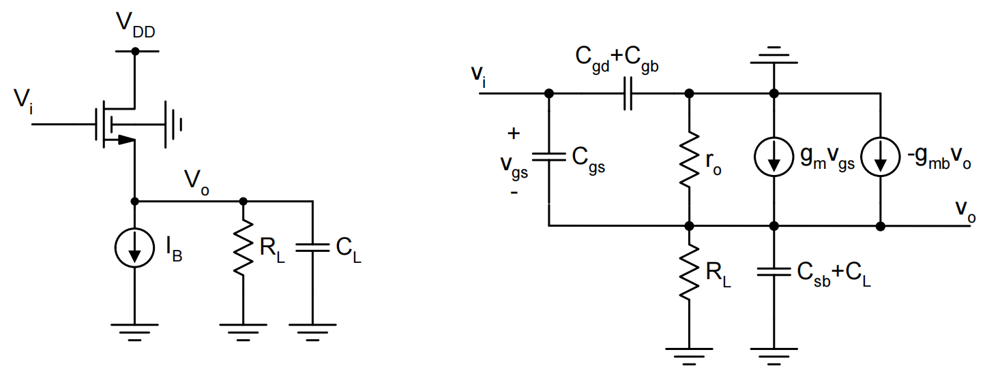

# 20230801 High-Performance Analog Circuit Design Lecture 05 -2

# Common Drain

Common drain与上一个Lecture的Common Gate相反，它有一个很低的输出阻抗和一个很高的输入阻抗，是一个电压Buffer。

- a common gate stage has a fairly low input impedance, and high output impedance.
- a common drain stage has a high input impedance and low output impedance.

# 1. 电压传递效率

电路形态与小信号模型

<aside>
💡 小信号：先画成小信号，再理清楚ac地

</aside>

$$
v_o({sC_{Ltot}}+sC_{gs}+\frac{1}{R_{Ltot}})-v_isC_{gs}-g_m(v_i-v_o)=0
$$

$$
\frac{v_o}{v_i}=\frac{g_m+sC_{gs}}{g_m+sC_{gs}+sC_{Ltot}+\frac{1}{R_{tot}}}
$$

$$
\frac{v_o}{v_i}=\frac{g_m}{g_m+\frac{1}{R_{tot}}}\cdot\frac{1+\frac{sC_{gs}}{g_m}}{1+\frac{s(C_{gs}+C_{Ltot})}{g_m+\frac{1}{R_{tot}}}}
$$

$$
C_{Ltot}=C_L+C_{sb}, \space R_{Ltot}=R_L||\frac{1}{g_{mb}}||r_o
$$

## 1.1 低频部分增益

即对于上式去掉频率响应部分（s部分）

$$
A_{vo}=\frac{g_m}{g_m+\frac{1}{R_{tot}}}, whereR_{tot}=R_L||\frac{1}{g_{mb}}||r_o
$$

- $R_L\to\infin, r_o\to \infin, g_{mb}=0$
    - PMOS做source follower一定程度上可以实现，source接bulk，无gmb

$$
A_{vo}=1
$$

- $R_L\to\infin, r_o\to \infin, g_{mb}\not=0$
    - NMOS做source follower，最多大概只能到0.8的效率

$$
A_{vo}=\frac{g_m}{g_m+g_{mb}},\space typical \approx0.8
$$

$r_o\to \infin, g_{mb}=0，R_L\to finite$

$$
A_{vo}=\frac{g_m}{g_m+\frac{1}{R_L}}
$$

## 1.2 高频部分增益

传递函数

$$
A_v(s)=\frac{v_o}{v_i}=A_{vo}\cdot\frac{1-\frac{s}{z}}{1-\frac{s}{p}}
$$

$$
z=-\frac{g_m}{C_{gs}}
$$

$$
p = -\frac{g_m+\frac{1}{R_{tot}}}{C_{gs}+C_{Ltot}}
$$

三种情况

- 零点<极点：传递函数先升后平
- 零点>极点：传递函数先降后平
- 零点=极点：零极点抵消，传递函数水平

# 2. 阻抗

## 2.1 输入阻抗：

NMOS: Cgs在特别高的频率下可以被boostrap掉

$$
Y_{in} = s(C_{gd}+C_{gb})+sC_{gs}(1-A_v(s))
$$

<aside>
💡 av(s) is real and close to unity up to fairly high frequencies

</aside>

PMOS: 将source和bulk接在一起，Cgb也会被boostrap掉一部分

$$
Y_{in}=sC_{gd}+s(C_{gs}+C_{sb})(1-A_v(s))\\Y_{in} \approx sC_{gd}
$$

进一步减小输入阻抗：人为boostrap

基底是PMOS，source和bulk连接在一起。将Cgd boost掉，即将Cgd耦合到source端

<aside>
💡 使用了一个float晶体管

</aside>

$$
Y_{in} \approx sC_{gd}(1-A_{vP}(s)A_{vN}(s))
$$