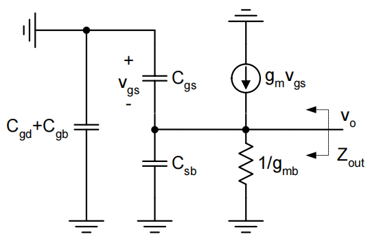

# 20230802High-Performance Analog Circuit Design Lecture 05 -3 Common Drain & Summary

<aside>
💡 特别小输入电容的Source Follower

</aside>

## 2.2 输出阻抗

输出阻抗输出端往回看可以看到源，因此先分成两种情况

- 源阻抗为0，即直接接地

$$
Z_{out}=\frac{1}{g_m+g_{mb}}||\frac{1}{s(C_{gs}+C_{sb})}
$$

- 源阻抗不为0

$$
Z_x=\frac{v_o}{v_i}\\i_x=(v_o-v_g)(g_m+sC_{gs})=v_o{1-\frac{v_g}{v_o}}(g_m+sC_{gs})
$$

$$
\frac{v_g}{v_o}=\frac{R}{\frac{1}{sC_{gs}}+R_i}
$$

$$
Z_x\approx\frac{1}{g_m}\frac{1+sR_iC_{gs}}{1+\frac{sC_{gs}}{g_m}}
$$

所以当输入阻抗小于1/gm，先遇到极点。输入阻抗大于1/gm，先遇到零点。

<aside>
💡 输入阻抗大于1/gm的时候展现了电感的特性，有可能导致震荡

</aside>

$$
R_1||R_2=\frac{1}{g_m}\\R_2=R_1\\L=\frac{R^2_iC_gs}{g_mR_i-1}
$$

**L forms an LC tank with any capacitance at the output**

<aside>
💡 大输入阻抗，用SF做buffer，可能会导致震荡

</aside>

考虑到寄生节点，高频处的极点会把传递函数往下拉

$$
Z_x=\frac{1}{g_m}\frac{(1+sR_i[C_{gs}+C_i])}{(1+\frac{sC_{gs}}{g_M})(1+sR_iC_i)}
$$

# 3. SF电路结构应用

## 3.1 电平搬移

信号搬移，DC量未搬移

## 3.2 Buffer

输出下一级是一个小阻抗，会拉低整体增益

- Vt是Vo的函数
- Buffer更倾向于用在输出摆幅较小的位置，比如前置放大器将μV放大到mV
- SF可以做一个很好的Buffer，但代价是引入更高的电压

## 3.3 负载

输入在M1变成电流，再在M2上变成电压。电路产生一个Ratio的比例

<aside>
💡 ADC领域的核心是一个放大器，整个电路的核心性能受放大器的影响

</aside>

<aside>
💡 放大器的核心设计是怎么让增益随着PVT的变化基本不变

</aside>

通过比例可以解决这个随着PVT变化而影响的情况，比如同时变大20%或同时减小20%。

- 反馈
- 上图所示电路

---

# Summary

### Backgate Effect & CG stage 内容目录：

1. **电压传递效率**
    1. 1.1 低频部分增益
    2. 1.2 高频部分增益
2. **阻抗**
    1. 2.1 输入阻抗
    2. 2.2 输出阻抗
    3. 2.3 进一步完善的小信号模型
3. **SF电路结构应用**
    1. 3.1 电平搬移
    2. 3.2 Buffer
    3. 3.3 负载

Common drain与上一个Lecture的Common Gate相反，它有一个很低的输出阻抗和一个很高的输入阻抗，是一个电压Buffer。

- a common gate stage has a fairly low input impedance, and high output impedance.
- a common drain stage has a high input impedance and low output impedance.

# 1. 电压传递效率

电路形态与小信号模型

<aside>
💡 小信号：先画成小信号，再理清楚ac地

</aside>

$$
v_o({sC_{Ltot}}+sC_{gs}+\frac{1}{R_{Ltot}})-v_isC_{gs}-g_m(v_i-v_o)=0
$$

$$
\frac{v_o}{v_i}=\frac{g_m+sC_{gs}}{g_m+sC_{gs}+sC_{Ltot}+\frac{1}{R_{tot}}}
$$

$$
\frac{v_o}{v_i}=\frac{g_m}{g_m+\frac{1}{R_{tot}}}\cdot\frac{1+\frac{sC_{gs}}{g_m}}{1+\frac{s(C_{gs}+C_{Ltot})}{g_m+\frac{1}{R_{tot}}}}
$$

$$
C_{Ltot}=C_L+C_{sb}, \space R_{Ltot}=R_L||\frac{1}{g_{mb}}||r_o
$$

## 1.1 低频部分增益

即对于上式去掉频率响应部分（s部分）

$$
A_{vo}=\frac{g_m}{g_m+\frac{1}{R_{tot}}}, whereR_{tot}=R_L||\frac{1}{g_{mb}}||r_o
$$

- $R_L\to\infin, r_o\to \infin, g_{mb}=0$
    - PMOS做source follower一定程度上可以实现，source接bulk，无gmb

$$
A_{vo}=1
$$

- $R_L\to\infin, r_o\to \infin, g_{mb}\not=0$
    - NMOS做source follower，最多大概只能到0.8的效率

$$
A_{vo}=\frac{g_m}{g_m+g_{mb}},\space typical \approx0.8
$$

$r_o\to \infin, g_{mb}=0，R_L\to finite$

$$
A_{vo}=\frac{g_m}{g_m+\frac{1}{R_L}}
$$

## 1.2 高频部分增益

传递函数

$$
A_v(s)=\frac{v_o}{v_i}=A_{vo}\cdot\frac{1-\frac{s}{z}}{1-\frac{s}{p}}
$$

$$
z=-\frac{g_m}{C_{gs}}
$$

$$
p = -\frac{g_m+\frac{1}{R_{tot}}}{C_{gs}+C_{Ltot}}
$$

三种情况

- 零点<极点：传递函数先升后平
- 零点>极点：传递函数先降后平
- 零点=极点：零极点抵消，传递函数水平

# 2. 阻抗

## 2.1 输入阻抗

NMOS: Cgs在特别高的频率下可以被boostrap掉

$$
Y_{in} = s(C_{gd}+C_{gb})+sC_{gs}(1-A_v(s))
$$

<aside>
💡 av(s) is real and close to unity up to fairly high frequencies

</aside>

PMOS: 将source和bulk接在一起，Cgb也会被boostrap掉一部分

$$
Y_{in}=sC_{gd}+s(C_{gs}+C_{sb})(1-A_v(s))\\Y_{in} \approx sC_{gd}
$$

进一步减小输入阻抗：人为boostrap

基底是PMOS，source和bulk连接在一起。将Cgd boost掉，即将Cgd耦合到source端

$$
Y_{in} \approx sC_{gd}(1-A_{vP}(s)A_{vN}(s))
$$

<aside>
💡 使用了一个float晶体管，实现了特别小输入电容的Source Follower

</aside>

## 2.2 输出阻抗

输出阻抗输出端往回看可以看到源，因此先分成两种情况

- 源阻抗为0，即直接接地

$$
Z_{out}=\frac{1}{g_m+g_{mb}}||\frac{1}{s(C_{gs}+C_{sb})}
$$

- 源阻抗不为0

$$
Z_x=\frac{v_o}{v_i}\\i_x=(v_o-v_g)(g_m+sC_{gs})=v_o{1-\frac{v_g}{v_o}}(g_m+sC_{gs})
$$

$$
\frac{v_g}{v_o}=\frac{R}{\frac{1}{sC_{gs}}+R_i}
$$

$$
Z_x\approx\frac{1}{g_m}\frac{1+sR_iC_{gs}}{1+\frac{sC_{gs}}{g_m}}
$$

所以当输入阻抗小于1/gm，先遇到极点。输入阻抗大于1/gm，先遇到零点。

<aside>
💡 输入阻抗大于1/gm的时候展现了电感的特性，有可能导致震荡

</aside>

$$
R_1||R_2=\frac{1}{g_m}\\R_2=R_1\\L=\frac{R^2_iC_gs}{g_mR_i-1}
$$

**L forms an LC tank with any capacitance at the output**

<aside>
💡 大输入阻抗，用SF做buffer，可能会导致震荡

</aside>

考虑到寄生节点，高频处的极点会把传递函数往下拉

$$
Z_x=\frac{1}{g_m}\frac{(1+sR_i[C_{gs}+C_i])}{(1+\frac{sC_{gs}}{g_M})(1+sR_iC_i)}
$$

# 3. SF电路结构应用

## 3.1 电平搬移

信号搬移，DC量未搬移

## 3.2 Buffer

输出下一级是一个小阻抗，会拉低整体增益

- Vt是Vo的函数
- Buffer更倾向于用在输出摆幅较小的位置，比如前置放大器将μV放大到mV
- SF可以做一个很好的Buffer，但代价是引入更高的电压

## 3.3 负载

输入在M1变成电流，再在M2上变成电压。电路产生一个Ratio的比例

<aside>
💡 ADC领域的核心是一个放大器，整个电路的核心性能受放大器的影响

</aside>

<aside>
💡 放大器的核心设计是怎么让增益随着PVT的变化基本不变

</aside>

通过比例可以解决这个随着PVT变化而影响的情况，比如同时变大20%或同时减小20%。

- 反馈
- 上图所示电路