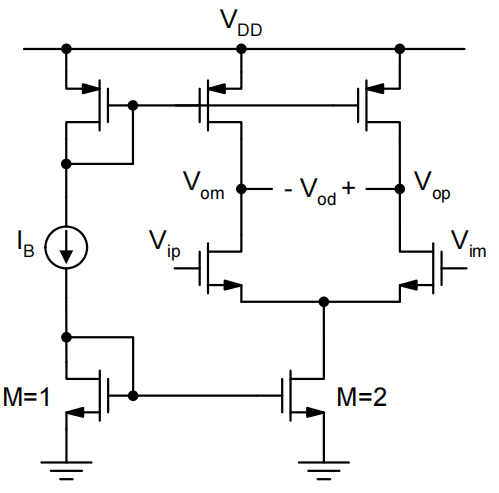

# 20230803 High-Performance Analog Circuit Design Lecture 07

# Fully Differential Amplifiers Switched-Capacitor Circuits

<aside>
💡 Corner是给数字电路准备的，对于模拟电路一定要跑蒙特卡洛仿真

</aside>

# 1. 全差分电路

输出共模无法定义，上面的电流镜和下面的电流镜互相争抢电流。

引入**共模负反馈**，解决全差分共模电压不确定的问题

检测共模环路，调整电流源的电流

通过一个average电路取出共模电压→通过一个放大器比较我们想要的共模电压→反馈回来调节电流源→最终得到上面电流源和下面电流源匹配的结果

<aside>
⚠️ 但凡涉及环路，就涉及稳定性问题

</aside>

由于电流镜的管子Rout不一定相同，需要利用共模负反馈实现调整电流

- 上管电流变大，将输出电压往上拽，减小上管的Vgs
- 上管电流变小，将输出电压往下拽，增大上管的Vgs

## 1.1 全差分电路

- 全差分：有效降低共模干扰与环境coupling，PSRR和CMRR较高，输出摆幅变大，确定的共模电压值。
    - 比如传感器的GND实际上并不是芯片上的GND，只选用单端的运放会出问题
- 单端：设计简单，元件少

