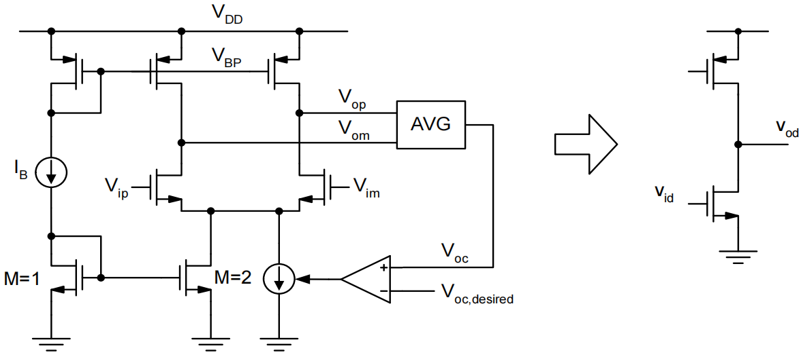

# 20230805 High-Performance Analog Circuit Design Lecture 07 Fully Differential Amplifiers & Switched-Capacitor Circuits & Process Variations and Feedback Intro.

<aside>
💡 信号跨模块时需要额外注意

</aside>

全共模电路差模小信号模型

## 1.2 考虑负载

RL直接挂在负载端，会显著降低增益。考虑用一个x1的buffer来驱动

考虑带一个小电阻的情况，这个buffer是很难实现的

- buffer的输出阻抗要小于0.1倍的$R_L$
- 消耗电压预算，限制了输出摆幅
- 额外的功耗与面积

以LDO为例，运放后接一个大的Pass transistor，被晶体管的大电容严重拉低了带宽

$**\to$用一个x1倍的buffer将二者隔开**

多级运放：人为造一个可以被牺牲掉的增益，将第二级的增益牺牲掉。第二级同时起到了隔离第一级和输出电容电阻的作用。

## 1.3 开关电容

一个好电路：在能解决问题的情况下最简单的电路

$$
\Delta q=C(V_1-V_2)\\i_{avg}=\frac{\Delta q}{\Delta t}=\frac{\Delta q}{T}=f\cdot C(V_1-V_2)\\ 
$$

$$
i=\frac{V_1-V_2}{R}\to R_{avg}=\frac{1}{f\cdot C}
$$

# 2. 开关电容电路的应用

- 适配CMOS电路：CMOS电路中最重要的就是开关
- 相比RC有更准的Corner frequency且可以改变：RC在集成电路工艺中无法做到非常精准，且如果需要拓展带宽，RC电路需要更大的C，而SC电路只需要把频率提升10倍即可
- 传输函数完全由电容的比例决定
- 可以实现一个较大的时间常数而不是用大的电阻

R. Gregorian et al., "Switched-Capacitor Circuit Design," Proceedings of the IEEE, Vol. 71, No. 8, August 1983.

<aside>
💡 One of the most significant inventions in the history of ICs

</aside>

## Switch C的噪声

SC本质上还是做了一个电阻，其噪声与一个正常的电阻没有区别

本课程中只考虑$\phi 2$阶段的SC电路，而不用担心开关切换问题

$$
i=v_i\cdot j \omega C_s\\v_o=-i\cdot \frac{1}{j\omega C_f}\\\frac{v_o}{v_i}=-\frac{C_s}{C_f}
$$

<aside>
💡 Switch Cap最终的增益和没有开关的情况实际上是一样的

</aside>

## Switch C放大器的噪声

在电路中的单个节点对全频带进行积分，噪声最终和电容的大小成反比

整体的噪声量级由放大器的结构决定

# 3. OPA与OTA

### OPA:

- 更加通用的设计
- 理想压控电压源
- 输出阻抗很低（一个OTA+一个x1的buffer）
- 能驱动电容和电阻

### OTA：

- 大部分片上放大器为OTA
- 理想的压控电流源
- 大输出阻抗
- 难以驱动电阻负载
- 使用电容（开关电容）反馈网络
- 能驱动一个电容

---

# Summary of Fully Differential Amplifiers & Switched-Capacitor Circuits

<aside>
💡 Corner是给数字电路准备的，对于模拟电路一定要跑蒙特卡洛仿真

</aside>

# 1. 全差分电路

输出共模无法定义，上面的电流镜和下面的电流镜互相争抢电流。

引入**共模负反馈**，解决全差分共模电压不确定的问题

检测共模环路，调整电流源的电流

通过一个average电路取出共模电压→通过一个放大器比较我们想要的共模电压→反馈回来调节电流源→最终得到上面电流源和下面电流源匹配的结果

<aside>
⚠️ 但凡涉及环路，就涉及稳定性问题

</aside>

由于电流镜的管子Rout不一定相同，需要利用共模负反馈实现调整电流

- 上管电流变大，将输出电压往上拽，减小上管的Vgs
- 上管电流变小，将输出电压往下拽，增大上管的Vgs

## 1.1 全差分电路

- 全差分：有效降低共模干扰与环境coupling，PSRR和CMRR较高，输出摆幅变大，确定的共模电压值。
    - 比如传感器的GND实际上并不是芯片上的GND，只选用单端的运放会出问题
- 单端：设计简单，元件少

<aside>
💡 信号跨模块时需要额外注意

</aside>

全共模电路差模小信号模型

## 1.2 负载

RL直接挂在负载端，会显著降低增益。考虑用一个x1的buffer来驱动

考虑带一个小电阻的情况，这个buffer是很难实现的

- buffer的输出阻抗要小于0.1倍的$R_L$
- 消耗电压预算，限制了输出摆幅
- 额外的功耗与面积

以LDO为例，运放后接一个大的Pass transistor，被晶体管的大电容严重拉低了带宽

$**\to$用一个x1倍的buffer将二者隔开**

多级运放：人为造一个可以被牺牲掉的增益，将第二级的增益牺牲掉。第二级同时起到了隔离第一级和输出电容电阻的作用。

## 1.3 开关电容

一个好电路：在能解决问题的情况下最简单的电路

$$
\Delta q=C(V_1-V_2)\\i_{avg}=\frac{\Delta q}{\Delta t}=\frac{\Delta q}{T}=f\cdot C(V_1-V_2)\\ 
$$

$$
i=\frac{V_1-V_2}{R}\to R_{avg}=\frac{1}{f\cdot C}
$$

# 2. 开关电容电路的应用

- 适配CMOS电路：CMOS电路中最重要的就是开关
- 相比RC有更准的Corner frequency且可以改变：RC在集成电路工艺中无法做到非常精准，且如果需要拓展带宽，RC电路需要更大的C，而SC电路只需要把频率提升10倍即可
- 传输函数完全由电容的比例决定
- 可以实现一个较大的时间常数而不是用大的电阻

R. Gregorian et al., "Switched-Capacitor Circuit Design," Proceedings of the IEEE, Vol. 71, No. 8, August 1983.

<aside>
💡 One of the most significant inventions in the history of ICs

</aside>

## 2.1 Switch C的噪声

SC本质上还是做了一个电阻，其噪声与一个正常的电阻没有区别

本课程中只考虑$\phi 2$阶段的SC电路，而不用担心开关切换问题

$$
i=v_i\cdot j \omega C_s\\v_o=-i\cdot \frac{1}{j\omega C_f}\\\frac{v_o}{v_i}=-\frac{C_s}{C_f}
$$

<aside>
💡 Switch Cap最终的增益和没有开关的情况实际上是一样的

</aside>

## 2.2 Switch C放大器的噪声

在电路中的单个节点对全频带进行积分，噪声最终和电容的大小成反比

整体的噪声量级由放大器的结构决定

# 3. OPA与OTA

### OPA:

- 更加通用的设计
- 理想压控电压源
- 输出阻抗很低（一个OTA+一个x1的buffer）
- 能驱动电容和电阻

### OTA：

- 大部分片上放大器为OTA
- 理想的压控电流源
- 大输出阻抗
- 难以驱动电阻负载
- 使用电容（开关电容）反馈网络
- 能驱动一个电容

---

# Process Variations & Feedback Intro.

### Process Variations & Feedback Intro. 内容目录：

1. **全差分电路**
2. 负反馈
    1. 2.1 增益敏感性
    2. 2.2 负反馈对非线性的改善
    3. 2.3 正反馈
    4. 2.4 使用理想运放来构建负反馈网络
3. **OPA与OTA**

# 1. PVT

PVT: process, voltage & temperature

<aside>
💡 与数字不同，模拟的Corner不一定出现在PN都慢或都快的情况下

</aside>

希望最坏的情况依然能超过SPEC的要求

- PROCESS: variations among production lots
    - Slow, Nominal and Fast" corners
    - Sometimes there are even significant variations across wafers
    and individual chips
- VOLTAGE: VDD is usually specified only within ±10%
- TEMPERATURE: ambient temperature variations
    - 0~70°C
    - -40~85°C
    - -55~125°C

典型的波动

RC滤波要做的很准的话实际上要做到覆盖较大的范围

过设计来解决问题：

- 有些时候是可行的
- 但在一些精准的场景下是不能容忍的
    - 噪声带宽太宽（不利于噪声）
    - 功耗的变大
    - ……

$\to$通过**负反馈**的方法来避免对绝对精度的要求，而是通过比值的方法来决定

<aside>
💡 负反馈是提高电路稳定性的最重要工具

</aside>

# 2. 负反馈

前向通路，反馈回路，$af$ 环路增益（$T$）

负反馈如何看它的增益：这一点到输出的前向增益除以环路增益

$$
v_{out}=a(v_{in}-fv_{out})\\\frac{v_{out}}{v_{in}}=\frac{a}{1+af}
$$

$$
af>>1 \to \frac{v_{out}}{v_{in}}\approx \frac{1}{f}
$$

**环路中任何一点x的增益**

$$
\frac{v_{out}}{v_x}=\frac{a_{feedforward}}{1+T}
$$

<aside>
💡 有一个很大的增益，就可以利用这个增益构造一个比它小但可以通过比值构造的增益

</aside>

Example.

10倍的开环增益改变只带来了1.8%的闭环增益改变

为了维持闭环的2倍增益该如何计算开环的前向增益？

$\to$利用误差去反推增益的误差是多少

## 2.1 增益敏感性

$$
A=\frac{a}{1+af}\\\frac{\Delta A}{A}=\frac{\frac{\Delta a}{a}}{1+af}=\frac{\frac{\Delta a}{a}}{1+T}
$$

## 2.2 负反馈对非线性的改善

输入不再直接加在输入范围上，而是减去一个与输入接近的量之后再加载在输入差分对上

观察经过负反馈系统之后一次项（b1）和三次项（b3）的区别

$$
b_1=\frac{a_1}{1+a_1f},b_3=\frac{a_3}{(1+a_1f)^4}
$$

可以看到一次项（线性项）被降低了1+T，而高阶项被降低了（1+T）的4次方倍

## 2.3 正反馈

利用正反馈可以提高增益

$$
v_{out}=a(v_{in}+fv_{out})\\\frac{v_{out}}{v_{in}}=\frac{a}{1-af}
$$

正反馈可以有效地提高增益 $T=0.9\to v_{out}/v_{in}=10a$

## 2.4 使用理想运放来构建负反馈网络

常见的同相放大器结构，可以很好地套用在反馈的框图上。通过电阻的分压实现反馈网络

$$
f=\frac{R_1}{R_1+R_2},a=g\\\frac{v_{out}}{v_{in}}=\frac{a}{1+af}=\frac{g}{1+g\frac{R_1}{R_1+R_2}}\approx\frac{R_1+R_2}{R_1}
$$

对于反相放大器，就无法直接映射到反馈的框图上

**解决方案1：**从更根本的角度上去看传递函数，即把输入断开，然后看到输出的传递函数

把输入短接，看反馈到输出即为环路增益

求得a和T之后可以写出整个环路的传递函数

$$
a=-\frac{R_2}{R_1+R_2}\cdot g, -af=T=-\frac{R_1}{R_1+R_2}\cdot g
$$

$$
\frac{v_{out}}{v_{in}}=\frac{a}{1+af}\approx -\frac{R_2}{R_1}
$$

更简单的做法：**Return Ratio**

负反馈环路里噪声的增益：