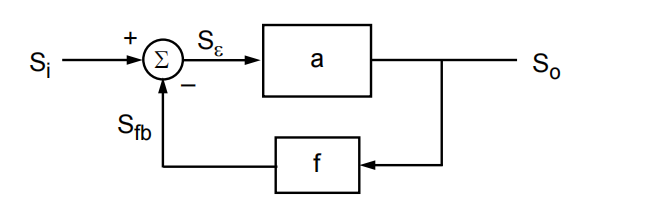

# 20230806 High-Performance Analog Circuit Design Lecture 08 feedback and stability analysis

# 1. Return Ratio

反馈是电路中比较重要的支点

## 1.1 Reference

- H.W. Bode, *Network Analysis and Feedback Amplifier Design*, Van Nostrand, New York, 1945.
- R.D. Middlebrook, "Measurement of Loop Gain in Feedback Systems," Int. J. Electronics, Vol. 38, No.4, .pp. 485-512, 1975.
- S. Rosenstark, "Loop Gain Measurement in Feedback Amplifiers," Int. J. Electronics, Vol. 57, No.3., pp. 415-421, 1984.
- P.J. Hurst, "Exact Simulation of Feedback Circuit Parameters," Trans. on Circuits and Systems, pp.1382-1389, Nov. 1991.
- P.J. Hurst, S.H. Lewis, "Simulation of Return Ratio in Fully Differential Feedback Circuits," Proc. CICC 1994, pp.29-32.
- Ken Kundert, "A Test Bench for Differential Circuits," Online: http://www.designers-guide.com/Analysis/diff.pdf
- M. Tian, V. Visvanathan, J. Hantgan, K. Kundert, "Striving for small-signal stability," IEEE Circuits and Devices Magazine, pp. 31-41, January 2001.

## 1.2 负反馈

<aside>
💡 Feedback is everywhere

</aside>

### 好处

- 降低对外界变化的敏感度（PVT）
- 降低失真（高次项被平方倍衰减）
- 向我们希望的方向上去改变阻抗
- 增加带宽

### 代价

- 牺牲增益
- 潜在的不稳定性（环路稳定性）

把电路分为前馈通路与反馈回路

## 1.3 理想反馈系统的前提假设

1. 无论是前馈放大器还是反馈通路都没有loading
2. 前馈通路和反馈回路都是单向的，没有其他方向的传输

$$
S_o=a\cdot S_{\epsilon}\\S_{fb}=f\cdot S_o\\S_\epsilon=S_i-S_{fb}
$$

$$
S_o=a(S_i-S_{fb})=a(S_i-f\cdot S_o)
$$

### Loop Gain

$$
T=af=\frac{S_{fb}}{S_{\epsilon}}
$$

### Closed Loop Gain

$$
A=\frac{S_o}{S_i}=\frac{a}{1+af}
$$

$$
A=\frac{a}{1+T}
$$

If T >> 1

$$
A\approx \frac{a}{T}=\frac{1}{f}
$$

反馈回路作用为最小化误差信号$S_{\epsilon}$，并使反馈信号$S_{fb}$追踪输入信号$S_i$

$$
S_{\epsilon}=S_i-f\cdot S_o=S_i-f\cdot(\frac{a}{1+af})S_i=(1-\frac{af}{1+af})\cdot S_i
$$

误差量

$$
\frac{S_{\epsilon}}{S_i}=1-\frac{T}{1+T}=\frac{1}{1+T}
$$

反馈量

$$
\frac{S_{fb}}{S_i}=a\cdot f(\frac{S_{\epsilon}}{S_i})=\frac{T}{1+T}
$$

## 1.4 对增益稳定性的改善

反馈网络一般是由精确的被动元件组成的网络且一般与频率无关，前向放大器的增益一般很大，但可控度不高。

负反馈除了降低了增益，也降低了增益的不稳定度为原来的（1+T）分之一

$$
\frac{dA}{da}=\frac{d}{da}(\frac{a}{1+af})=\frac{1}{1+af}+a\frac{d}{da}(\frac{1}{1+af})\\=\frac{(1+af)-af}{(1+af)^2}=\frac{1}{(1+af)^2}=\frac{1}{(1+T)^2}
$$

当a发生了$\delta a$的改变

$$
\delta A=\frac{dA}{da}\delta a=\frac{\delta a}{(1+T)^2}
$$

$$
\frac{\delta A}{A}=\frac{\delta a}{(1+T)^2}(\frac{1+T}{a})=\frac{1}{1+T}\frac{\delta a}{a}
$$

## 1.5 负反馈的模式

f和加法器具体是怎么实现的

- At the OUTPUT
    - A shunt connection senses the output voltage
    - A series connection senses the output current
- At the INPUT
    - A shunt connection feeds back a current in parallel with the input
    - A series connection feeds back a voltage in series with the input

<aside>
💡 我们更在乎的实际上是T

</aside>

## 1.6 负反馈对输入输出阻抗的影响

<aside>
💡 **Feedback always helps the loading and the driving**

</aside>

- Input impedance
    - For voltage input, it increases the input impedance by (1+T)
    - For current input, it lowers the input impedance by (1+T)
- Output impedance
    - For voltage output, it lowers the output impedance by (1+T)
    - For current output, it increases the output impedance by (1+T)

CCIA: cap coupled instrument amp. 一般使用一个chop来将offset变成一个ripple。但加入chop会导致输入阻抗降低

# 2. 稳定性与稳定性判据

稳定性：BIBO，有界输入，有界输出

$$
A(s)=\frac{v_o}{v_i}=\frac{a(s)}{1+a(s)f(s)}=\frac{a(s)}{1+T(s)}
$$

一个连续时间线性系统如果所有极点频率都在s平面的左半平面则是BIBO稳定的

- 可以通过计算1+T(s)的根来检查稳定性
    - 数学上可行，但有时很难具体实施

## 2.1  Barkhausen稳定性判据

相位=180度，增益＞1

System is unstable when |T(jω)| > 1 @ frequency where Phase(T(jω)) = -180°

- Can use simple bode plot to check for stability
- Safe to use in many electronic circuits
- However, it is **not** mathematically rigorous, be aware of exceptions
- It is **not** good at analyzing more complicated transfer functions
    - T(s) of a phase-locked loop
    - T(s) with a right-half plane pole

<aside>
💡 相位裕度最优要达到60~70°

</aside>

增益裕度：相位达到180度的时候增益是不是小于1了（希望距离1有3~5的裕度）

## 2.1  Nyquist Stability稳定性判据

直接分析1+T(s)（T(s)的极点可能和1+T(s)有明显的不同）