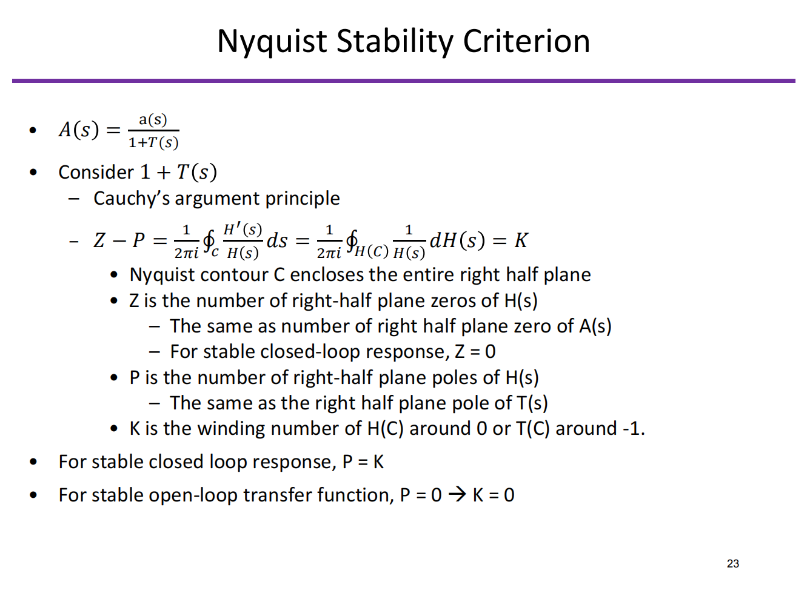

# 20230807 High-Performance Analog Circuit Design Lecture 08 feedback and stability analysis

奈奎斯特稳定性判据

Good online tutorial videos:

- [https://www.youtube.com/watch?v=sof3meN96MA](https://www.youtube.com/watch?v=sof3meN96MA)
- [https://www.youtube.com/watch?v=FXbKYT1G6Xs](https://www.youtube.com/watch?v=FXbKYT1G6Xs)

<aside>
💡 奈奎斯特判据是一个更全面的判据，但一般情况下用巴克豪斯稳定性判据也够用了

</aside>

# 3. 电容负反馈的放大器

以以下电容负反馈放大器为例分析

分析该电路的：

- 电路的稳定性，相位裕度是多少
- 低频闭环增益是多少
- 闭环带宽是多少

## 3.1 写出小信号模型

观察小信号模型发现**很难**写成标准的负反馈闭环（af）形式

- 负反馈网络作为运放的负载的一部分
- 运放也是负反馈网络的一部分
- 高频下有一条bypass放大器的前馈通路

<aside>
💡 我们不是很在乎a到底是什么，f到底是什么，而是关系af这个整体

</aside>

## 3.2 解决方法

- 完整的推一遍KCL和KVL
    - 对于某些复杂的电路几乎是不可能完成的
    - 很难获得稳定性判据和裕度
- Two port feedback analysis（也是拉扎维书上提到的）
    - 对某些负反馈电路无法使用
- **Return Ratio Analysis**
    - 不再区分a和f的具体值（不再区分前向增益和反馈网络的传递函数），而是放在一起看
    - 关注T的值
    - 稳定性，闭环增益和阻抗变换均至于T有关

## 3.3 **Return Ratio Analysis**

- **Set all independent sources to zero**
- **Identify a controlled source in the feedback loop that you want to analyze and
break the loop by disconnecting the source**
    - **E.g. VCCS, VCVS, …**
- **Inject a test signal $s_t$ at the breakpoint**
    - **Current or voltage, depending on type of removed source**
- **Find the return signal $s_r$ generated by the controlled source that was
disconnected from the circuit in step 2.**
- **The return ratio of the controlled source is given by $RR=-s_r/s_t$**
    - **Provided that we have chosen a controlled source that breaks the loop
    under consideration (and no other loop), the return ratio of the source is
    equal to the loop gain of the circuit, i.e. RR =**

$$
v_x=\beta\cdot v_o\\\beta=\frac{C_f}{C_f+C_s+C_X}
$$

$$
v_o=-i_t\cdot(R_o||\frac{1}{sC_{tot}}), C_{Ltot}=C_L+(1-\beta)C_f\\T(s)=-\frac{i_r}{i_t}=-\frac{G_mv_x}{i_t}=\beta\cdot G_m\cdot(R_o||\frac{1}{s_{Ltot}})=\frac{\beta\cdot G_mR_o}{1+sR_oC_{Ltot}}
$$

最终的闭环增益形式：直流增益*ctotl的分压*频率响应部分

高频下：注意高频下可以进行忽略

$$
T(s)=\frac{\beta\cdot G_mR_o}{1+sR_oC_{Ltot}}\approx \frac{\beta\cdot G_m}{sC_{Ltot}}\\|\frac{\beta G_m}{j\omega_cC_{Ltot}}|=1\to \omega_c \approx \frac{\beta G_m}{C_{Ltot}}=\beta\cdot GBW_{OTA}
$$

相位裕度

## 3.4 闭环传递函数

$$
A(s)=\frac{v_o}{v_i}=A_\infin \frac{T(s)}{1+T(s)}+\frac{d}{1+T(s)}
$$

- $**A_\infin$ is the ideal closed loop gain when loop gain T goes to infinity**
- d is the direct signal feedthrough with the controlled source removed (Gm→0)
    - Can often be ignored; we'll look at this term later
    - Be cautious when the feedback loop has explicit feedforward path

### 求$A_\infin$

当Gm趋向于无穷，Vx点的电压值必须为0，此时没有电流流经Cx

$$
0=v_isC_s+v_osC_f\\A_\infin=\frac{C_s}{C_f}
$$

### 闭环环路的带宽

$$
T(s)=\frac{\beta \cdot G_mR_o}{1+sR_oC_{Ltot}}\approx \frac{\beta \cdot G_m}{sC_{Ltot}}=\frac{\omega_c}{s}(high \ freqency)
$$

$$
A(s)\approx A_\infin \frac{T(s)}{1+T(s)}\approx A_\infin \frac{\omega_c}{s+\omega_c},|\frac{\omega_c}{jw_{-3dB}+\omega_c}|=\frac{1}{\sqrt{2}}\to\omega_{-3dB}=\omega_c
$$

- 闭环系统带宽等于T(s)的GBW
- 闭环系统的极点比开环系统的极点大$T_0$倍

$$
\omega_{-3dB}\approx \omega_pT_0=\frac{1}{C_{Ltot}R_o}\cdot \beta G_mR_o=\omega_c
$$

### 求d

直接写出一个d的表达式会变得比较复杂

可以求两个极限（低频极限和高频极限）下的情况

- 低频$R_o<<|1/j\omega_c|$
    - d=0，无前馈通路
- 高频$R_o>>|1/j\omega_c|$
    - calculating feedforward zeros is easier using simple KCL
    analysis, with large resistors removed

### 误差

给无穷长的时间，最终能settle到什么位置

**static gain error**

$$
\epsilon_0=\frac{A_0-A_\infin}{A_\infin}=\frac{A_0}{A_\infin}-1=\frac{T_0}{1+T_0}-1=\frac{1}{1+\frac{1}{T_0}}-1\approx(1-\frac{1}{T_0})-1=-\frac{1}{T_0}
$$

$$
|\epsilon_0|\approx\frac{1}{T_0}
$$

## 3.5 Summary of OTA with cap.

- 寻找低频增益误差
    - 写出低频的环路增益表达式，忽略所有电容带来的阻抗分压
    - 需要注意电容分压网络依然是起作用的（忽略小电容）
- 闭环带宽
    - 写出高频下的环路增益表达式，忽略所有有限输出阻抗的器件
    - 闭环系统的-3dB带宽约等于环路增益的UGB
- 稳定性和相位裕度
    - 环路增益的相位和UGB

<aside>
💡 想看哪个频率就往哪个方向推导

</aside>

# 4. Circuit Example

求环路增益

- 输入短接，输出断掉
- 在受控源上断开，补一个电流源
- 绕一圈看有多少环路增益

如何在SPICE仿真中仿真这些内容：

<aside>
💡 一个实际模型中是无法断开的

</aside>

## 4.1 仿真

### Middlebrook

<aside>
💡 用stb仿真

</aside>

## 4.2 全差分电路

使用CMDM Prob

- -1是差模
- 1是共模

## 4.3 多环路分析

有没有一个点可以把所有环路都断掉，在那个点插入prob

# **Always run one or more transient analyses for a "true" stability check!**

---

# Feedback and Stability Analysis Summary

### Feedback and Stability Analysis 内容目录

1. **负反馈分析**
    1. 1.1 Reference
    2. 1.2 负反馈
    3. 1.3 理想反馈系统的前提假设
    4. 1.4 对增益稳定性的改善
    5. 1.5 负反馈的模式
    6. 1.6 负反馈对输入输出阻抗的影响
2. **稳定性与稳定性判据**
    1. 2.1 Barkhausen稳定性判据
    2. 2.2 Nyquist Stability稳定性判据
3. **电容负反馈的放大器**
    1. 3.1 写出小信号模型
    2. 3.2 解决方法
    3. 3.3 Return Ratio Analysis
    4. 3.4 闭环传递函数
    5. 3.5 Summary of OTA with cap.
4. **Circuit Example**
5. **Note**

# 1. 负反馈分析

反馈是电路中重要的支点

## 1.1 Reference

- H.W. Bode, *Network Analysis and Feedback Amplifier Design*, Van Nostrand, New York, 1945.
- R.D. Middlebrook, "Measurement of Loop Gain in Feedback Systems," Int. J. Electronics, Vol. 38, No.4, .pp. 485-512, 1975.
- S. Rosenstark, "Loop Gain Measurement in Feedback Amplifiers," Int. J. Electronics, Vol. 57, No.3., pp. 415-421, 1984.
- P.J. Hurst, "Exact Simulation of Feedback Circuit Parameters," Trans. on Circuits and Systems, pp.1382-1389, Nov. 1991.
- P.J. Hurst, S.H. Lewis, "Simulation of Return Ratio in Fully Differential Feedback Circuits," Proc. CICC 1994, pp.29-32.
- Ken Kundert, "A Test Bench for Differential Circuits," Online: http://www.designers-guide.com/Analysis/diff.pdf
- M. Tian, V. Visvanathan, J. Hantgan, K. Kundert, "Striving for small-signal stability," IEEE Circuits and Devices Magazine, pp. 31-41, January 2001.

## 1.2 负反馈

<aside>
💡 Feedback is everywhere

</aside>

### 好处

- 降低对外界变化的敏感度（PVT）
- 降低失真（高次项被平方倍衰减）
- 向我们希望的方向上去改变阻抗
- 增加带宽

### 代价

- 牺牲增益
- 潜在的不稳定性（环路稳定性）

把电路分为前馈通路与反馈回路

## 1.3 理想反馈系统的前提假设

1. 无论是前馈放大器还是反馈通路都没有loading
2. 前馈通路和反馈回路都是单向的，没有其他方向的传输

$$
S_o=a\cdot S_{\epsilon}\\S_{fb}=f\cdot S_o\\S_\epsilon=S_i-S_{fb}
$$

$$
S_o=a(S_i-S_{fb})=a(S_i-f\cdot S_o)
$$

### Loop Gain

$$
T=af=\frac{S_{fb}}{S_{\epsilon}}
$$

### Closed Loop Gain

$$
A=\frac{S_o}{S_i}=\frac{a}{1+af}
$$

$$
A=\frac{a}{1+T}
$$

If T >> 1

$$
A\approx \frac{a}{T}=\frac{1}{f}
$$

反馈回路作用为最小化误差信号$S_{\epsilon}$，并使反馈信号$S_{fb}$追踪输入信号$S_i$

$$
S_{\epsilon}=S_i-f\cdot S_o=S_i-f\cdot(\frac{a}{1+af})S_i=(1-\frac{af}{1+af})\cdot S_i
$$

误差量

$$
\frac{S_{\epsilon}}{S_i}=1-\frac{T}{1+T}=\frac{1}{1+T}
$$

反馈量

$$
\frac{S_{fb}}{S_i}=a\cdot f(\frac{S_{\epsilon}}{S_i})=\frac{T}{1+T}
$$

## 1.4 对增益稳定性的改善

反馈网络一般是由精确的被动元件组成的网络且一般与频率无关，前向放大器的增益一般很大，但可控度不高。

负反馈除了降低了增益，也降低了增益的不稳定度为原来的（1+T）分之一

$$
\frac{dA}{da}=\frac{d}{da}(\frac{a}{1+af})=\frac{1}{1+af}+a\frac{d}{da}(\frac{1}{1+af})\\=\frac{(1+af)-af}{(1+af)^2}=\frac{1}{(1+af)^2}=\frac{1}{(1+T)^2}
$$

当a发生了$\delta a$的改变

$$
\delta A=\frac{dA}{da}\delta a=\frac{\delta a}{(1+T)^2}
$$

$$
\frac{\delta A}{A}=\frac{\delta a}{(1+T)^2}(\frac{1+T}{a})=\frac{1}{1+T}\frac{\delta a}{a}
$$

## 1.5 负反馈的模式

f和加法器具体是怎么实现的

- At the OUTPUT
    - A shunt connection senses the output voltage
    - A series connection senses the output current
- At the INPUT
    - A shunt connection feeds back a current in parallel with the input
    - A series connection feeds back a voltage in series with the input

<aside>
💡 我们更在乎的实际上是T

</aside>

## 1.6 负反馈对输入输出阻抗的影响

<aside>
💡 **Feedback always helps the loading and the driving**

</aside>

- Input impedance
    - For voltage input, it increases the input impedance by (1+T)
    - For current input, it lowers the input impedance by (1+T)
- Output impedance
    - For voltage output, it lowers the output impedance by (1+T)
    - For current output, it increases the output impedance by (1+T)

CCIA: cap coupled instrument amp. 一般使用一个chop来将offset变成一个ripple。但加入chop会导致输入阻抗降低

# 2. 稳定性与稳定性判据

稳定性：BIBO，有界输入，有界输出

$$
A(s)=\frac{v_o}{v_i}=\frac{a(s)}{1+a(s)f(s)}=\frac{a(s)}{1+T(s)}
$$

一个连续时间线性系统如果所有极点频率都在s平面的左半平面则是BIBO稳定的

- 可以通过计算1+T(s)的根来检查稳定性
    - 数学上可行，但有时很难具体实施

## 2.1  Barkhausen稳定性判据

相位=180度，增益＞1

System is unstable when |T(jω)| > 1 @ frequency where Phase(T(jω)) = -180°

- Can use simple bode plot to check for stability
- Safe to use in many electronic circuits
- However, it is **not** mathematically rigorous, be aware of exceptions
- It is **not** good at analyzing more complicated transfer functions
    - T(s) of a phase-locked loop
    - T(s) with a right-half plane pole

<aside>
💡 相位裕度最优要达到60~70°

</aside>

增益裕度：相位达到180度的时候增益是不是小于1了（希望距离1有3~5的裕度）

## 2.2  Nyquist Stability稳定性判据

直接分析1+T(s)（T(s)的极点可能和1+T(s)有明显的不同）

奈奎斯特稳定性判据

Good online tutorial videos:

- [https://www.youtube.com/watch?v=sof3meN96MA](https://www.youtube.com/watch?v=sof3meN96MA)
- [https://www.youtube.com/watch?v=FXbKYT1G6Xs](https://www.youtube.com/watch?v=FXbKYT1G6Xs)

<aside>
💡 奈奎斯特判据是一个更全面的判据，但一般情况下用巴克豪斯稳定性判据也够用了

</aside>

# 3. 电容负反馈的放大器

以以下电容负反馈放大器为例分析

分析该电路的：

- 电路的稳定性，相位裕度是多少
- 低频闭环增益是多少
- 闭环带宽是多少

## 3.1 写出小信号模型

观察小信号模型发现**很难**写成标准的负反馈闭环（af）形式

- 负反馈网络作为运放的负载的一部分
- 运放也是负反馈网络的一部分
- 高频下有一条bypass放大器的前馈通路

<aside>
💡 我们不是很在乎a到底是什么，f到底是什么，而是关系af这个整体

</aside>

## 3.2 解决方法

- 完整的推一遍KCL和KVL
    - 对于某些复杂的电路几乎是不可能完成的
    - 很难获得稳定性判据和裕度
- Two port feedback analysis（也是拉扎维书上提到的）
    - 对某些负反馈电路无法使用
- **Return Ratio Analysis**
    - 不再区分a和f的具体值（不再区分前向增益和反馈网络的传递函数），而是放在一起看
    - 关注T的值
    - 稳定性，闭环增益和阻抗变换均至于T有关

## 3.3 **Return Ratio Analysis**

- **Set all independent sources to zero**
- **Identify a controlled source in the feedback loop that you want to analyze and
break the loop by disconnecting the source**
    - **E.g. VCCS, VCVS, …**
- **Inject a test signal $s_t$ at the breakpoint**
    - **Current or voltage, depending on type of removed source**
- **Find the return signal $s_r$ generated by the controlled source that was
disconnected from the circuit in step 2.**
- **The return ratio of the controlled source is given by $RR=-s_r/s_t$**
    - **Provided that we have chosen a controlled source that breaks the loop
    under consideration (and no other loop), the return ratio of the source is
    equal to the loop gain of the circuit, i.e. RR =**

$$
v_x=\beta\cdot v_o\\\beta=\frac{C_f}{C_f+C_s+C_X}
$$

$$
v_o=-i_t\cdot(R_o||\frac{1}{sC_{tot}}), C_{Ltot}=C_L+(1-\beta)C_f\\T(s)=-\frac{i_r}{i_t}=-\frac{G_mv_x}{i_t}=\beta\cdot G_m\cdot(R_o||\frac{1}{s_{Ltot}})=\frac{\beta\cdot G_mR_o}{1+sR_oC_{Ltot}}
$$

最终的闭环增益形式：直流增益*ctotl的分压*频率响应部分

高频下：注意高频下可以进行忽略

$$
T(s)=\frac{\beta\cdot G_mR_o}{1+sR_oC_{Ltot}}\approx \frac{\beta\cdot G_m}{sC_{Ltot}}\\|\frac{\beta G_m}{j\omega_cC_{Ltot}}|=1\to \omega_c \approx \frac{\beta G_m}{C_{Ltot}}=\beta\cdot GBW_{OTA}
$$

相位裕度

## 3.4 闭环传递函数

$$
A(s)=\frac{v_o}{v_i}=A_\infin \frac{T(s)}{1+T(s)}+\frac{d}{1+T(s)}
$$

- $**A_\infin$ is the ideal closed loop gain when loop gain T goes to infinity**
- d is the direct signal feedthrough with the controlled source removed (Gm→0)
    - Can often be ignored; we'll look at this term later
    - Be cautious when the feedback loop has explicit feedforward path

### 求$A_\infin$

当Gm趋向于无穷，Vx点的电压值必须为0，此时没有电流流经Cx

$$
0=v_isC_s+v_osC_f\\A_\infin=\frac{C_s}{C_f}
$$

### 闭环环路的带宽

$$
T(s)=\frac{\beta \cdot G_mR_o}{1+sR_oC_{Ltot}}\approx \frac{\beta \cdot G_m}{sC_{Ltot}}=\frac{\omega_c}{s}(high \ freqency)
$$

$$
A(s)\approx A_\infin \frac{T(s)}{1+T(s)}\approx A_\infin \frac{\omega_c}{s+\omega_c},|\frac{\omega_c}{jw_{-3dB}+\omega_c}|=\frac{1}{\sqrt{2}}\to\omega_{-3dB}=\omega_c
$$

- 闭环系统带宽等于T(s)的GBW
- 闭环系统的极点比开环系统的极点大$T_0$倍

$$
\omega_{-3dB}\approx \omega_pT_0=\frac{1}{C_{Ltot}R_o}\cdot \beta G_mR_o=\omega_c
$$

### 求d

直接写出一个d的表达式会变得比较复杂

可以求两个极限（低频极限和高频极限）下的情况

- 低频$R_o<<|1/j\omega_c|$
    - d=0，无前馈通路
- 高频$R_o>>|1/j\omega_c|$
    - calculating feedforward zeros is easier using simple KCL
    analysis, with large resistors removed

### 误差

给无穷长的时间，最终能settle到什么位置

**static gain error**

$$
\epsilon_0=\frac{A_0-A_\infin}{A_\infin}=\frac{A_0}{A_\infin}-1=\frac{T_0}{1+T_0}-1=\frac{1}{1+\frac{1}{T_0}}-1\approx(1-\frac{1}{T_0})-1=-\frac{1}{T_0}
$$

$$
|\epsilon_0|\approx\frac{1}{T_0}
$$

## 3.5 Summary of OTA with cap.

- 寻找低频增益误差
    - 写出低频的环路增益表达式，忽略所有电容带来的阻抗分压
    - 需要注意电容分压网络依然是起作用的（忽略小电容）
- 闭环带宽
    - 写出高频下的环路增益表达式，忽略所有有限输出阻抗的器件
    - 闭环系统的-3dB带宽约等于环路增益的UGB
- 稳定性和相位裕度
    - 环路增益的相位和UGB

<aside>
💡 想看哪个频率就往哪个方向推导

</aside>

# 4. Circuit Example

求环路增益

- 输入短接，输出断掉
- 在受控源上断开，补一个电流源
- 绕一圈看有多少环路增益

如何在SPICE仿真中仿真这些内容：

<aside>
💡 一个实际模型中是无法断开的

</aside>

## 4.1 仿真

### Middlebrook

<aside>
💡 用stb仿真

</aside>

## 4.2 全差分电路

使用CMDM Prob

- -1是差模
- 1是共模

## 4.3 多环路分析

有没有一个点可以把所有环路都断掉，在那个点插入prob

# **Always run one or more transient analyses for a "true" stability check!**