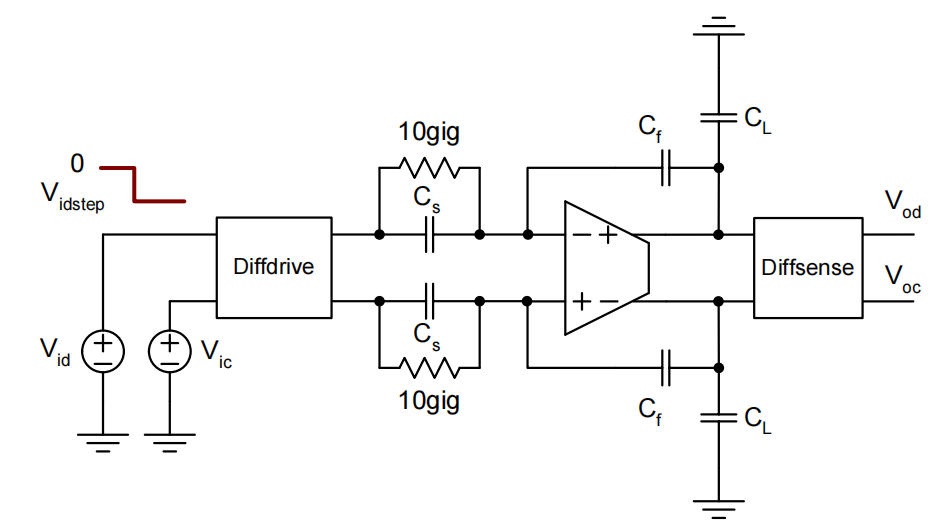

# 20230810 High-Performance Analog Circuit Design Lecture 11 Slew

### 压摆率

# 1. Slew

使用大信号作为输入，查看阶跃响应

$C_s=C_f=500fF,C_L=10pF,\beta=0.48,G_m=1mS,G_mR_o=85$

下冲是由前馈电容造成的

$$
\frac{V_{odstep}}{V_{idstep}}=\frac{C_S}{C_S+C_{in}+\frac{C_fC_L}{C_f+C_L}}\approx -1V\frac{500fF}{500fF+40fF+500fF}=-480mV
$$

在输入端会看到-480mV的下冲$\to$会让放大器输入差分对管离开饱和区

### 输入差分对管输入端与输出电流关系

在slew过程中，放大器在用一个恒定的电流（尾电流）来驱动输出

slew在输入差分电压＜$1.4\times(2/\frac{g_m}{I_D})$时结束

- 在这个点差分对重新进入其线性区
- 剩下的settling时间一般也被称为线性settling（实际上时域上看是e指数）

**During "slewing", the amplifier drives its output with a constant current (equal to tail bias)**

<aside>
💡 输入电流完全偏向了某一边

</aside>

# 2. Slew Rate

压摆率：输入差分对偏离线性区时输出节点信号上升的斜率

$$
SR=\frac{dV_{od}}{dt}=\frac{I_{TAIL}}{C_{Ltot}}=\frac{I_{TAIL}}{C_L+(1-\beta)C_f}
$$

花费时间计算：

- 电压起点：$|V_{step}|$
- 电压终点：$2.8/\frac{g_m}{I_D}$

$$
t_{slew}=\frac{|V_{step}|-(2.8/\frac{g_m}{I_D})}{\beta\cdot SR}
$$

在本例中

$$
SR=\frac{I_{TAIL}}{C_{Ltot}}\approx\frac{200\mu A}{10pF}=20\frac{V}{\mu s}\\t_{slew}=\frac{480mV-280mV}{0.48\cdot20\frac{V}{\mu s}}=21ns
$$

slew的出现并没有使settling time发生太多变化

### 总settling time

$$
t_s=t_{slew}+t_{in}\approx\frac{|V_{step}-2.8/(\frac{g_m}{I_D})|}{\beta\cdot SR}-\tau ln(\epsilon_{d,tot})\\SR=\frac{I_{TAIL}}{C_{Ltot}}=\frac{I_{TAIL}}{C_L+(1-\beta)C_f},\beta=\frac{C_f}{C_f+C_s+C_{in}}\\V_{step}=V_{istep}\frac{C_s}{C_s+C_{in}+\frac{C_fC_L}{C_f+C_L}}=V_{istep}\frac{C_s}{C_s+C_{in}+C_f}
$$

β如果足够小，则slew一定不会发生

## 2.1 两级运放Slew设计

第一级输出节点相对来说是稳定的

两个节点一边是抽电流的，另一边是补电流的

负端的slew rate是由输出节点较小的那个决定的

$$
SR_{-,MAX}=\frac{d(V_{on}-V_{ip})}{dt}=min\{\frac{I_{TAIL/2}}{C_C},\frac{I_{B2}}{C_C+C_{Ltot}}\}
$$

正端的slew rate可以达到

$$
SR_{+,MAX}=\frac{d(V_{Op}-V_{In})}{dt}=\frac{I_{TAIL/2}}{C_C}
$$

为了使正端和负端的slew rate相等，我们需要

$$
\frac{I_{TAIL}}{C_C}\leq \frac{I_{B2}}{C_C+C_{Ltot}}
$$

## 2.2 Slew对大信号的影响

slew决定了放大器能输出的最大斜率，如果输出斜率小于信号的最大斜率（比如正弦信号过零点时），那么波形就会发生失真

<aside>
💡 Slew：无法提供更大的电流→把第一级的尾电流做大

</aside>

# 3. 加入Slew的设计流程

- Set up a spreadsheet for small signal design as usual
    - Settling time requirement translates into minimum "linear" bandwidth spec (based on linear analysis, without slewing)
- Introduce a bandwidth spec scale factor K≥1 in your design script
    - If the circuit slews, we will need more bandwidth than predicted
    from linear analysis
- Perform design optimization as usual, begin with K=1
- Calculate slewing time, add to linear settling time
    - Done if $t_{slew}$=0
- Increase K until design meets settling time spec
    - In the process, you may consider to optimize $g_m/I_D$ values to minimize power in presence of slewing

<aside>
💡 增益误差由于slew的存在变成了和输入有关的函数

</aside>