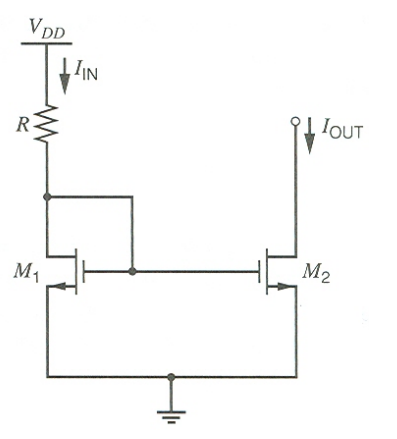

# 20230815 High-Performance Analog Circuit Design Lecture 13 Bias

# 1. 偏置电流的产生

构建对电源不敏感的偏置体系

利用VDD直接产生电流，但随着VDD变化较大，VDD变化则产生的电流（偏置电流）会直接发生变化→电流和VDD直接线性相关。

## 1.1 原理

观察上面这种偏置方式，可以发现M1的Vgs基本不随电流的变化→能否使用这个电压直接除电阻来产生一个偏压

$$
I_{OUT}=\frac{V_{GS1}}{R_2}\approx\frac{V_t+V_{OV}}{R_2}\approx \frac{V_t+\sqrt{\frac{2I_{IN}}{\mu C_{ox}\frac{W}{L}}}}{R_2}
$$

- 通过使用特别宽的MOS管，我们可以使$V_{OV}<<V_t$，来达到

$$
I_{OUT}\approx\frac{V_t}{R_2}
$$

这种情况下的敏感度：**8%**

## 1.2 BJT版本

使用BJT能使进一步随着温度变化进一步降低

$$
I_{OUT}=\frac{V_{BE1}}{R_2}=\frac{1}{R_2}\frac{kT}{q}ln(\frac{I_{IN}}{I_S})
$$

$$
S_{V_{DD}}^{I_{OUT}}=\frac{\frac{kT}{q}}{V_{BE}}\ e.g.\ \frac{26mV}{700mV}=3.7\%
$$

电流变化特别大→Vbe基本不发生变化

## 1.3 稳定性问题

电流偏置电路同样为一个环路，会有稳定性问题

$$
T(s)\approx g_{m1}R_1\cdot\frac{g_{m2}R_2}{1+g_{m2}R_2}\cdot\frac{1}{1+\frac{s}{\omega_{p1}}}\cdot\frac{1}{1+\frac{s}{\omega_{p2}}}
$$

Loop gain greater than 1 at low frequencies, two poles

Means that we must make one of the poles dominant to guarantee sufficient phase margin

- E.g. use large capacitance to ground
at drain of T1

## 1.4 自偏置

使用产生的稳定性达到了8%的电流来继续偏置这个管子，自己做一个循环

### 启动电路

我们需要一个很好的电流源来做一个基准电流源，我们发现这个电路可以自己产生一个偏置电流供给自己来做这个电流源

Unfortunately, self-biasing comes with a built in "chicken and egg problem"

- There exists a stable operating point with all currents = 0
- Can use a simple start-up circuit to solve this problem

<aside>
💡 但凡是有循环的（自己产生一个东西供给自己），就需要一个启动电路

</aside>

启动电路要验证所有的PVT

使用任何CMOS中存在的寄生的BJT来作为稳定偏压的产生（VBE与I无关）

# 2. 温度影响

## 2.1 减弱温度影响

PVT除了process和voltage之外，我们还需要使其对温度不敏感。对温度做微分

结果分成Vbe随温度变化的特性和电阻随温度变化的特性和电阻随温度变化的特性

可以看到在100K的温度变化范围内，产生的偏置电流变化了53%，是一个**很大的范围**

除了套一个BJT之外可以套两个不一样的，1：n的管子。这种情况下相同的压降变化会更小，这种情况下，温度变化100K重新变成了13%

任何一个有BJT的地方都会有一个MOSFET：

$V_{BE}/R\to V_{GS}/R$

$\Delta V_{BE}/R\to \Delta  V_{GS}/R$

## 2.2 Constant $g_m$ Bias

## 2.3 Constant Settling Time Bias

保证在任何温度下都能完成指定时间内的settle

> I. E. Opris, L. D. Lewicki, "Bias optimization for switched capacitor
amplifiers,"IEEE TCAS II, pp. 985-989, Dec. 1997.
> 

整个Settling Time：slew的时间（1.4倍的Vov）+linear settle的时间

希望电流能适应对应的电路，使settle时间在所有的Corner下都相同

