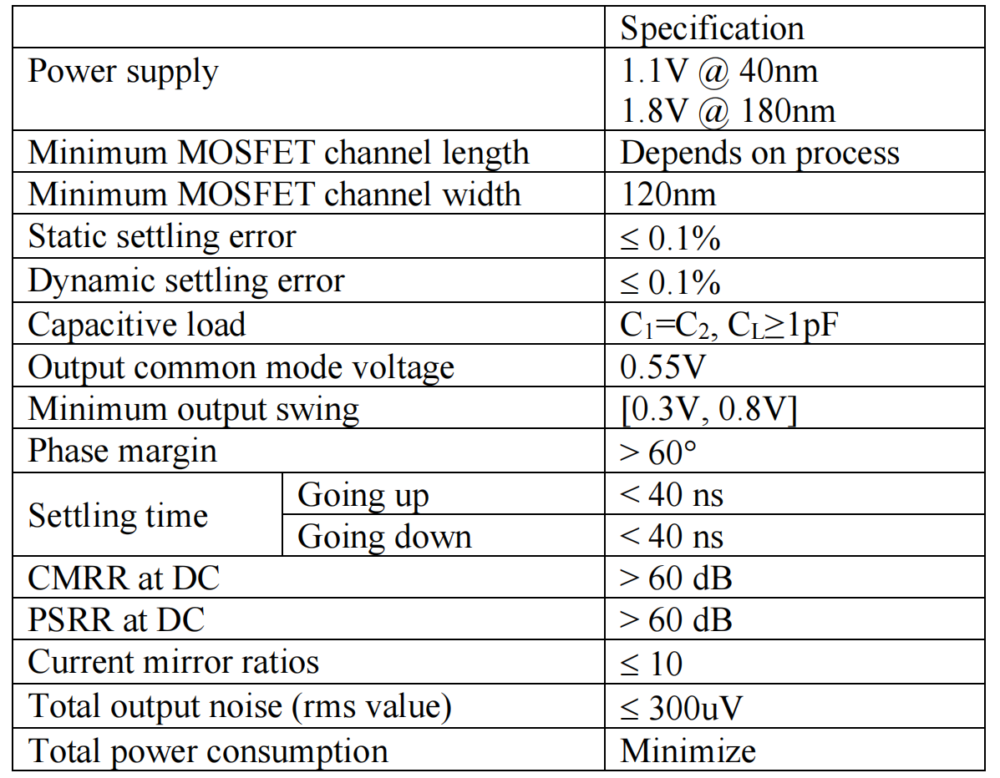

# 20230817 OTA design 01

完成课程设计Project，全差分两级运放设计

# 1. Spec.设计要求

# 2. 关键手算参数

课程Project要求采用电容负反馈网络

### 直流增益

根据静态误差要求可以算出放大器需要的直流增益

$$
\frac{1}{\beta}[1-(\frac{1}{A_{DC}{\beta}})]=0.999\frac{1}{\beta}\\\to \beta = \frac{C_1}{C_1+C_2}=\frac{1}{2}
$$

根据以上条件解得

$$
A_{DC}>66dB
$$

留一定裕度，认为直流增益应该达到至少70dB。在如此增益要求之下一般选用二级运放来保证摆幅和增益，考虑使用folded-cascode作为第一级基本结构，common-source作为第二级基本结构，并通过Miller电容补偿得到指定的相位裕度。

### 带宽

根据动态误差要求可以算出放大器需要的带宽

$$
1-e^{\frac{-t}{\tau}}>0.999\\\to e^{\frac{-t}{\tau}}<0.001
$$

此时需要根据40 ns的总settling time来得到

根据之前课上讲的内容，总settling time=slew+linear settle

> 为了dirty&fast的搭出一个原型设计，先近似分配20ns给slew，另外20ns给linear settle，后续如果有空间则对设计进行优化。
> 

因此取t=20ns

算得

$$
GBW\approx110MHz\to GBW \approx150MHz
$$

综上，得到基本的手算结果，直流增益＞70 dB，增益带宽积＞150MHz