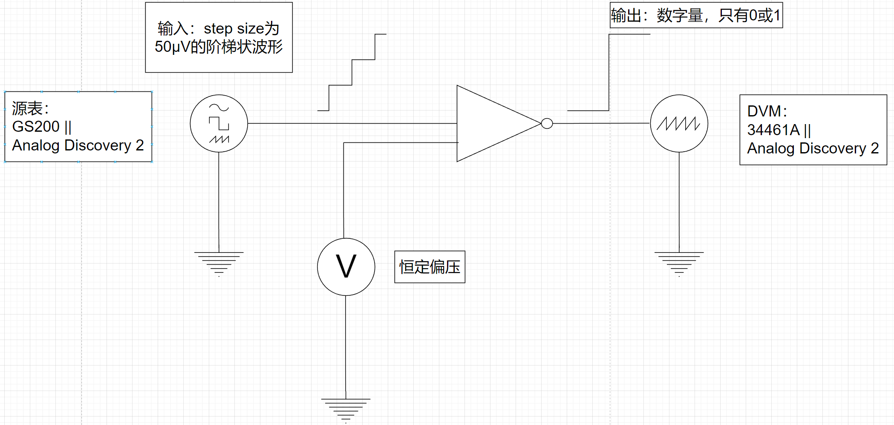

# 20230819 Test

# 1. 需求

产生一个step size为50uV的波形，从一个电压扫到另一个特定的电压，每上升50uV的时候扫1000个点，自动化产生波形，并记录结果

# 2. 方案

需要找到能产生50uV幅度的源，以及能自动完成采集的DVM

大概的测试架构如图，如果是用源表实现就是图中的情况，如果是用MCU实现把源表换成DAC，DVM换成ADC即可

## 2.1 仪器仪表方案

- **基于Analog Discovery 2：**

Analog Discovery 2有模拟输出和数字输入（逻辑分析仪）

可以直接用模拟输出通道给输出，同时把反相器的输入接回逻辑分析仪。

Datasheet上说明的精度：

可能需要一个电阻衰减网络。

AD2可以直接通过Python API控制：

- [https://pydwf.readthedocs.io/en/latest/welcome.html](https://pydwf.readthedocs.io/en/latest/welcome.html)
- [https://digilent.com/reference/software/waveforms/waveforms-sdk/reference-manual](https://digilent.com/reference/software/waveforms/waveforms-sdk/reference-manual)
- **基于GS200+34461A**

两个表的分辨率（产生/读入）都可以达到1uV，足以满足实验要求。需要使用GPIB与仪表通信，目前只有GPIB转PCIe转接卡，需要台式机和支持的PCIe槽才能使用。已经购买了USB转GPIB转接线。

驱动这两个表可以使用Labview，也可以使用Python的Qcodes库

[Home — QCoDeS 0.40.0.dev218 documentation](https://qcodes.github.io/Qcodes/)

GS200的驱动库：[Yokogawa Drivers — QCoDeS 0.40.0.dev218 documentation](https://qcodes.github.io/Qcodes/drivers_api/Yokogawa.html#qcodes.instrument_drivers.yokogawa.YokogawaGS200)

34461A的驱动库：[Keysight Drivers — QCoDeS 0.40.0.dev218 documentation](https://qcodes.github.io/Qcodes/drivers_api/Keysight.html#qcodes.instrument_drivers.Keysight.Keysight34461A)

- **基于STM32H7系列**

查阅H7系列数据手册，发现DAC分辨率只有12bit，ENOB更是只有10.9（ADC是16bit，我正好记反了），而且一般的32开发板为了省事模拟域的供电就直接和给数字部分的供电合并了，如果采用32的话可能需要自己设计模拟部分的供电（比如用LT3045这种高精度的LDO）

- **基于STM32H7+片外DA**

可以给32挂一个片外DA，DAC采用SPI或者IIC和32通信。比较好的选择就是AD5781（18bit）&AD5791（20bit）

- 5781

- 5791

<aside>
⚠️ 另一个可能的坑是，上万个数据点可能会塞满23的ram，如果是通过串口实时传回PC，PC的串口调试助手不确定有没有这么大的buffer存这些数据，可能需要自己动上位机（比较麻烦），而用仪表或者Qcodes这种现成的仪器库可以避免这个问题

</aside>

# 3. 当前进度

- 国锵同学调Analog Discovery 2，看看能不能通过一个AD2搞定。如果可以的话是最简单的
- 我已经下单了USB转GPIB，等到了之后看一下Qcodes实现这个功能麻不麻烦，如果不麻烦直接用Qcodes来
- 如果以上均出问题了，再考虑自己画32或者用32+外部DA芯片解决（感觉比前两个实现会有坑，但坑的位置暂时不明）