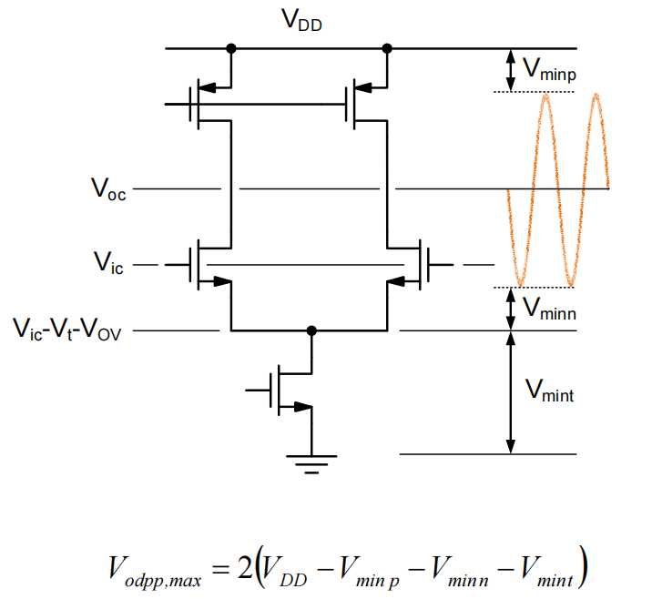

# 11. Two Stage OTA & Frequency Compensation Summary

### Two Stage OTA & Frequency Compensation Summary 内容目录

1. **单级运放**
    1. 1.1 输出摆幅
    2. 1.2 增益
    3. 1.3 两级放大器
2. **Frequency Compensation**
    1. 2.1 多极点与稳定性
    2. 2.2 密勒补偿与极点分裂
    3. 2.3 主极点近似
    4. 2.4 解决右半平面零点
    5. 2.5 多级Miller补偿
3. **General OpAmp**
    1. 3.1 写出小信号模型
    2. 3.2 解决方法
    3. 3.3 Return Ratio Analysis
    4. 3.4 闭环传递函数
    5. 3.5 Summary of OTA with cap.
4. **反馈OTA中的噪声**
    1. 4.1 积分cheatsheet
    2. 4.2 常见运放
    3. 4.3 SNR in differential pair

# 1. 单级运放

## 1.1 输出摆幅

对于单级运放来说其输出受限，同时输入与输出强关联

如果输入输出共模均定在$V_{DD}/2$，则可用的单端峰峰值大概在两个Vth，差分的峰峰值在四个Vth

但对于短沟道器件来说，饱和区和线性区的转折并没有那么明显，如何定义输出摆幅？

<aside>
💡 增益什么时候掉了3dB，就认为输出摆幅受限了

</aside>

## 1.2 增益

$$
a_{v0}=g_{mn}\cdot \frac{r_{on}r_{op}}{r_{on}+r_{op}}=a_{von}\frac{1}{1+\frac{r_{on}}{r_{op}}}=a_{von}\frac{1}{1+\frac{g_{mp}}{g_{mn}}\frac{a_{von}}{a_{vop}}}
$$

$$
a_{vo}=a_{von}\frac{1}{1+\frac{(g_m/I_D)_p}{(g_m/I_D)_n}\frac{a_{von}}{a_{vop}}}
$$

$$
for:(g_m/I_D)_p=(g_m/I_D)_n \to a_{vo}=a_{vop}||a_{von}
$$

例：当$a_{von}=a_{vop}=50, (g_m/I_D)_p=(g_m/I_D)_n\to a_{vo}=25$

$$
static\ gain\ error \approx1/T_o\approx1/a_{vo}\approx1/25\approx4\%
$$

静态误差过大，不适用于很多精密应用场景

## 1.3 两级放大器

改善单级放大器输出摆幅与增益：

- 更大的输出摆幅：输入共模电平与输出共模电平无关
- 更大的增益：$(g_mr_O/2)^2$

共模负反馈：与单端的共模负反馈相同

共模负反馈可以做全局的（比如下图），但是一个三级的放大器稳定性问题，设计存在挑战

也可以做成局部的，即每一级各自做自己的共模反馈

<aside>
💡 Cross-coupled共模小信号与差模小信号不同，不需要共模反馈

</aside>

并不是所有全差分电路都需要共模负反馈，还是需要看有没有高阻节点

# 2. Frequency Compensation

与单级放大器始终只有90°相位裕度不同，两级放大器引入了两个高阻节点，因此需要考虑其稳定性问题

环路增益：

$$
T(s)=\beta\frac{g_{m1}R_1\cdot g_{m2}R_2}{(1-\frac{s}{p_1})\cdot(1-\frac{s}{p_2})}=\beta\cdot a_1(s)a_2(s)=\beta\cdot a(s)\\p_1=-\frac{1}{R_1C_1},p_2=-\frac{1}{R_2C_2}
$$

减小virtual ground上的电容：

- 使用Cascode管缓解Miller
- 使用neutralization cap

<aside>
💡 正反馈能造负电容

</aside>

不太可行，无法保证一个恒定的增益

## 2.1 多极点与稳定性

电路里极点多了，相位裕度会很快下降

引入一个主极点（把其他极点推远），来获取相位裕度

主极点与非主极点倍数与相位裕度之间的关系

一个极点占主导，另一个极点需要在UGB之外

<aside>
💡 最优的相位裕度在60°

</aside>

## 2.2 密勒补偿与极点分裂

引例：

$$
\beta=0.5,G_{m1}=G_{m2}=1mS,R_1=R_2=100kΩ,C_2=1pF,PM=72\degree\\f_{p2}=\frac{1}{2\pi R_2C_2}=1.6MHz,f_C=\frac{f_{p2}}{3}=530kHz\\f_{p1}=\frac{f_c}{\beta\cdot G_{m1}R_1 \cdot G_{m2}R_2}=106Hz
$$

$$
C_1=\frac{1}{2\pi\cdot f_{p1}R_1}=15nF
$$

从以上的例子可以看出

- 非常低的$f_C$，从而导致非常低的闭环带宽
- 引入了一个巨大无比的电容

<aside>
💡 人为引入一个Miller电容，造成Pole splitting

</aside>

- 对低频来说，M2的增益可以把Cc等效成一个大电容，把主极点往里推很多
- 对高频来说，Cc是一个前馈通路，把M2变成了一个diode连接的晶体管，把非主极点往外推很多

## 2.3 主极点近似

两级放大器的传递函数

非常复杂，缺少直觉性的认识

$$
a(s)=\frac{v_o}{v_i}=\frac{g_{m1}R_1\cdot g_{m2}R_2\cdot(1-s\frac{C_c}{g_{m2}})}{1+s[(C_2+C_c)R_2+(C_1+C_c)R_1+g_{m2}R_2R_1C_C]+s^2R_1R_2(C_1C_2+C_cC_2+C_CC_1)}
$$

主极点近似

$$
D(s)=(1-\frac{s}{p_1})\cdot(1-s\frac{s}{p_2})=1-s(f\frac{1}{p_1}+\frac{1}{p_2})+\frac{s^2}{p_1p_2}
$$

由于实用的电路要求主极点频率远远小于次极点频率

$$
D(s)\approx1-s(\frac{1}{p_1}+\frac{s^2}{p_1p_2})
$$

最终结果

$$
a(s)\approx a_{vo}\cdot\frac{1-\frac{s}{z}}{(1-\frac{s}{p_1})(1-\frac{s}{p_2})}
$$

结合前面的式子

$$
p_1\approx-\frac{1}{R_1(C_1+C_C)+R_2(C_2+C_C)+g_{m2}R_1R_2C_C}\approx-\frac{1}{g_{m2}R_2R_1C_C}
$$

$$
p_2\approx-\frac{g_{m2}}{\frac{C_1C_2}{C_C}+C_1+C_2},z=\frac{g_{m2}}{C_C}
$$

注意有一个**右半平面的零点**

右半平面的零点对相位裕度是有害的（分子有理化，等价于一个左半平面极点）

## 2.4 解决右半平面零点

<aside>
💡 **把反馈回路留下，去掉前馈通路**

</aside>

- Create unilateral feedback through Cc
    - Add a voltage buffer: source follower
    - Add a current buffer: cascode compensation
        - Ahuja, IEEE J. Solid-State Ckts., 12/1983
        - Ribner, IEEE J. Solid-State Ckts., 12/1984
- "Nulling resistor"
    - Push zero to infinity
    - Push zero into LHP and cancel nondominant pole (!)

### Voltage Buffer

较难实现，第二级如果是一个满摆幅的输出级，则很难设计一个满摆幅的x1buffer来实现这个功能（输入轨道轨的buffer）

### Current Buffer

Cc处看到一个低阻节点，而Icc处是一个高阻的电流源，没有前馈通路了

对输出节点没有任何影响，主要影响在功耗$\to$把第二级的反馈嵌入第一级的cascode

但把整个系统变成了一个三阶的系统，并不是很好设计

### Nulling resistor

调零电阻，改变零点的位置，把零点推导无穷远去。坏处是额外引入了另一个极点

$$
a(s)\approx a_{v0}\cdot\frac{1-sC_C(\frac{1}{g_{m2}}-R_z)}{(1-\frac{s}{p_1})\cdot(1-\frac{s}{p_2})\cdot(1-\frac{s}{p_3})}
$$

如果不能完全cancel掉的话，就会造成插入了一堆零极点对，影响到Settle

<aside>
💡 pole-zero越靠近，则settle越慢

</aside>

### 两级放大器

Cross Over Frequency:

$$
\omega_c\approx\beta\frac{g_{m1}}{C_c}
$$

Zero

$$
\omega_z=\frac{g_{m2}}{C_C}
$$

<aside>
💡 如果Miller的零点并不在UGB内，并不需要主动补偿零点（$g_{m2}$很大的情况下）

</aside>

电阻的物理实现：线性区的MOS管

## 2.5 多级Miller补偿

较复杂

- Feedforward compensation（主要用处，DSM，无settle事宜）
    - Adding parallel path
    - Can enable very low-power amplifier
    - Rely on pole-zero cancellation
    - Settling may not be good

Thandri, Bharath Kumar, and José Silva-Martínez. "A robust feedforward compensation scheme for multistage operational transconductance amplifiers with no Miller capacitors." *IEEE Journal of Solid-State Circuits*38.2 (2003): 237-243.

# 3. General OpAmp

产品中的通用运放一般会以最坏的情况来做frequency compensation

最坏情况：单位增益负反馈

有些OpAmp会提供一个pin来供用户来选择

<aside>
💡 针对特定应用来设计放大器

</aside>

# 4. 反馈OTA中的噪声

- General method
    - Identify noise sources
    - Derive noise transfer functions (NTF)
    - Find total noise power from each source by integrating PSD·NTF from 0 to ∞
    - Add up noise powers

通过能量相加的方式在噪声带宽内积分即可

## 4.1 积分cheatsheet

## 4.2 常见运放

### 单极放大器

### 单级Cascode放大器

### 两级放大器

<aside>
💡 Miller补偿运放需要用Cc来把噪声压低

</aside>

## 4.3 SNR in diff

差分对信噪比是有帮助的，3dB的获益，需要付出2倍的功耗

$$
SNR \propto\frac{V_o^2}{\frac{kT}{C}}
$$