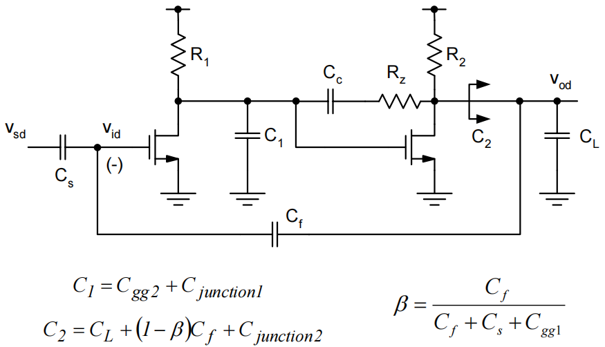

# 12. OTA design consideration Summary

# 两级运放设计流程

<aside>
💡 尽可能通过手算减少迭代的次数，尤其是在Cadence里迭代的次数

</aside>

**小信号推导完成后会发现有很多不知道的参数（比如特定电容取值），根据经验取值即可**

The design equations for a two-stage OTA are fairly complex, and involve several capacitances that may not be known a priori.

- Solution: Iterative hand analysis/design
    - Most efficiently done using e.g. Excel, Matlab
- Possible design flow
1. Pick$C_{gg1}$,$C_{gg2}$based on heuristics (see following slides)
2. Pick $L$  based on gain requirement
3. Use initial guesses for junction capacitances
4. Calculate $C_C$ based on noise spec (or based on optimum power)
5. Find $g_m,f_T,g_m/I_D$
6. Iterate, using different choices in step 1
7. Find $W$  for SPICE verification
8. Resolve potential discrepancies
    1. E.g. refine $C_{junction}$ estimates if necessary

# 1. 误差来源

误差主要从以下三个地方产生：

- 设计管子并不都是工作在$V_{dd}/2$这个点上，与扫参数的管子偏置不同
- 结电容$C_{junction}$估计不准
- 公式都是近似过的

<aside>
💡 与$g_m/I_D$可能会有偏差，但与平方律差距很大，不要用平方律

</aside>

# 2. 设计过程

## 2.1 首先确定一个电路的拓扑结构，根据这个拓扑结构来确定电容的取值

## 2.2 确定电容值之后确定GBW

$$
\omega_c\approx\frac{1}{g_{m2}R_2R_1C_c}\cdot\beta\cdot g_{m1}R_1g_{m2}R_2=\beta\frac{g_{m1}}{C_C}\\\beta=\frac{C_f}{C_f+C_s+C_{gg1}}
$$

- 小的$C_{gg1}$（更高的$f_t$，更小的$g_m/I_D$）可以有效帮助增加$\beta$，从而增加$\omega_c$

<aside>
💡 一个不错的起始点是认为$C_{gg}$值和$C_f,C_S$值相同

</aside>

## 2.3 确定非主极点的位置

$$
\omega_{p2}\approx\frac{g_{m2}}{\frac{C_{Ltot}C_{gg2}}{C_C}+C_{gg2}+C_{Ltot}},C_{Ltot}\approx C_L+(1-\beta)C_f
$$

$$
\frac{1}{\omega_{p2}}\approx(\frac{C_{gg2}}{g_{m2}}+\frac{C_{Ltot}}{g_{m2}})(1+\frac{\frac{C_{Ltot}C_{gg2}}{C_{gg2}+C_{Ltot}}}{C_C})
$$

<aside>
💡 一个不错的起始点是认为$C_{gg2}\approx C_{Ltot}$

</aside>

对于一个给定的$\omega_{p2}$和一个固定的$C_{Ltot}$

- Choosing Cgg2 much smaller than CLtot means excess gm2/Cgg2=ωT2 and
therefore small (gm/ID)2
- Choosing Cgg2 much larger than CLtot will cost excess gm2 (power) to meet
ωp2 target

**以上两个内容展现了设计过程中的trade off，实际设计过程中要根据两个极点的位置来优化$C_{gg1},C_{gg2}$，从而来优化功耗**

## 2.4 确定Cc的值

- In practice, and particularly for high DR designs, Cc is often set by noise requirements.
- For designs that are not constraint by noise, it is interesting to assume Cgg2=CLtot (not necessarily optimum) to develop further qualitative insight.
    - With this choice, we have
    
    $$
    \frac{1}{\omega_{p2}}\approx\frac{2}{\omega_{T2}}(1+\frac{C_{Ltot}}{2C_C})
    $$
    
- Cc large means that we can use lower ωT2 (higher gm/ID) and save power in the second stage.
    - But larger Cc also requires larger gm1 and thus more power in the first stage
    - This implies that there will be a design-dependent optimum for Cc

## 2.5 共模负反馈

因为高阻节点的存在，需要给全差分电路设计共模负反馈

如何选择反馈的g有多大？

<aside>
💡 CMFB同样是一个环路，有自己的带宽

</aside>

CMFB：在自身的带宽以内把输入共模定住$\to$一般取至少**30%**差分对的环路带宽

稳定共模的系统误差：

$$
\Delta V_{OC}\approx\frac{I_D{(MB)}-I_D{(MTa)-I_D(MTb)}}{g}=\frac{\Delta I_D}{g}
$$

$$
\Delta I_D=100\mu A,g=10mS\to\Delta V_{OC}=10mV
$$

g的边界：

- 上边界由稳定性确定
- 下边界由CMFB的带宽和共模电压偏差要求确定