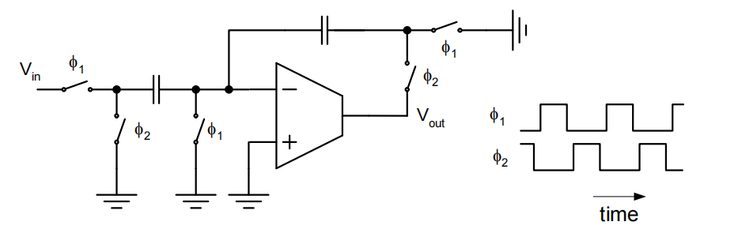

# 13. Step Response & Slew Summary

### Step Response & Slew Summary 内容目录

1. **开关电容放大器**
2. **设计考量**
3. **Slew**
4. **Slew Rate**
    1. 4.1 两级运放Slew设计
    2. 4.2  Slew对大信号的影响
5. **加入Slew的设计流程**

# 1. 开关电容放大器

在开关电容放大器中，放大器需要对阶跃电压进行响应$\to$最快能工作在什么频率下？

<aside>
💡 主要关心输出的时域波形是如何变化的

</aside>

首先假设其为一个单极点系统

$$
A(s)\approx\frac{V_{out}(s)}{V_{in}(s)}=-\frac{C_S}{C_f}\frac{T_0}{1+T_0}\cdot\frac{1}{1+\frac{s}{\omega_c}}\\T_0=\beta\cdot G_mR_0,\beta=\frac{C_f}{C_f+C_S+C_{in}}\\\omega_c\approx\beta\cdot\frac{G_m}{C_{Ltot}},C_{Ltot}=C_L+(1-\beta)\cdot C_f
$$

对传递函数做反拉普拉斯变换，得到时域波形

- 有限的直流增益导致了静态误差$\epsilon_0$
- 有限的带宽导致了动态误差$\epsilon_d$，随着时间衰减

# 2. 设计考量

- 需要较大的直流增益来减小静态误差
    - $|\epsilon_0\approx1/T_0|$
    - $T_0>1000$来实现千分之一的静态误差
- 需要小的时间常数（大的带宽）来实现快速settle
- 可以通过要求给出的settling time来得到动态误差的范围

$$
-\epsilon_{d,tot}=-e^{-t_s/\tau}\\t_s=-\tau\cdot ln(\epsilon_{d,tot})\\t_s=-\frac{1}{\omega_c}\cdot ln(\epsilon_{d,tot})
$$

提升3倍的准确度，只需要增长3倍的settle time即可

开关电容放大器时钟频率与settling时间

### 最快能做到多快

Rule of thumb: $f_t/100$是开关电容放大器能达到的最大速度

- 速度由UGB决定$\to$通过加功耗可以外推$\to$$\omega_{t2}$

<aside>
💡 60%的时间给Linear settling

</aside>

当信号接近电路的极限性能时，功耗会非常大

实际上一般比较困难达到$f_{clk}>f_t/50$

- 运放结构限制
    - 比如信号通路中有一个PMOS
- 功耗限制
    - 在接近工艺节点限制的时候，功耗会很快增加
- 时钟裕度
    - 两相非交叠时钟
- 其他情况

相位裕度与settle时间之间的关系

仿真testbench搭建

对DC来说，放大器是无反馈通路的（电容是断路的），任何放大器自身的offset都会导致输出饱和，因此需要一个大电阻做反馈

如果负载变轻，即变为300fF，可以看到明显下冲

电容的前馈通路

$$
\frac{V_{odstep}}{V_{idstep}}=\frac{C_S}{C_S+C_{in}+\frac{C_fC_L}{C_f+C_L}}\cdot \frac{C_f}{C_f+C_L}
$$

使用两种等效的建模方式对前馈通路造成的下降做分析

- 利用电容分压网络计算e指数settle的起点位置
- 使用拉普拉斯反变换对带有前馈通路零点的传递函数进行分析

$$
A(s)=-\frac{C_S}{C_f}\frac{1-\frac{s}{z}}{1-\frac{s}{p}}\cdot\frac{T_0}{1+T_0},z=\frac{G_m}{C_F},p=-\frac{\beta G_m}{C_L+(1-\beta)C_f}
$$

得到新结果

$$
V_{od}(t)=L^{-1}\{A(s)\cdot\frac{V_{step}}{s}\}=-\frac{C_s}{C_f}\cdot V_{idstep}\cdot\frac{T_0}{1+T_0}\cdot(1-[1-\frac{p}{z}]e^{-t/\tau}))\\1-\frac{p}{z}=\frac{C_L+(1-\beta)C_f+\beta C_f}{C_L+(1-\beta)C_f}=\frac{C_L+C_f}{C_L+(1-\beta)C_f}=\frac{1}{1-\beta\frac{C_f}{C_f+C_L}}
$$

带入之前的例子

$$
\frac{1}{1-0.48\frac{500fF}{500fF+300fF}}=1.4\to V_{od}(t=0)\approx10mV(1-1.4)=-4mV
$$

与仿真吻合较好

矫正后的settling time

$$
t_s=--\frac{1}{\omega_C}\cdot ln(\epsilon_{d,tot}[1-\beta\cdot \frac{C_f}{C_f+C_L}])
$$

注意新的项是＜1的，因此settle所需要的时间会延长。不过一般情况下（β不大，两个电容容值相近）其实并不显著。

# 3. Slew

使用大信号作为输入，查看阶跃响应

$C_s=C_f=500fF,C_L=10pF,\beta=0.48,G_m=1mS,G_mR_o=85$

下冲是由前馈电容造成的

$$
\frac{V_{odstep}}{V_{idstep}}=\frac{C_S}{C_S+C_{in}+\frac{C_fC_L}{C_f+C_L}}\approx -1V\frac{500fF}{500fF+40fF+500fF}=-480mV
$$

在输入端会看到-480mV的下冲$\to$会让放大器输入差分对管离开饱和区

### 输入差分对管输入端与输出电流关系

在slew过程中，放大器在用一个恒定的电流（尾电流）来驱动输出

slew在输入差分电压＜$1.4\times(2/\frac{g_m}{I_D})$时结束

- 在这个点差分对重新进入其线性区
- 剩下的settling时间一般也被称为线性settling（实际上时域上看是e指数）

**During "slewing", the amplifier drives its output with a constant current (equal to tail bias)**

<aside>
💡 输入电流完全偏向了某一边

</aside>

# 4. Slew Rate

压摆率：输入差分对偏离线性区时输出节点信号上升的斜率

$$
SR=\frac{dV_{od}}{dt}=\frac{I_{TAIL}}{C_{Ltot}}=\frac{I_{TAIL}}{C_L+(1-\beta)C_f}
$$

花费时间计算：

- 电压起点：$|V_{step}|$
- 电压终点：$2.8/\frac{g_m}{I_D}$

$$
t_{slew}=\frac{|V_{step}|-(2.8/\frac{g_m}{I_D})}{\beta\cdot SR}
$$

在本例中

$$
SR=\frac{I_{TAIL}}{C_{Ltot}}\approx\frac{200\mu A}{10pF}=20\frac{V}{\mu s}\\t_{slew}=\frac{480mV-280mV}{0.48\cdot20\frac{V}{\mu s}}=21ns
$$

slew的出现并没有使settling time发生太多变化

### 总settling time

$$
t_s=t_{slew}+t_{in}\approx\frac{|V_{step}-2.8/(\frac{g_m}{I_D})|}{\beta\cdot SR}-\tau ln(\epsilon_{d,tot})\\SR=\frac{I_{TAIL}}{C_{Ltot}}=\frac{I_{TAIL}}{C_L+(1-\beta)C_f},\beta=\frac{C_f}{C_f+C_s+C_{in}}\\V_{step}=V_{istep}\frac{C_s}{C_s+C_{in}+\frac{C_fC_L}{C_f+C_L}}=V_{istep}\frac{C_s}{C_s+C_{in}+C_f}
$$

β如果足够小，则slew一定不会发生

## 4.1 两级运放Slew设计

第一级输出节点相对来说是稳定的

两个节点一边是抽电流的，另一边是补电流的

负端的slew rate是由输出节点较小的那个决定的

$$
SR_{-,MAX}=\frac{d(V_{on}-V_{ip})}{dt}=min\{\frac{I_{TAIL/2}}{C_C},\frac{I_{B2}}{C_C+C_{Ltot}}\}
$$

正端的slew rate可以达到

$$
SR_{+,MAX}=\frac{d(V_{Op}-V_{In})}{dt}=\frac{I_{TAIL/2}}{C_C}
$$

为了使正端和负端的slew rate相等，我们需要

$$
\frac{I_{TAIL}}{C_C}\leq \frac{I_{B2}}{C_C+C_{Ltot}}
$$

## 4.2 Slew对大信号的影响

slew决定了放大器能输出的最大斜率，如果输出斜率小于信号的最大斜率（比如正弦信号过零点时），那么波形就会发生失真

<aside>
💡 Slew：无法提供更大的电流→把第一级的尾电流做大

</aside>

# 5. 加入Slew的设计流程

- Set up a spreadsheet for small signal design as usual
    - Settling time requirement translates into minimum "linear" bandwidth spec (based on linear analysis, without slewing)
- Introduce a bandwidth spec scale factor K≥1 in your design script
    - If the circuit slews, we will need more bandwidth than predicted
    from linear analysis
- Perform design optimization as usual, begin with K=1
- Calculate slewing time, add to linear settling time
    - Done if $t_{slew}$=0
- Increase K until design meets settling time spec
    - In the process, you may consider to optimize $g_m/I_D$ values to minimize power in presence of slewing

<aside>
💡 增益误差由于slew的存在变成了和输入有关的函数

</aside>