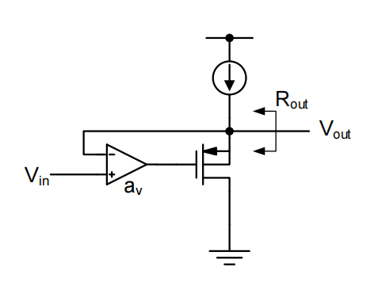

# 14. Blackman, CMFB, OTA variant Summary

### Blackman, CMFB, OTA variant Summary 内容目录

1. **Blackman impedance theory**
    1. 1.1 计算方法
    2. 1.2 Gain Boosting
2. **常见OTA架构**
    1. 2.1 Telescopic
    2. 2.2 Folded Cascode OTA
    3. 2.3 Current Mirror OTA
    4. 2.4 Gain Boosted Gain Boosters
3. **CMFB**
    1. 3.1 控制共模电平
    2. 3.2 与理想共模电压做比较
    3. 3.3 检测共模电平

# 1. Blackman impedance theory

## 1.1 计算方法

$$
Z_{port}=Z_{port}(k=0)\cdot \frac{1+T(port\ shorted)}{1+T(port\ open)}
$$

1. 首先找到开环时的端口阻抗
    1. e.g. set $g_m$=0
2. 计算端口认为是短路时候的环路增益
3. 计算端口认为是开路时候的环路增益
- 很多情况下开路或短路的环路增益为0

$$
R_{out}(k=0)=R_{out}(a_v=0)=\frac{1}{g_m}
$$

$$
T(port\ shorted)=0\\T(port\ open)=a_v\\R_{out}=\frac{1}{g_m}\frac{1}{1+a_v}
$$

## 1.2 Gain Boosting

### "Regulated Cascode" or "Gain Boosting" technique

$$
R_{out}(a_v=0)\approx r_{o1}\cdot g_{m2}r_{o2}\\T(port\ open)=0\\T(port\ short)=a_v\frac{g_{m2}}{g_{mb2}+g_{m2}}\approx a_v\\R_{out}\approx r_{o1}\cdot g_{m2}r_{o2}\cdot(a_v+1)\\\approx r_{o1}\cdot g_{m2}r_{o2}\cdot a_v
$$

基本实现：

额外增加了一个环路，需要校准额外环路的crossover frequency能比M2的非主极点更早到

Must compensate local feedback loop such that its crossover frequency $\omega_c$ occurs before non-dominant pole at source of M2

> See Bult, JSSC 12/1990 for design considerations
> 

# 2. 常见OTA架构

## 2.1 Telescopic

只使用两个电流就实现了两级运放的增益

输出摆幅严重受限

设计难点：设计偏置

使用叠管子的方法凑出所需要的Vgs，中间的偏置电路可以消耗20%尾电流源的功耗，即尾电流源为1.2倍的预先值

## 2.2 Folded Cascode OTA

<aside>
💡 轨到轨的基础结构

</aside>

以上两种架构均有两个高阻节点，分别为输入输出节点

- 非主极点位置$\omega_{p2}=g_{m1a}/C_p,C_p=C_{gs1a}+C_{j1a}+C_{j1}$
- 补偿难度较低
    - 使$k\cdot\beta\cdot g_{m1}/C_L<\omega_{p2}$,$k$为需要多少相位裕度的系数，$k=3\to72\degree$

## 2.3 Current Mirror OTA

第一级的电流通过电流镜转为一个更大的电流

- 输出摆幅很大
- 低速低功耗的场景

<aside>
💡 更快的放大器：希望信号通路上主要是NMOS点

</aside>

### 全NMOS信号路径

在第一级输出之后通过一个电容做一个level shift，之后再送给第二级的NMOS上

## 2.4 Gain Boosted Gain Boosters

嵌套的Gain Boosted

# 3. CMFB

共模反馈的架构

- 如何检测共模电平
- 如何和理想共模电压做比较
- 如何控制共模电平

## 3.1 控制共模电平

<aside>
💡 把固定的一部分电流分出来，变成另一个可变的电流源

</aside>

## 3.2 与理想共模电压做比较

如果以上放大器增益不足，则可用替换为一个五管放大器（但引入五管放大器则引入了一个高阻节点，会有带宽的问题）

## 3.3 检测共模电平

如果串接一个电阻，一般需要并联一个电容来解决高频稳定性的问题

电阻会衰减增益，为了保证这个增益只能使用一个巨大的，严重消耗版图面积的电阻$\to$使用开关电容共模负反馈

<aside>
💡 注意共模负反馈的极性

</aside>

第二级如果是一个CS stage，则输出会导致相位增加180°

### 共模半电路

注意共模反馈环路也有稳定性的问题

共模负反馈一般只有几种选项：

- 电阻平均 or 开关电容
- 全局 or 各自单独的共模反馈
    - 输出级，R或者Switch Cap