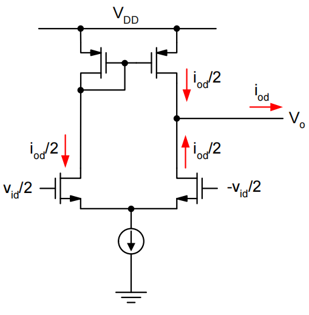

# 15. Output Stage & Bias Summary

### Output Stage & Bias Summary 内容目录

1. **单端输出**
    1. 1.1 单位增益buffer
    2. 1.2 反向放大器
2. **输出级**
    1. 2.1 Telescopic
    2. 2.2 Folded Cascode OTA
    3. 2.3 Current Mirror OTA
    4. 2.4 Gain Boosted Gain Boosters
3. **偏置电流的产生**
    1. 3.1 原理
    2. 3.2 BJT版本
    3. 3.3 稳定性问题
    4. 3.4 自偏置
4. **温度影响**
    1. 4.1 减弱温度影响
    2. 4.2 Constant $g_m$ Bias
    3. 4.3 Constant Settling Time Bias

# 1. 单端输出

之前的设计主要集中在输入级的设计上，现在来看一下输出级

差分输入→单端输出

使用电流镜来实现输出，起到了差分转单端的作用

Half of the output current comes directly from the differential pair, the other half goes through a current mirror with finite bandwidth→**Pole-Zero doublet**

$$
i_o=g_mv_{id}(\frac{1}{2}+\frac{1}{2}\frac{1}{1-\frac{s}{p}})\\=g_mv_{id}\frac{1-\frac{s}{2p}}{1-\frac{s}{p}}
$$

有电流的交汇，就会有零点的产生→差分转单端的电流镜导致了一个零点和一个极点的产生

## 1.1 单位增益buffer

利用差分转单端实现一个差分输入单端输出的单位增益buffer

<aside>
💡 最好的单位增益电路，差分输入单端输出

</aside>

- 闭环环路增益为1
- 输出阻抗为$1/g_m$
- **输出范围等于共模输入范围**
    - 使用folded-Cascode实现较宽的输入范围

## 1.2 反向放大器

输入极性是与输出相反的

- 输入动态范围较大，DC量与共模相同
- β会变小
- Note that $C_x$ is nontrivial to calculate due to asymmetry

利用两级放大器将输入特性与输出特性去耦合

- 第一级，单端转差分的五管
- 第二级，单端的CS stage

以上电路会引入一个offset：M3，M4，M6如果W/L相同，才能输出一个同样的共模电平，但大多数时候两级的宽长比并不相同。为了能达到输出共模，则输入相当于天生多了个偏置→系统offset

五管的上面两个管子只提供了$r_o$和噪声，而没有提供$g_m$。

消耗了功耗而没有提供增益→进一步提高能效

- 可以第一级使用两个反相器类型的放大器，第二级完成差分转单端的任务

# 2. 输出级

- 需要能够驱动电阻负载（低电阻）
    - 连续时间的RC滤波器
    - 片外电阻负载
    - 线缆驱动器
        - E.g. 双绞线（网线，ISDN，ADSL）
- Solutions
    - 使用OTA+源跟随器
        - 输出摆幅受限
    - 使用OTA+低增益共源极
        - 牺牲掉某一级$g_m\cdot R_L\approx1$
        - $20mS\cdot50 \Omega=1, I_{BIAS}=20mS\cdot10V^{-1}=2mA$
    - 其他输出级（下面讨论）
    
    
    
    
    
    ### A：全导通
    
    
    
    ### B：导通50%
    
    
    
    ### AB：介于AB之间，略微提升线性度
    
    用diode模拟，输出摆幅受限
    
    
    
    C：谐波导通
    

在Class-AB的基础上进行修正

### Class G

提升功耗：改V

### Class D

或者改I，让管子处于线性区

Class AB 输出级：可以很好地偏置M25和M26

轨道轨输入+轨道轨输出

Folded Cascode：N input pair与P input pair cover整个范围

低电压版本

---

# 偏置电流

# 1. 偏置电流的产生

构建对电源不敏感的偏置体系

$$
I_{OUT }\approx I_{IN}=\frac{V_{DD}-V_t-V_{OV}}{R}
$$

利用VDD直接产生电流，但随着VDD变化较大，VDD变化则产生的电流（偏置电流）会直接发生变化→电流和VDD直接线性相关。

观察上面这种偏置方式，可以发现M1的Vgs基本不随电流的变化→能否使用这个电压直接除电阻来产生一个偏压

$$
I_{OUT}=\frac{V_{GS1}}{R_2}\approx\frac{V_t+V_{OV}}{R_2}\approx \frac{V_t+\sqrt{\frac{2I_{IN}}{\mu C_{ox}\frac{W}{L}}}}{R_2}
$$

- 通过使用特别宽的MOS管，我们可以使$V_{OV}<<V_t$，来达到

$$
I_{OUT}\approx\frac{V_t}{R_2}
$$

这种情况下的敏感度：**8%**

## BJT版本

使用BJT能使进一步随着温度变化进一步降低

$$
I_{OUT}=\frac{V_{BE1}}{R_2}=\frac{1}{R_2}\frac{kT}{q}ln(\frac{I_{IN}}{I_S})
$$

$$
S_{V_{DD}}^{I_{OUT}}=\frac{\frac{kT}{q}}{V_{BE}}\ e.g.\ \frac{26mV}{700mV}=3.7\%
$$

电流变化特别大→Vbe基本不发生变化

### 稳定性问题

电流偏置电路同样为一个环路，会有稳定性问题

$$
T(s)\approx g_{m1}R_1\cdot\frac{g_{m2}R_2}{1+g_{m2}R_2}\cdot\frac{1}{1+\frac{s}{\omega_{p1}}}\cdot\frac{1}{1+\frac{s}{\omega_{p2}}}
$$

Loop gain greater than 1 at low frequencies, two poles

Means that we must make one of the poles dominant to guarantee sufficient phase margin

- E.g. use large capacitance to ground
at drain of T1

# 3. 偏置电流的产生

构建对电源不敏感的偏置体系

利用VDD直接产生电流，但随着VDD变化较大，VDD变化则产生的电流（偏置电流）会直接发生变化→电流和VDD直接线性相关。

## 3.1 原理

观察上面这种偏置方式，可以发现M1的Vgs基本不随电流的变化→能否使用这个电压直接除电阻来产生一个偏压

$$
I_{OUT}=\frac{V_{GS1}}{R_2}\approx\frac{V_t+V_{OV}}{R_2}\approx \frac{V_t+\sqrt{\frac{2I_{IN}}{\mu C_{ox}\frac{W}{L}}}}{R_2}
$$

- 通过使用特别宽的MOS管，我们可以使$V_{OV}<<V_t$，来达到

$$
I_{OUT}\approx\frac{V_t}{R_2}
$$

这种情况下的敏感度：**8%**

## 3.2 BJT版本

使用BJT能使进一步随着温度变化进一步降低

$$
I_{OUT}=\frac{V_{BE1}}{R_2}=\frac{1}{R_2}\frac{kT}{q}ln(\frac{I_{IN}}{I_S})
$$

$$
S_{V_{DD}}^{I_{OUT}}=\frac{\frac{kT}{q}}{V_{BE}}\ e.g.\ \frac{26mV}{700mV}=3.7\%
$$

电流变化特别大→Vbe基本不发生变化

## 3.3 稳定性问题

电流偏置电路同样为一个环路，会有稳定性问题

$$
T(s)\approx g_{m1}R_1\cdot\frac{g_{m2}R_2}{1+g_{m2}R_2}\cdot\frac{1}{1+\frac{s}{\omega_{p1}}}\cdot\frac{1}{1+\frac{s}{\omega_{p2}}}
$$

Loop gain greater than 1 at low frequencies, two poles

Means that we must make one of the poles dominant to guarantee sufficient phase margin

- E.g. use large capacitance to ground
at drain of T1

## 3.4 自偏置

使用产生的稳定性达到了8%的电流来继续偏置这个管子，自己做一个循环

### 启动电路

我们需要一个很好的电流源来做一个基准电流源，我们发现这个电路可以自己产生一个偏置电流供给自己来做这个电流源

Unfortunately, self-biasing comes with a built in "chicken and egg problem"

- There exists a stable operating point with all currents = 0
- Can use a simple start-up circuit to solve this problem

<aside>
💡 但凡是有循环的（自己产生一个东西供给自己），就需要一个启动电路

</aside>

启动电路要验证所有的PVT

使用任何CMOS中存在的寄生的BJT来作为稳定偏压的产生（VBE与I无关）

# 4. 温度影响

## 4.1 减弱温度影响

PVT除了process和voltage之外，我们还需要使其对温度不敏感。对温度做微分

结果分成Vbe随温度变化的特性和电阻随温度变化的特性和电阻随温度变化的特性

可以看到在100K的温度变化范围内，产生的偏置电流变化了53%，是一个**很大的范围**

除了套一个BJT之外可以套两个不一样的，1：n的管子。这种情况下相同的压降变化会更小，这种情况下，温度变化100K重新变成了13%

任何一个有BJT的地方都会有一个MOSFET：

$V_{BE}/R\to V_{GS}/R$

$\Delta V_{BE}/R\to \Delta  V_{GS}/R$

## 4.2 Constant $g_m$ Bias

## 4.3 Constant Settling Time Bias

保证在任何温度下都能完成指定时间内的settle

> I. E. Opris, L. D. Lewicki, "Bias optimization for switched capacitor
amplifiers,"IEEE TCAS II, pp. 985-989, Dec. 1997.
> 

整个Settling Time：slew的时间（1.4倍的Vov）+linear settle的时间

希望电流能适应对应的电路，使settle时间在所有的Corner下都相同

