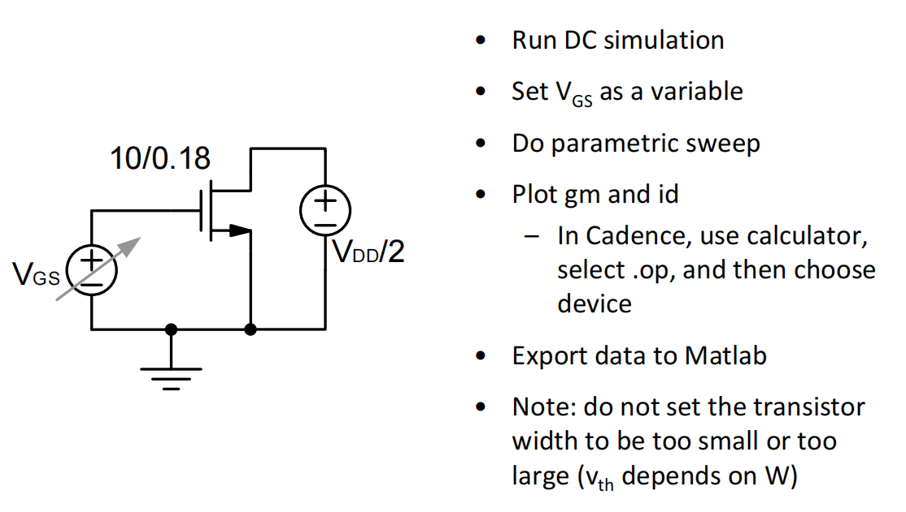

# 2. Gm/Id Summary

### 吴志远，仅供个人复习整理使用

春季课程《高性能模拟集成电路设计》复习笔记整理

### Gm/Id内容目录：

1. 短沟道效应
    1. 1.1 $\frac{g_m}{I_d}$查找表
    2. 1.2 长沟道模型误差来源
    3. 1.3  $\frac{g_m}{I_d}$总结
2. Gm/Id对晶体管参数建模
    1. 2.1. $f_t$
    2. 2.2. $g_{ds}$
    3. 2.3. CMOS小信号模型
3.  $g_m/I_D$设计方法
4. 设计示例
    1. 4.1 设计过程
    2. 4.2 注意事项
5. 总结

# 1. 短沟道效应

## 1.1 $\frac{g_m}{I_d}$查找表

查表法→根据需要的参数，查个表得到管子尺寸

$g_m-I_d$第一步：建立testbench，扫描晶体管参数

<aside>
💡 对于晶体管来说，$g_m$是一个最重要的参数，我们希望用最少量的电流来产生最大量的$g_m$，在另一个维度上来说，我们希望用最少的$C_{GS}$来产生最大的$g_m$

</aside>

### 由直流参数扫描可以得到一些结论：

- $\frac{g_m}{I_d}$不会带来无穷的问题
- BJT的$\frac{g_m}{I_d}$是一个常数
    - 少了一个设计的自由度
    - BJT能量效率是一直高于MOS管的
- 在大于150mV时（强反型）可以观察到绿线和蓝线较为接近（相对准的一侧）
- 在小于0V时（亚阈值区）$\frac{g_m}{I_d}$逐渐饱和（like BJT）并趋于最大（最低能耗，放入亚阈值区）
- 在0~150mV时（弱反型）是一个过渡区，兼有强反型和亚阈值的特性

## 1.2 长沟道模型误差来源

### 亚阈值区

通过对数坐标（右图）来查看亚阈值区间

晶体管在亚阈值的物理模型：

<aside>
💡 非常接近一个BJT（栅控的BJT）

</aside>

真正控制沟道的电压实际上是栅电压经过两个电容的分压（衰减之后），从而造成亚阈值的MOS器件栅控更差

对于一个BJT器件，其电流为

$$
I_{C} \approx I_S\cdot e^{\frac{V_{BE}}{\frac{kT}{q}}}
$$

因此将亚阈值区MOS电流公式写出

$$
I_D\approx I_0\cdot e^{\frac{V_{GS}-V_t}{\frac{nkT}{q}}}
$$

n由栅电容和衬底电容分压决定，一般$n \approx 1.4$，在不同工艺下应该通过仿真确定这个值是多少

$$
n = \frac{C_{js}+C_{OX}}{C_{OX}}=1+\frac{C_{js}}{C_{OX}}
$$

NMOS栅控较为NPN有一个衰减，由以下公式求偏导可以得到MOS管在亚阈值区的$g_m$

$$
I_D\approx I_0\cdot e^{\frac{V_{GS}-V_t}{\frac{nkT}{q}}}
$$

$$
g_m = \frac{d I_D}{dV_{GS}}=\frac{1}{n}\frac{I_d \cdot q}{kT}
$$

$$
\frac{g_m}{I_d} = \frac{d I_D}{dV_{GS}}=\frac{1}{n}\frac{q}{kT}
$$

即始终与NPN有一个$\frac{1}{n}$的差距，如下图红色箭头所示

### 强反型区

短沟道效应带来的与长沟道器件的区别

- 强横向电场：速度饱和
- 强纵向电场：迁移率下降

**速度饱和**

高横向场强下载流子速度达到速度饱和（过驱动电压很强的情况下）

**迁移率下降**

纵向场强增加，吸引更多载流子到表面，表面的缺陷态导致迁移率下降

以上两种效应的叠加导致了与长沟道模型预测的电流效率相比有进一步的下降

## 1.3  $\frac{g_m}{I_d}$总结

- 长沟道在各个区间内都无法精确地描述晶体管
- 长沟道模型主要在于建立直觉上的认识
- 用$\frac{g_m}{I_d}$这些更直接的参数来sizing管子尺寸

# 2. Gm/Id对晶体管参数建模

## 2.1 $f_t$

在Virtuoso中进行直流扫描，Plot$g_m/2\pi\cdot C_{gs}$

仿真结果，小于0时会饱和到一个很慢的速度，Vov加的再高也不会到一个很快的频率

- $f_t$的饱和主要是发生在亚阈值和高Vov的区间
- 长沟道模型仍然不能很好的在全范围内进行建模

### 短沟道下的速度能效乘积

由于短沟道效应的存在，速度与能效乘积并不再是一个固定值（如Lecture1中所显示的）

<aside>
💡 找到一个速度和能耗乘积的最优值，最优点在0.1~0.2附近

</aside>

## 2.2 $g_{ds}$

在Virtuoso中进行直流扫描，Plot$g_m/g_{ds}$

长沟道模型基本无法对本征增益进行建模

<aside>
💡 基本没办法通过简单的$\lambda$对实际的器件进行建模

</aside>

在Virtuoso中进行直流扫描，Plot$1/g_{ds}$（输出阻抗）

输出阻抗随着$V_{DS}$的增大会趋于平衡，甚至会稍微往下掉一些

- 本征增益随着偏置变化不大
- 在$V_{DS}$特别小的时候，本征增益是一个随着$V_{DS}$变化的强函数，因此我们不希望$V_{DS}$偏置的非常低，同时我们也不希望$V_{DS}$偏置的非常高（消耗功耗）
    
    <aside>
    💡 一般可以取$V_{DS}>V_{OV}+4kT/q$ （.18工艺 150mV左右）
    
    </aside>
    

功耗与增益的tradeoff

进一步降低功耗→降低VDD→VDD最小可以达到各个管子均饱和时的情况→降低Vdsat→Ron变化

### 尽量给一个比较合理的Vds值

# 3. $g_m/I_D$设计方法

根据查找表，搜索出最合适的size

<aside>
💡 BSIM与平方律有巨大的差距，需要迭代很久

</aside>

将BSIM模型抽象出来，通过仿真能得到的设计参数（$g_m, r_o, g_m/I_D$等），得到一个查找表。用这个更能反应BSIM的表来辅助设计电路

# 4. 设计示例

## 4.1 设计过程

用一个common-source来演示，SPEC要求如图

根据设计参数算得尺寸

得到了$g_m/I_D$的值之后根据图表查到$I_D/W=57$

再根据$I_D-I_D/W$可以得到宽度

偏置不应该给一个电压，而是一个电流偏置，来应对PVT情况(current mode bias)。

对于工作在亚阈值区的MOS，其电流是e指数变化的，因此常规的偏置方法也成为问题

→将$V_B$ track $V_{TH}$→Voltage mode bias

在确定了$g_m/I_D$的值之后如何确定偏置值（$V_{OV}$）？

根据这张表，得到$V_{OV}$

## 4.2 注意事项

第一步，手算参数，根据Spec要求把各个参数算清楚。

第二步，查表，根据查表结果确定各个管子尺寸。

本质上讲是从手算一个解析解变成查找一个数值解

<aside>
💡 Design Charts应该是一个与W无关的变量

</aside>

<aside>
💡 工程角度来说，$g_m/I_D$也基本不随$V_{DS}$变化

</aside>

# 5. 总结

效率最低的方法：只单纯的调整参数

效率适中的方法：利用各种近似得到的长沟道模型做近似计算

效率最高的方法：利用查表法得到数值解进行设计，所需要迭代次数最少

一种更适用于$g_m/I_D$设计法的情况：新兴器件或国产新型PDK，参数准确性本就比稳定的PDK差，或数据点少，因此可以使用查表法规避掉不存在的点或者拟合出来的点等情况。