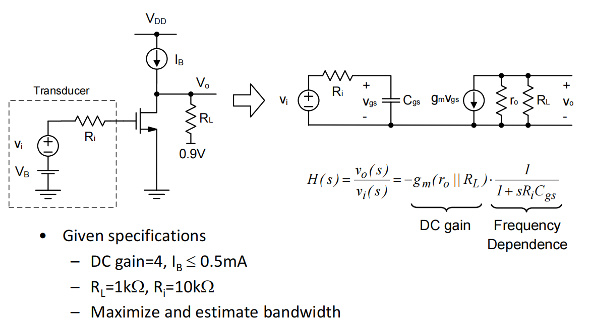

# 3. Ext. Cap Summary

### 吴志远，仅供个人复习整理使用

春季课程《高性能模拟集成电路设计》复习笔记整理

### Ext. Cap内容目录：

1. 外部电容对速度的影响
    1. 1.1 示例
    2. 1.2 原因分析
2. Cadence仿真分析
3.  PMOS
4. 完善小信号模型
5. 考虑外部电容的设计流程

# 1. 外部电容对速度的影响

## 1.1 示例

带有频率响应特性的电路设计

第一步：根据小信号模型把传递函数推出来

$$
H(s) = \frac{v_o(s)}{v_i(s)}=-g_m(r_O||R_L)\cdot\frac{1}{1+sR_iC_{gs}}
$$

输入端电容与源端阻抗形成一个RC

第二步：根据直流增益求出$g_m$

$$
A_{DC}\approx g_m R_L=4\ \ \ and \ \ \ R_L=1k
$$

$$
g_m = \frac{4}{1k}=4mS
$$

<aside>
💡 为了最大化BW，要尽可能减小C

</aside>

$$
\frac{g_m}{I_D} = \frac{4mS}{0.5mA}=8
$$

根据查找表查找得到27G的$f_t$

根据查找到的值，反算电容

$$
C_{GS}=\frac{1}{2\pi}\frac{g_m}{f_t}=24fF
$$

$$
f_{-3dB} = \frac{1}{2\pi}\frac{1}{R_iC_{GS}}=663MHz
$$

根据$g_m/I_D-I_D/W$的图，可以查到W

综合以上计算结果，得到以下参数，带入virtuoso仿真

**发现-3dB带宽差距非常大**

<aside>
💡 并不是只有$C_{GS}$，还有其他电容也在起不可忽略的作用

</aside>

## 1.2 原因分析

The reason for this discrepancy is that we have neglected "**extrinsic**" capacitances that affect the frequency response of our circuit in a significant way.

### 内部电容

### 外部电容

- **Overlap电容：**晶体管越宽，电容越大，对于.18工艺来说每微米带来0.8fF电容（NMOS）0.7fF电容（PMOS）

- **Junction电容：**source和drain到bulk的电容，晶体管不能悬空，要长在一个bulk上就会有Junction的电容

Layout也会影响电容，如何尽可能减小寄生电容？W和L定下之后受finger影响比较大，如下图，使用finger理论上能达到更快的速度。

通过版图技巧可以实现一些诸如让电容的一个基板更干净这种做法

<aside>
💡 将外部寄生电容加入到现有电容的模型中

</aside>

Bulk即为Backgate，所以在Gate上有的现象在Bulk上都会出现

# 2. Cadence仿真分析

仿真下的电容：

1. Cgs和Cgd并没有突变
2. 即使沟道形成了，Cgb也没有完全掉到0，表面沟道并不是一个理想的屏蔽层
3. Cgd在饱和区近似是一个常数，大概为Cgs的40%

<aside>
💡 先进工艺下沟道长度在缩小，但overlap的电容其实变化不大，即overlap电容占据了主导位置

</aside>

从栅极看下去实际上不止是Cgs

$$
f_T = \frac{1}{2\pi} \frac{g_m}{C_{gs}}
$$

**还有寄生的外部电容**

$$
f_T = \frac{1}{2\pi}\frac{g_m}{C_{gs}+C_{gb}+C_{gd}}=\frac{1}{2\pi}\frac{g_m}{C_{gg}}
$$

Plot出新的$\frac{g_m}{C_{gg}}$，明显看到速度变慢了

# 3. PMOS

NMOS是一个四端器件，而PMOS实际上是一个五端器件。

PMOS需要先在P-substrate上打一个N-Well，除了s，d，g，b还有一个自己的substrate

- 一般的做法是直接将PMOS的衬底接在VDD上，好处是所有的PMOS可以放在一个井里，省面积。坏处是有背栅效应，阈值变高，晶体管占用更大的$V_{GS}$
- 另一种接法是将bulk和source连接在一起，好处是没有背栅效应，阈值低一些，坏处是每个MOS需要单独放在一个井里。同样还需要注意，在这种接法上substrate和bulk的电容会直接挂在source上

<aside>
💡 SPICE中是没有nwell到sub的电容的！需要注意

</aside>

# 4. 完善小信号模型

先进工艺下会有Deep N Well工艺，类似PMOS里的Nwell，这样NMOS也变成了五端器件

## Transcap.

当器件是一个四端器件的时候，电容也会变成一个多端电容，即多个端点之间互相影响

<aside>
💡 在SPICE中电容建模如下图

</aside>

Cgg：从栅端出去的所有电容，栅端有一个电压变化在栅端到底会积累多少电容

Cgd：栅端变化一点，drain端要变化多少电荷（类似Miller）

晶体管的关键参数：

- $g_m/I_D$
- $g_m/C_{gg}$
- $C_{gd}/C_{gg}$
- $g_m/g_{ds}$

<aside>
💡 晶体管真正在工作的时候栅端电容可能并不完全是Cgg，所以需要知道drain上的电容占总电容的配比

</aside>

# 5. 考虑外部电容的设计流程

较小的gm-id在更偏向于线性区，但速度很快。较大的gm-id偏向于亚阈值区，但速度很慢。

在较大的范围内Cgd占比是一个常数

扫出器件的设计图

<aside>
💡 快→NMOS

</aside>

Ft：最快的GBW能做到多少，初步判断下能不能做指定的放大器

本征增益

电流密度

寄生电容：基本随着Vds没什么变化

