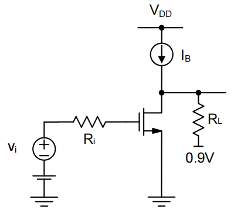

# 5. Miller Effect Summary

### Miller Effect 内容目录：

1. **Miller等效**
    1. 1.1 推导
    2. 1.2 检查近似的合理性
2. **ZVTC Method**
    1. 2.1 原理
    2. 2.2 计算
    3. 2.3 总结

# 1. Miller等效

## 1.1 推导

重新审视之前的例子，如何才能写出更准确的传递函数

$$
H(s)=?
$$

忽略$C_{db}$，使用利用基尔霍夫

$$
i = (v_{gs}-v_0)\cdot C_{gd},\ \ \ g_m v_{gs}+\frac{v_0}{R_L}+(v_0-v_{gs})\cdot sC_{gd} = 0\\Y(s) = \frac{i(s)}{v_{gs}(s)}=(1-A_v(s))\cdot sC_{gd}\space with\space A_v(s)=-g_mR_L(\frac{1-s\frac{C_{gd}}{g_m}}{1+sR_LC_{gd}})
$$

由上式可以看到，$Y(s)$是一个被放大的电容（Miller电容）

$$
Y(s) \approx (1+g_mR_L)\cdot sC_{gd}
$$

更一般的情况，对于一个跨接的阻抗：

$$
Z_{in}=\frac{v_{test}}{i_{test}}=\frac{v_{test}}{\frac{v_{test}-A_v\cdot v_{test}}{Z}}=\frac{Z}{1-A_v}\\Y_{in} = Y(1-A_v)
$$

$$
A_v=0 \rightarrow Z_{in}=Z\\A_v=1\rightarrow Z_{in}=\infin
$$

- Bootstrapping & Impedance reduction

$$
A_v>1, e.g. A_v=2\rightarrow Z_{in}=-Z(negective)\\A_v <0 \rightarrow Z_{in} = \frac{Z}{1+|A_V|}
$$

从V的角度看，两个极板上的$\Delta v$不同，看起来像是电容被放大了（source follower）

<aside>
💡 增益大于1的时候会形成一个负电容

</aside>

Z→电阻：TIA，跨阻放大器

把之前电路中的跨接电容根据Miller效应分开，输入端变成为

再次根据之前扫到的表，带入数据计算

<aside>
💡 这次计算得到的数值与仿真非常相近

</aside>

## 1.2 检查近似的合理性

目前为止做了两个假设

1. 在200MHz频率范围内

$$
A_v(s)=-g_mR_L\frac{1-s\frac{C_{gd}}{gm}}{1+sR_LC{gd}}\approx-g_mR_L
$$

检查一下传递函数的零点和极点为止

$$
\frac{1}{2\pi}\frac{1}{R_LC_{gd}}=\frac{1}{2\pi}\frac{1}{R_Lk_{gd}C_{gg}}=\frac{1}{2\pi}\frac{1}{1kΩ\cdot0.3\cdot37fF}=14GHz\\\frac{1}{2\pi}\frac{g_m}{C_{gd}}=\frac{1}{2\pi}\frac{g_m}{k_{gd}C_{gg}}=\frac{1}{2\pi}\frac{4mS}{1kΩ\cdot0.3\cdot37fF}=57GHz
$$

<aside>
💡 先把零极点去掉，得到3dB带宽，方便计算

</aside>

之后再确认下零极点是不是在3dB带宽外即可

1. $C_{gd}$直接省略是否有影响

$$
A_v(s)=\frac{v_o(s)}{v_{gs}(s)}=-g_mR_L(\frac{1-s\frac{C_{gd}}{gm}}{1+sR_L(C_{gd}+C_{db})})
$$

可以看到零点位置没有变化，但极点频率变低了。但$C_{db}$很小，因此不是一个主要问题

<aside>
💡 只占4%的Cgg

</aside>

**但如果加了负载呢？**

## 1.3 负载效应

在输出端挂一个几pF的负载电容

这时传递函数变为了

$$
A_v(s)=\frac{v_o(s)}{v_{gs}(s)}=-g_mR_L(\frac{1-s\frac{C_gd}{g_m}}{1+sR_L(C_{gd}+C_{db}+C_L)})
$$

假设负载电容为10pF

$$
\frac{1}{2\pi}\frac{1}{R_L(C_{gd}+C_{db}+C_L)}\approx\frac{1}{2\pi}\frac{1}{1kΩ\cdot10pF}=16MHz<<200MHz
$$

<aside>
💡 大的负载电容不止破坏了Miller等效，也破坏了整个电路的-3dB带宽

</aside>

当有很大的负载电容的时候，主要的输出带宽在输出级的$R_L\ C_L$上，而非输入级的Miller电容上。输入反而影响变小了。

# 2. ZVTC Method

### **当电路中的电容越来越多之后→ZVTC Analysis**

1. 电路中若干个电容一个一个的去分析，分析一个电容的时候把其他的电容都去掉。
    1. Remove all but one capacitor. Short independent voltage sources, remove independent current sources
2. 计算和这个电容并联的电路上的电阻有多大。
    1. Calculate resistance seen by capacitor and compute $τ_j=R_{jo}C_j$
3. 递归处理每个电容。
    1. Repeat for all capacitors in the circuit
4. 将所有时间常数相加并用来估算带宽
    1. Sum all time constants and calculate bandwidth estimate

$$
\omega_{-3dB} = \frac{1}{ \sum τ_j}
$$

## 2.1 原理

（只看极点）电路的传递函数可以写成：

$$
A_v(s)=\frac{1}{(1+\frac{s}{\omega_1})(1+\frac{s}{\omega_2})...(1+\frac{s}{\omega_n})}
$$

分母即为极点位置，可以写成

$$
1+\frac{s}{\omega_1+\omega_2...+\omega_n}+\frac{s^2}{\omega_1+\omega_2...+\omega_n}+...
$$

主极点近似认为为一次项，因此为$\omega_1+\omega_2+...+\omega_n$

## 2.2 计算

仍然以刚才的例子，不过使用ZVTC方法

第一步：把所有电容都去掉（开路），从C1看进去，和C1并联的R有多大

第二步：从C2看进去，和C2并联的R有多大（输入阻抗）

求输入阻抗：加$V_{test}$，求$I_{test}$或加$I_{test}$，求$V_{test}$

$$
R_{2o}=\frac{v_{test}}{i_{test}}=\frac{v_{gs}+R_L(g_mV_{gs}+i_{test})}{i_{test}}=R_i+R_L+g_mR_LR_i\\\tau_2=(R_i+R_L+g_mR_LR_i)C_2
$$

第三步：从C3看进去

$$
R_{3o}=R_L\\\tau_3=R_LC_3
$$

带宽为三个时间常数的相加

$$
f_{-3dB}\approx\frac{1}{2\pi}\frac{1}{\tau_1+\tau_2+\tau_3}=\frac{1}{2\pi}\frac{1}{R_iC1+(R_i+R_L+g_mR_LR_i)C_2+R_LC_3}
$$

带入数据

$$
f_{-3dB}\approx193MHz
$$

- Miller 200MHz
- SPICE sim 206MHz

计入$C_L$，$\tau_3$变为10000ps

$$
f_{-3dB}\approx15MHz
$$

<aside>
💡 ZVTC是一个偏向保守的方法，在无主极点且两个极点离得很近的情况下，误差会变大

</aside>

## 2.3 总结

- 当有一个主极点的情况下，ZVTC方法准确度较高
    - 幸运的是大部分实用的电路都有一个主极点
- 一些去耦电容，隔直电容需要在使用ZVTC方法之前去掉
    - 这些电容在高频情况下视为短路
- ZVTC并不能带来零点的信息