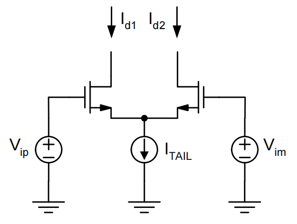

# 8. Diff. Pair Summary

### Diff. Pair 内容目录：

1. **差模信号&共模信号**
2. **大信号传递函数**
    1. 2.1 大信号分析
    2. 2.2 非线性
    3. 2.3 进一步完善的小信号模型
3. **小信号**
    1. 3.1 共模增益
    2. 3.2 共模抑制比（CMRR）：与PPT不同
    3. 3.3 电源抑制比（PSRR）

<aside>
💡 The differential pair is the most widely used two-transistor sub-circuit in analog ICs

</aside>

# 1. 差模信号&共模信号

施加一个电压，看两侧电流的差异。差分两侧电压的变化对差分对没有影响，只有变化的信号才会有影响

$$
V_{id}=(V_{ip}-V_{im})
$$

共模电压：夹在信号的中间

$$
V_{ic}=\frac{V_{ip}+V_{im}}{2}
$$

差分对可以避免共模噪声对信号的干扰

# 2. 大信号传递函数

## 2.1 大信号分析

<aside>
💡 差分对：分电流，输出范围大概在$+-\sqrt{2}V_{ov}$

</aside>

$$
V_{ip}-V_{gs1}=V_{im}-V_{gs2}\\I_{d1}+I_{d2}=I_{tail}
$$

$$
V_{gs1}=V_t+\sqrt{\frac{2I_{d1}}{\mu C_{ox}\frac{W}{L}}},V_{gs2}=V_t+\sqrt{\frac{2I_{d2}}{\mu C_{ox}\frac{W}{L}}}\\\to I_{od}=I_{d1}-I_{d2}=\frac{1}{2}\mu C_{ox}\frac{W}{L}V_{id}\sqrt{\frac{4I_{tail}}{\mu C_{ox}\frac{W}{L}-V_{id}^2}}
$$

$$
Using: \frac{I_{tail}}{2}=\frac{1}{2}\mu C_{ox}\frac{W}{L}V_{ov}^2\\\frac{I_{od}}{I_{tail}}=\frac{I_{d1}-I_{d2}}{I_{tail}}=\frac{V_{id}}{V_{ov}\sqrt{1-(\frac{V_{id}}{2V_{ov}})^2}}
$$

闭环情况下放大器输入两端是比较接近的，大部分情况下是比较好的差分对的形式

## 2.2 非线性

差分之后会可以去掉偶次谐波（单端放大器主要的非线性在二阶谐波上）

$$
\frac{I_{od}}{I_{tail}}=(\frac{V_{id}}{V_{ov}})-\frac{1}{8}(\frac{V_{id}}{V_{ov}})^3-...
$$

闭环放大器为什么能提高线性度：尽可能减少了$V_{id}$，提升了差分对的线性度

<aside>
💡 $V_{id}$越小于$V_{ov}$，线性度越好

</aside>

差分对的等效跨导

$$
G_m=\frac{dI_{od}}{dV_{id}}|_{V_id=0}=\frac{I_{tail}}{V_{ov}}
$$

注意差分对两个管子各自的跨导也是

$$
g_{m1,2}=\frac{2I_D}{V_{ov}}=\frac{2\frac{I_{tail}}{2}}{V_{ov}}=\frac{I_{tail}}{V_{ov}}
$$

差分尾电流源是一个小信号地（也没有那么地，在一端输入信号过大的时候这个位置上也还是有信号分量的），使用小信号半电路分析的时候天生就失去了分析非线性的能力，需要分析非线性还是要用之前的电路。

# 3. 小信号

$$
差模增益：A_{dm}=\frac{V_{od}}{V_{id}}\\ 共模增益：A_{cm}=\frac{V_{oc}}{V_{ic}},差模-共模增益：A_{dm-cm}=\frac{V_{oc}}{V_{id}},\\共模-差模增益 A_{cm-dm}=\frac{V_{od}}{V_{ic}} 
$$

## 3.1 **共模增益**

画出共模的小信号模型

当尾电流是理想源的时候：

$$
A_{cm}=0
$$

当尾电流有有限阻抗的时候

$$
A_{cm}=-\frac{g_m}{1+g_m\cdot 2R_{tail}}(R||r_o[1+g_m\cdot2R_{tail}])
$$

## 3.2 **共模抑制比（CMRR）：**与PPT不同

$$
A_{dm-cm}=\frac{V_{oc}}{V_{id}}
$$

输入短接在一起，看输出有多少不想要的东西

<aside>
💡 给共模和差模加一个chop，破坏共模和差模之间混合去机会

</aside>

## 3.3 **电源抑制比（PSRR）**

PSRR+：电源上噪声的影响

PSRR-：地上噪声的影响

$$
A_+=\frac{V_{od}}{V_{dd}}, A_-=\frac{V_{od}}{V_{ss}}\\PSRR_+=|\frac{A_{dm}}{A_+}|,PSRR_-=|\frac{A_{dm}}{A_-}|
$$

伪差分：直接把两个单端放在一起，有差分的作用，但没有去除偶次谐波的作用