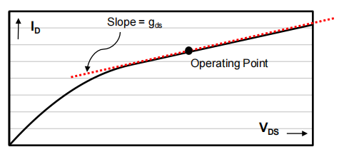

# 20230711 High-Performance Analog Circuit Design Lecture 01 -3

补：7-11准备了一天的会议PPT和对应的仿真，请假一天。本文为后续补上的7-11笔记

## 小信号输出阻抗建模

以小信号模型为前提条件，将其有限的**输出阻抗**建模为一个随工作点变化的输出电阻

$$
g_{ds}=\frac{dI_D}{d V_{DS}}=\frac{d}{dV_{DS}}[\frac{1}{2}\mu C_{OX} \frac{W}{L}(V_{GS}-V_t)^2(1+\lambda V_{DS})]
$$

$$
g_{ds} = \frac{\lambda I_D}{1+\lambda V_{DS}} \approx \lambda I_D
$$

## 输入电容

有了$g_m$和输出阻抗之后，下一步考虑把输入电容添加进来$C_{GS}$

<aside>
💡 不同的工作区，输入电容不同

</aside>

### 线性区

沟道里的电荷是一直形成的，S与D是一直联通的，也就是栅和channel形成了一个电容。

此时G和S和G和D形成的电容是相同的，衬底电容是可以**忽略**的。

$$
C_{GC} = WL \frac{\epsilon_{OX}}{t_{OX}} = WLC_{ox}
$$

$$
C_{GS} = C_{GD} = \frac{1}{2}C_{GC}
$$

### 饱和区

沟道形成了pinch-off，大部分电荷在S端，D端电容约为0

$$
C_{GS} = \frac{2}{3} WLC_{ox}, C_{GD} \approx0
$$

### 截止区

没有电荷，栅与耗尽的沟道形成的电容与衬底电容串联，形成一个整体上更小的电容

施加一个大的负栅压则电容重新近似等于$C_{GC}$

<aside>
💡 总结电容分布如下

</aside>

## 一阶小信号模型

一般希望工作在饱和区，由以上分析得到了小信号模型如下

用建立的小信号模型分析电路，可以得到一个如下图的常见setup

输入信号，源阻抗，输出负载等（偏置只是用来产生晶体管的gm到底有多大）

写出输入到输出的传递函数：

$$
H(S) = \frac{V_O(s)}{V_i(s)} = -g_mR\cdot\frac{1}{1+sR_iC_{GS}}
$$

## 关键测试指标

- DC增益
    - 低频下的增益：$A_{DC} = -g_mR$
- 带宽
    - 小的栅电容带来最大的带宽：$f_{-3dB} = \frac{1}{2\pi}\frac{R_i}{C_{GS}}$
- 功耗
    - 小的漏端电流带来最小化的功耗：$P = V_{DD}\cdot I_D$

# Gm-Id设计法

What we really want from our MOS transistor

- Some $g_m$without investing much current $I_D$.
- Some $g_m$without introducing large $C_{GS}$.

<aside>
💡 在放大器中希望有大的gm，小的Cgs以及小的电流

</aside>

使用以下两个指标来衡量功耗与速度：

$$
\frac{g_m}{I_D}, \frac{g_m}{C_{GS}}
$$

从长沟道器件模型出发

$$
\frac{g_m}{I_d} = \frac{2}{V_{OV}}
$$

$$
\frac{g_m}{C_{GS}}=\frac{3}{2}\frac{\mu V_{OV}}{L^2}
$$

<aside>
💡 $V_{OV}$ is the "knob" that trades power efficiency gm/ID for speed gm/Cgs

</aside>

与速度相关：更大的Vov

与能耗相关：更小的Vov

把两个数乘一下，看看能不能得到一个sweet point

$$
\frac{g_m}{I_d} \cdot \frac{g_m}{C_{GS}}=\frac{3\mu}{L^2}
$$

