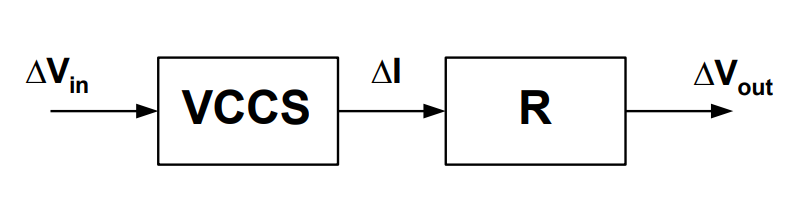

# 20230710 High-Performance Analog Circuit Design Lecture 01 -2

### 吴志远，仅供个人复习整理使用

春季课程《高性能模拟集成电路设计》复习笔记整理

# Lecture 1-2

## *对应PPT： CMOS小信号模型*

电压→电流→电压

$g_m\cdot R > 1$→电压放大，可以在中间倍增电流，即

电压→电流→放大电流→电压

Common source单管电路：

关断区→饱和区→线性区

<aside>
💡 只在一个特定的偏置范围起作用

</aside>

如何产生偏置？→后续（待填坑）

## 小信号分析

在Vov（偏置）的基础上，添加一个小信号的微扰

输出的$\Delta V_O$与输入小信号$\Delta V_{i}$之间的关系：

$$
V_{O}+\Delta V_{O} = V_{DD}-\frac{1}{2}\mu C_{OX}\frac{W}{L}(V_{OV}+\Delta V_{i})^2 \cdot R
$$

$$
\Delta V_{O} = -\frac{1}{2}\mu\ C_{OX}\frac{W}{L}R\cdot [(V_{OV}+\Delta V_{i})^2-V_{OV}^2]
$$

化简得到

$$
\Delta V_{O}=-\frac{2I_{D}}{V_{OV}}\cdot R\cdot \Delta V_{i}[1+\frac{\Delta V_{i}}{2V_{OV}}]
$$

小信号有$\Delta V_{i}<<2V_{OV}$

$$
\Delta V_{O}=-\frac{2I_D}{V_{OV}}\cdot R \cdot \Delta V_i
$$

<aside>
💡 本质上说，实际上$\frac{\Delta V_i}{2V_{OV}}$实际上是一直存在的，当不满足近似条件时，一定会产生**非线性**

</aside>

开环放大器→输入输出曲线落在一个非线性的曲线上

小信号：对一个曲线做切线，切线斜率即为小信号增益

## 小信号模型

### 首先把$g_m$弄出来

利用一个VCCS给$g_m$建模（小信号模型的第一个元件），线性区同理

$g_m$即为$I_D$对$V_{GS}$的偏导

$$
I_{D}=\frac{1}{2}\mu C_{OX}\frac{W}{L} (V_{GS}-V_t)^2
$$

$$
g_{m} = \frac{i_d}{v_{gs}}=\frac{\partial I_D}{\partial V_{GS}} = \frac{1}{2} \mu C_{OX}\frac{W}{L}(V_{GS}-V_{t})=\frac{2I_D}{V_{OV}}
$$

### 然后加入非理想特性

$$
I_D = \frac{1}{2} \mu C_{OX}\frac{W}{L} (V_GS-V_t)^2(1+\lambda V_{DS})
$$

理想：前段是一个抛物线，饱和后是一个和$V_{DS}$无关的平线

实际：饱和后与$V_{DS}$仍然是相关的→小信号的有限输出阻抗