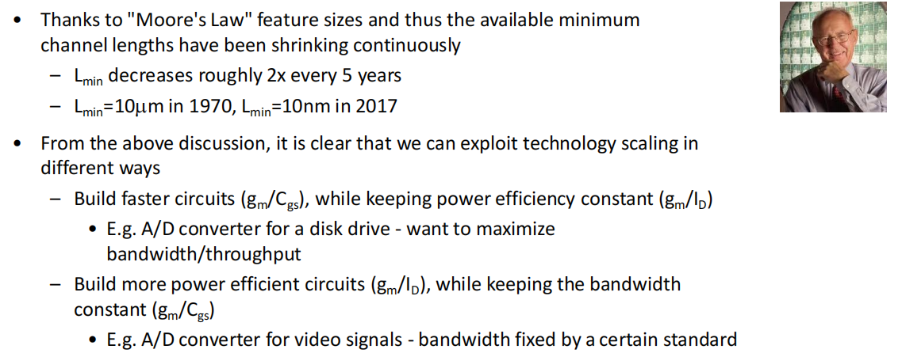

# 20230713 High-Performance Analog Circuit Design Lecture 01 -4

### 吴志远，仅供个人复习整理使用

春季课程《高性能模拟集成电路设计》复习笔记整理

利用长沟道模型得到速度与能效乘积

$$
\frac{g_m}{I_D}\cdot \frac{g_m}{C_{GS}} = \frac{3\mu}{L^2}
$$

<aside>
💡 想获得更大的乘积只能继续减小L，即沟道长度

</aside>

## 摩尔定律

可以通过摩尔定律来观察沟道缩减的规律，我们需要探索如何更好的针对工艺特性做优化：

可以做的两类事情：

- 在功耗不变的基础上提升速度
- 在速度被某些标准限制的前提下降低功耗

## 晶体管指标

Transit Frequency: $\omega _t$

电流开始不再放大的效果，即晶体管失去放大作用的频率

The transit frequency of a transistor is defined as the frequency where the magnitude of
the common source current gain is equal to 1.

$$
\omega_T = \frac {g_m} {C_{GS}} = \frac{3}{2}\frac{\mu V_{OV}}{L^2}
$$

Intrinsic Gain

在负载$R_L$无穷大的情况下能提供的增益，即自己的$r_o$决定的

With $R_L$→ $\infin$, the basic common source stage achieves its maximum possible voltage gain or "intrinsic gain".

$$
|A_{DC}| = g_m R = g_m(R_L||R_o)
$$

$$
|A_{DC, max}| = g_mr_o=\frac{g_m}{g_{ds}}\approx\frac{1}{\lambda} \frac{g_m}{I_d}=\frac{2}{\lambda V_{OV}}
$$

<aside>
💡 尺寸都确定了如何得到更高增益？降低过驱动电压到亚阈值区

</aside>

## 通过Cadence Virtuoso查看晶体管特性

Step1. 建立一个DC仿真的电路图，可以如下图所示，画完之后点击save and check，不报warning和error为准

注意管子选择nmosmvt2v，模型更完整一些

Step2. Launch→ ADE L，打开ADE L界面，在Variables选择Copy from cellview将变量读入，并赋初始值。

在Analysis处右键，点击Edit添加一个DC仿真

<aside>
💡 注意一定要勾选Save DC Operating Point

</aside>

Step3. 运行一次仿真，如果仿真没有跑起来可以检查下工艺库路径是否正确等

Step4. 成功运行一次之后选择Tools→Calculator

点击OS，之后选择器件，会出现一个小的对话框，点击下拉菜单即可选择需要查看的内容

Step5. 点击需要查看的内容，会出现在计算器中，可以在计算器内进行一些运算得到最终需要的表达式，也可以直接按齿轮键送回Output中