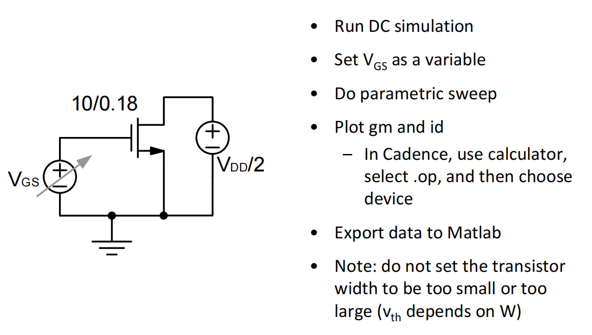

# 20230715 High-Performance Analog Circuit Design Lecture 02 -1

### 吴志远，仅供个人复习整理使用

春季课程《高性能模拟集成电路设计》复习笔记整理

# 1. Gm-Id设计法与长沟道模型对比

## 1.1 $\frac{g_m}{I_d}$

查表法→根据需要的参数，查个表得到管子尺寸

$g_m-I_d$第一步：建立testbench，扫描晶体管参数

<aside>
💡 对于晶体管来说，$g_m$是一个最重要的参数，我们希望用最少量的电流来产生最大量的$g_m$，在另一个维度上来说，我们希望用最少的$C_{GS}$来产生最大的$g_m$

</aside>

### 由直流参数扫描可以得到一些结论：

- $\frac{g_m}{I_d}$不会带来无穷的问题
- BJT的$\frac{g_m}{I_d}$是一个常数
    - 少了一个设计的自由度
    - BJT能量效率是一直高于MOS管的
- 在大于150mV时（强反型）可以观察到绿线和蓝线较为接近（相对准的一侧）
- 在小于0V时（亚阈值区）$\frac{g_m}{I_d}$逐渐饱和（like BJT）并趋于最大（最低能耗，放入亚阈值区）
- 在0~150mV时（弱反型）是一个过渡区，兼有强反型和亚阈值的特性

## 1.2 亚阈值区

通过对数坐标（右图）来查看亚阈值区间

晶体管在亚阈值的物理模型：

<aside>
💡 非常接近一个BJT（栅控的BJT）

</aside>

真正控制沟道的电压实际上是栅电压经过两个电容的分压（衰减之后），从而造成亚阈值的MOS器件栅控更差

对于一个BJT器件，其电流为

$$
I_{C} \approx I_S\cdot e^{\frac{V_{BE}}{\frac{kT}{q}}}
$$

因此将亚阈值区MOS电流公式写出

$$
I_D\approx I_0\cdot e^{\frac{V_{GS}-V_t}{\frac{nkT}{q}}}
$$

n由栅电容和衬底电容分压决定，一般$n \approx 1.4$，在不同工艺下应该通过仿真确定这个值是多少

$$
n = \frac{C_{js}+C_{OX}}{C_{OX}}=1+\frac{C_{js}}{C_{OX}}
$$

NMOS栅控较为NPN有一个衰减，由以下公式求偏导可以得到MOS管在亚阈值区的$g_m$

$$
I_D\approx I_0\cdot e^{\frac{V_{GS}-V_t}{\frac{nkT}{q}}}
$$

$$
g_m = \frac{d I_D}{dV_{GS}}=\frac{1}{n}\frac{I_d \cdot q}{kT}
$$

$$
\frac{g_m}{I_d} = \frac{d I_D}{dV_{GS}}=\frac{1}{n}\frac{q}{kT}
$$

即始终与NPN有一个$\frac{1}{n}$的差距，如下图红色箭头所示

## 1.3 强反型区

短沟道效应带来的与长沟道器件的区别

- 强横向电场：速度饱和
- 强纵向电场：迁移率下降

### 速度饱和

高横向场强下载流子速度达到速度饱和（过驱动电压很强的情况下）

### 迁移率下降

纵向场强增加，吸引更多载流子到表面，表面的缺陷态导致迁移率下降

以上两种效应的叠加导致了与长沟道模型预测的电流效率相比有进一步的下降

## 1.4  $\frac{g_m}{I_d}$总结

- 长沟道在各个区间内都无法精确地描述晶体管
- 长沟道模型主要在于建立直觉上的认识
- 用$\frac{g_m}{I_d}$这些更直接的参数来sizing管子尺寸

# 2. $f_t$

在Virtuoso中进行直流扫描，Plot$g_m/2\pi\cdot C_{gs}$

