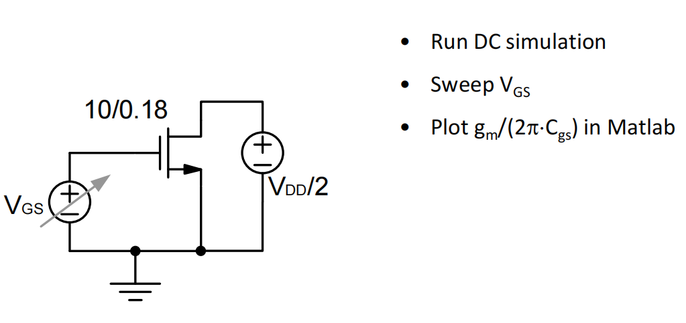

# 20230716 High-Performance Analog Circuit Design Lecture 02 -2

### 吴志远，仅供个人复习整理使用

春季课程《高性能模拟集成电路设计》复习笔记整理

# 2. $f_t$

在Virtuoso中进行直流扫描，Plot$g_m/2\pi\cdot C_{gs}$

仿真结果，小于0时会饱和到一个很慢的速度，Vov加的再高也不会到一个很快的频率

- $f_t$的饱和主要是发生在亚阈值和高Vov的区间
- 长沟道模型仍然不能很好的在全范围内进行建模

### 短沟道下的速度能效乘积

由于短沟道效应的存在，速度与能效乘积并不再是一个固定值（如Lecture1中所显示的）

<aside>
💡 找到一个速度和能耗乘积的最优值，最优点在0.1~0.2附近

</aside>

# 3. $g_{ds}$

在Virtuoso中进行直流扫描，Plot$g_m/g_{ds}$

长沟道模型基本无法对本征增益进行建模

<aside>
💡 基本没办法通过简单的$\lambda$对实际的器件进行建模

</aside>

在Virtuoso中进行直流扫描，Plot$1/g_{ds}$（输出阻抗）

输出阻抗随着$V_{DS}$的增大会趋于平衡，甚至会稍微往下掉一些

- 本征增益随着偏置变化不大
- 在$V_{DS}$特别小的时候，本征增益是一个随着$V_{DS}$变化的强函数，因此我们不希望$V_{DS}$偏置的非常低，同时我们也不希望$V_{DS}$偏置的非常高（消耗功耗）
    
    <aside>
    💡 一般可以取$V_{DS}>V_{OV}+4kT/q$ （.18工艺 150mV左右）
    
    </aside>
    

功耗与增益的tradeoff

进一步降低功耗→降低VDD→VDD最小可以达到各个管子均饱和时的情况→降低Vdsat→Ron变化

### 尽量给一个比较合理的Vds值

# 4. $g_m/I_D设计方法$

根据查找表，搜索出最合适的size

<aside>
💡 BSIM与平方律有巨大的差距，需要迭代很久

</aside>

将BSIM模型抽象出来，通过仿真能得到的设计参数（$g_m, r_o, g_m/I_D$等），得到一个查找表。用这个更能反应BSIM的表来辅助设计电路

## 4.1 设计示例

用一个common-source来演示，SPEC要求如图

根据设计参数算得尺寸

得到了$g_m/I_D$的值之后根据图表查到$I_D/W=57$

再根据$I_D-I_D/W$可以得到宽度

偏置不应该给一个电压，而是一个电流偏置，来应对PVT情况(current mode bias)。

对于工作在亚阈值区的MOS，其电流是e指数变化的，因此常规的偏置方法也成为问题

→将$V_B$ track $V_{TH}$→Voltage mode bias

在确定了$g_m/I_D$的值之后如何确定偏置值（$V_{OV}$）？

根据这张表，得到$V_{OV}$

## 4.2 设计过程

第一步，手算参数，根据Spec要求把各个参数算清楚。

第二步，查表，根据查表结果确定各个管子尺寸。

