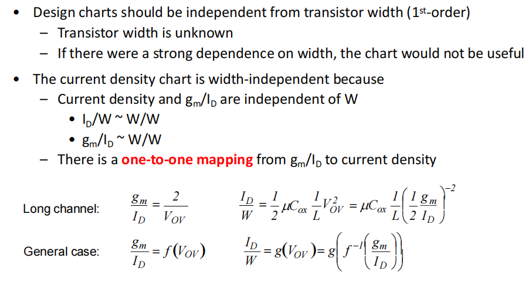

# 20230717 High-Performance Analog Circuit Design Lecture 02 -3

### 吴志远，仅供个人复习整理使用

春季课程《高性能模拟集成电路设计》复习笔记整理

本质上讲是从手算一个解析解变成查找一个数值解

<aside>
💡 Design Charts应该是一个与W无关的变量

</aside>

<aside>
💡 工程角度来说，$g_m/I_D$也基本不随$V_{DS}$变化

</aside>

## 4.3 对比长沟道模型与$g_m/I_D$设计法

效率最低的方法：只单纯的调整参数

效率适中的方法：利用各种近似得到的长沟道模型做近似计算

效率最高的方法：利用查表法得到数值解进行设计，所需要迭代次数最少

一种更适用于$g_m/I_D$设计法的情况：新兴器件或国产新型PDK，参数准确性本就比稳定的PDK差，或数据点少，因此可以使用查表法规避掉不存在的点或者拟合出来的点等情况。

---

# 1. 设计案例2

带有频率响应特性的电路设计

第一步：根据小信号模型把传递函数推出来

$$
H(s) = \frac{v_o(s)}{v_i(s)}=-g_m(r_O||R_L)\cdot\frac{1}{1+sR_iC_{gs}}
$$

输入端电容与源端阻抗形成一个RC

第二步：根据直流增益求出$g_m$

$$
A_{DC}\approx g_m R_L=4\ \ \ and \ \ \ R_L=1k
$$

$$
g_m = \frac{4}{1k}=4mS
$$

<aside>
💡 为了最大化BW，要尽可能减小C

</aside>

$$
\frac{g_m}{I_D} = \frac{4mS}{0.5mA}=8
$$

根据查找表查找得到27G的$f_t$

根据查找到的值，反算电容

$$
C_{GS}=\frac{1}{2\pi}\frac{g_m}{f_t}=24fF
$$

$$
f_{-3dB} = \frac{1}{2\pi}\frac{1}{R_iC_{GS}}=663MHz
$$

根据$g_m/I_D-I_D/W$的图，可以查到W

综合以上计算结果，得到以下参数，带入virtuoso仿真

**发现-3dB带宽差距非常大**

<aside>
💡 并不是只有$C_{GS}$，还有其他电容也在起不可忽略的作用

</aside>

The reason for this discrepancy is that we have neglected "**extrinsic**" capacitances that affect the frequency response of our circuit in a significant way.

- 内部电容

- 外部电容

