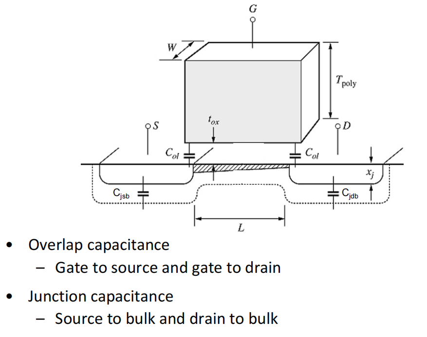

# 20230718 High-Performance Analog Circuit Design Lecture 03 -1

外部寄生电容：

**Overlap电容：**晶体管越宽，电容越大，对于.18工艺来说每微米带来0.8fF电容（NMOS）0.7fF电容（PMOS）

**Junction电容：**source和drain到bulk的电容，晶体管不能悬空，要长在一个bulk上就会有Junction的电容

Layout也会影响电容，如何尽可能减小寄生电容？W和L定下之后受finger影响比较大，如下图，使用finger理论上能达到更快的速度。

通过版图技巧可以实现一些诸如让电容的一个基板更干净这种做法

<aside>
💡 将外部寄生电容加入到现有电容的模型中

</aside>

Bulk即为Backgate，所以在Gate上有的现象在Bulk上都会出现

仿真下的电容：

1. Cgs和Cgd并没有突变
2. 即使沟道形成了，Cgb也没有完全掉到0，表面沟道并不是一个理想的屏蔽层
3. Cgd在饱和区近似是一个常数，大概为Cgs的40%

<aside>
💡 先进工艺下沟道长度在缩小，但overlap的电容其实变化不大，即overlap电容占据了主导位置

</aside>

从栅极看下去实际上不止是Cgs

$$
f_T = \frac{1}{2\pi} \frac{g_m}{C_{gs}}
$$

**还有寄生的外部电容**

$$
f_T = \frac{1}{2\pi}\frac{g_m}{C_{gs}+C_{gb}+C_{gd}}=\frac{1}{2\pi}\frac{g_m}{C_{gg}}
$$

Plot出新的$\frac{g_m}{C_{gg}}$，明显看到速度变慢了

## PMOS

NMOS是一个四端器件，而PMOS实际上是一个五端器件。

PMOS需要先在P-substrate上打一个N-Well，除了s，d，g，b还有一个自己的substrate

- 一般的做法是直接将PMOS的衬底接在VDD上，好处是所有的PMOS可以放在一个井里，省面积。坏处是有背栅效应，阈值变高，晶体管占用更大的$V_{GS}$
- 另一种接法是将bulk和source连接在一起，好处是没有背栅效应，阈值低一些，坏处是每个MOS需要单独放在一个井里。同样还需要注意，在这种接法上substrate和bulk的电容会直接挂在source上

<aside>
💡 SPICE中是没有nwell到sub的电容的！需要注意

</aside>

### 相对完整的小信号模型

先进工艺下会有Deep N Well工艺，类似PMOS里的Nwell，这样NMOS也变成了五端器件