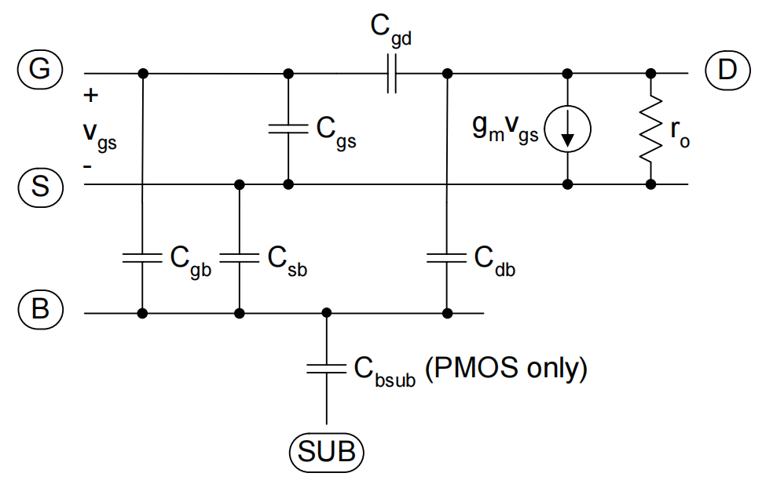

# 20230719 High-Performance Analog Circuit Design Lecture 03 -2

# 完整的小信号模型

## Transcap.

当器件是一个四端器件的时候，电容也会变成一个多端电容，即多个端点之间互相影响

<aside>
💡 在SPICE中电容建模如下图

</aside>

Cgg：从栅端出去的所有电容，栅端有一个电压变化在栅端到底会积累多少电容

Cgd：栅端变化一点，drain端要变化多少电荷（类似Miller）

晶体管的关键参数：

- $g_m/I_D$
- $g_m/C_{gg}$
- $C_{gd}/C_{gg}$
- $g_m/g_{ds}$

<aside>
💡 晶体管真正在工作的时候栅端电容可能并不完全是Cgg，所以需要知道drain上的电容占总电容的配比

</aside>

## 更通用的设计流程

较小的gm-id在更偏向于线性区，但速度很快。较大的gm-id偏向于亚阈值区，但速度很慢。

在较大的范围内Cgd占比是一个常数

扫出器件的设计图

<aside>
💡 快→NMOS

</aside>

Ft：最快的GBW能做到多少，初步判断下能不能做指定的放大器

本征增益

电流密度

寄生电容：基本随着Vds没什么变化

