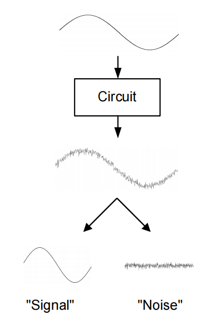

# 20230722 High-Performance Analog Circuit Design Lecture 03 -2 Noise

# 1. 噪声简介

噪声是一定存在的，会影响信号的保真度（准确性）

## 1.1 噪声的种类

- Man made noise：
    - 信号耦合串扰
    - 衬底耦合（旁边有一个很大的数字电路）
    - 有限的电源抑制比
    
    > 解决：
    > 
    - 全差分
    - 版图技巧：减小电容耦合
- Electronic Noise || Device Noise
    - 基本：
        - 热噪声：热载流子无规则运动产生的噪声
    - 工艺相关：
        - 闪烁噪声：材料的缺陷和“粗糙度”引起

本节课关注：fundmental的噪声

## 1.2 信噪比：

<aside>
💡 噪声的绝对强度是无意义的，关心的是信噪比

</aside>

衡量噪声水平，信号强度/噪声强度

$$
SNR=\frac{P_{signal}}{P_{noise}}\propto \frac{V^2_{signal}}{P_{noise}}
$$

噪声通常是直接与功耗进行trade-off的，更关心在这个噪声水平下消耗了多少功耗

$$
SNR\propto \frac{V^2_{signal}}{P_{noise}} \propto \frac{V^2_{DD}}{P_{noise}}
$$

模拟电路在深亚微米下是较难设计的：VDD变低了，信号能量一般不超过VDD，即信号能量在不断降低。但噪声能量不会降低，因此SNR会劣化。

<aside>
💡 深亚微米下较难达到一个低的SNR

</aside>

并不是所有电路都会关注噪声：比如**数字电路**

多级模拟电路：多一级一定会引入一级的噪声，导致信噪比变差

多级数字电路：通过一个锁存器再生数字信号，对信噪比进行增强

多电平标准的数字电路（比如PAM4-PAM8）：通过一个AD-DA再生信号

# 2. 噪声建模

电路角度建立噪声模型→计算/仿真某个电路的噪声水平

## 2.1 热噪声

### 电阻

- 理想电阻：一个恒定不变的电压
- 实际电阻：由于载流子热运动导致叠加了一个热噪声源，通过并联一个噪声电流进行建模

热噪声是一个高斯分布，从DC~1THz范围内均为一个白噪声

对于电阻来说，串联一个电压噪声或并联一个电流噪声

非相关噪声：

<aside>
💡 不要将RMS直接相加！

</aside>

$$
\bar v^2_n = \bar v^2_{n1} +\bar v^2_{n2}-\bar 2\cdot \bar  v_{n1} \cdot \bar  v_{n2} 
$$

$V_{n1}, V_{n2}$是无关变量

$$
\bar V^2_n=\bar V^2_{n1}+\bar V^2_{n2}=4\cdot k T\cdot (R_1+R_2)\cdot \Delta f
$$

### MOS

线性区：完全当电阻算

饱和区：多一个$\gamma$系数，对于长沟道MOS模型来说$\gamma = 2/3$，较短的沟道可以近似认为$\gamma = 1$

$$
\bar i^2_d = 4kT\cdot\gamma\cdot g_m\cdot \Delta f
$$

SPICE仿真管子的噪声水平

使用一个CCVS将电流噪声以电压的形式Plot出来

