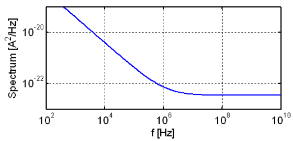

# 20230723 High-Performance Analog Circuit Design Lecture 03 -3 Noise

## 2.2 闪烁噪声

由硅和二氧化硅界面缺陷产生的噪声，只要有界面的器件都会有闪烁噪声。但是在MOS器件中最为常见：沟道

与频率成反比：1/f噪声

<aside>
💡 PMOS的1/f噪声比NMOS低，在.18工艺下要低5倍

</aside>

$$
\bar i^2_{1/f}=\frac{K_f}{C_{ox}}\frac{I_D}{L^2}\frac{\Delta f}{f}
$$

### 1/f噪声Corner：闪烁噪声与热噪声相等的点

$$
\frac{K_f}{C_{ox}}\frac{I_D}{L^2}\frac{\Delta f}{f}=4kT\gamma \cdot g_m \cdot \Delta f
$$

在.18工艺下转角频率约为4 MHz，和晶体管面积成**反比**

### 1/f噪声贡献

$$
\bar i^2_{1/f,tot} = \int_{f_1}^{f_2}K\frac{\Delta f}{f}=Kln(\frac{f_2}{f_1})=K\cdot2.3log(\frac{f_2}{f_1})
$$

<aside>
💡 1Hz~10Hz内1/f噪声功率和1GHz~10GHz内是相同的

</aside>

对于宽频的应用来说，1/f噪声所贡献的比重很小，左噪声谱密度，右噪声能量积分

1/f噪声不可能积分到0Hz，所以能量并不会到$\infin$

加入噪声建模的MOS小信号模型

## 2.3 其他噪声

- Gate noise:
    - Shot noise from gate leakage current.
    - Noise from to finite resistance of gate material.
    - Noise due to randomly changing potential/capacitance
- Bulk noise
- Source barrier noise in very short channels
    - Shot noise from carriers injected across source barrier.

## 2.4 Take Away

- 白噪声与闪烁噪声的特点，仿真得到各种信息，白噪声和功耗成反比
- 闪烁噪声根据工作频谱决定需不需要单独处理

# 3. 电路中的噪声

电路中器件众多，需要将所有的噪声等效到输入或等效到输出

输出噪声并不能公平的比较电路，比如不同增益带来的影响→输入等效噪声

比输入和噪声的信噪比能更公平的得到结果

## 3.1 Circuit Example

- 短路信号，加入噪声源
- 计算噪声源到输出的传递函数
- 将噪声的功率谱密度函数与传递函数相乘
- 将所有噪声的功率谱密度函数相加

$$
\frac{\bar V^2_{n,out}}{\Delta f}=4kT\cdot R\cdot |\frac{1}{1+sRC}|^2
$$

Plot电阻带来的噪声频谱

将输出的噪声重新refer到输入

<aside>
💡 一般情况下，输入等效噪声必须以一个电压源和一个电流源的形式建模

</aside>

但在低频情况下一般可以直接以一个电压源来建模

## 3.2 信噪比

观测器一般都有一个有限带宽，因此取这个带宽来进行积分

$$
SNR=\frac{P_{signal}}{P_{noise}}=\frac{\frac{1}{2}V^2_{out,peak}}{\int_{f_1}^{f_2} \frac{\bar V_{n, out}^2}{\Delta f}\cdot df}
$$

对于之前的例子中，积分得到的噪声为

$$
\bar V_{n, out, tot}^2=\int_0^\infin4kT\cdot R\cdot |\frac{1}{1+j2\pi f\cdot RC}|^2df=\frac{kT}{C}
$$

<aside>
💡 与R无关，与C相关。C越大，噪声谱密度越小

</aside>

越大的R带来越大的噪声谱密读函数，但带宽越低。反之则反。

系统的典型信噪比要求：

- 音频：100dB
- 视频：60dB
- 以太网收发器：35dB

<aside>
💡 高信噪比以大电容为代价

</aside>

对简单的电路，难以实现120dB，140dB的信噪比