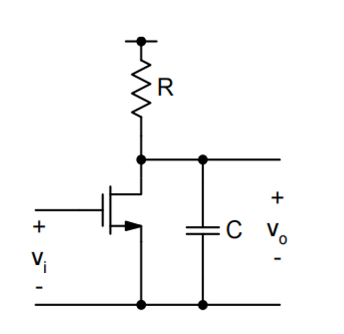

# 20230724 High-Performance Analog Circuit Design Lecture 04 -1 Noise

<aside>
💡 对生物应用，能用PMOS尽量使用PMOS

</aside>

### 相关噪声与无关噪声：

$$
P_{av} = \lim_{T \rightarrow \infin} \frac{1}{T}\int_{-T/2}^{T/2}[x_1(t)+x_2(t)]^2dt\\=\lim_{T \rightarrow \infin} \frac{1}{T}\int_{-T/2}^{T/2}x_1(t)^2 + \lim_{T \rightarrow \infin} \frac{1}{T}\int_{-T/2}^{T/2}x_2(t)^2 +  \lim_{T \rightarrow \infin} \frac{1}{T}\int_{-T/2}^{T/2}2x_1(t)x_2(t)dt \\=P_{av1}+P_{av2}+  \lim_{T \rightarrow \infin} \frac{1}{T}\int_{-T/2}^{T/2}2x_1(t)x_2(t)dt
$$

无关噪声最后一项为0，因此直接通过两个噪声的功率谱密度函数相加即可。相关噪声最后一项不为0，因此不能简单相加。

<aside>
💡 大部分噪声都是非相关的噪声

</aside>

<aside>
💡 对于双端口网络，需要两个源来描述

</aside>

详见Razavi Chap. 7

MOS的输入阻抗是很大的，因此噪声电流源影响不大

<aside>
💡 对于很多电路来说，噪声都应该是KT/C的形式，不同架构可能前面的系数不同

</aside>

120dB：过采样来减小对大电容的需求

## 3.3 最小可探测信号和动态范围

最小可测信号（MDS）

当SNR为1时的信号水平，或噪声功率=信号功率

动态范围（DR）

$$
DR =\frac{P_{signal,max}}{MDS}
$$

以common source为例：

$$
\frac{\bar v_0^2(f)}{df}=4kT(\frac{1}{R}+\gamma g_m)\cdot|\frac{R}{1+j2\pi f\cdot RC}|^2 \\ \bar v_{o,tot}^2=\int_0^\infin4kT(\frac{1}{R}+\gamma g_m)\cdot |\frac{R}{1+j2\pi f \cdot RC}|^2 df \\ = \frac{kT}{C}(1+\gamma g_m R)\\ =\frac{kT}{C}(1+\gamma |A_v|) \\=\frac{kT}{C}\cdot \alpha
$$

噪声带宽：对一阶系统来说，3dB带宽的位置以及PSD函数即可得到噪声模型

<aside>
💡 1/f噪声在类似推导过程中可忽略

</aside>

# 4. Noise-Power Tradeoff

提升6dB的SNR：

- 提升4倍的C
- 减小4倍的R来保证带宽
- 提升4倍的$g_m$来保留增益

<aside>
💡 **Improving the SNR in a noise limited circuit by 6dB ("1bit")**

**QUADRUPLES power dissipation!**

</aside>

大部分的FoM追求的是Noise和Power的Tradeoff

# 5. **Equipartition Theorem**

一种简化计算噪声的方法：在一个热力学平衡的系统中，每个自由度还有1/2kT的能量。需要系统中只有RC

$$
E=\frac{1}{2}CV_n^2=\frac{1}{2}kT, V_n^2 = \frac{kT}{C}
$$

计算自由度：储能元件认为有一个自由度，检查其上的噪声电压/噪声电流是不是相关，有相关就去掉一个

用一个电容去搬移另一个电容上的噪声电荷，每次搬移之后短接一下。原来的电容上最后会剩下什么？

稳态之后搬移电容上存了一个$kTC_1Q$，在另一个电容上存了一个$kTC_0Q$，在搬移的时候电荷会发生一个重新分配。

在开关断开的时候只有一个自由度（两个电容并联）