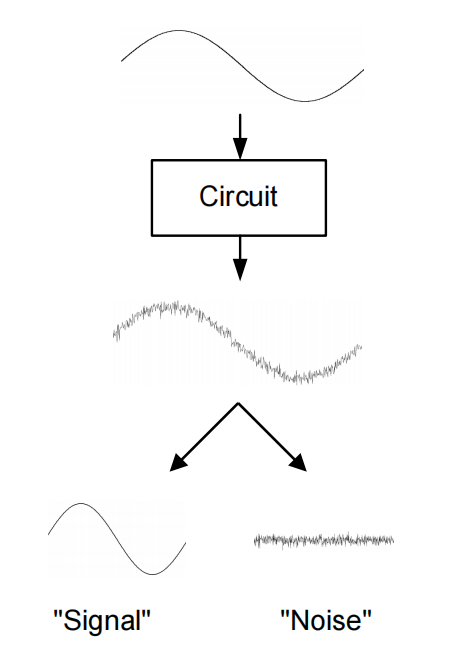

# 20230725 Noise Summary

### 吴志远，仅供个人复习整理使用

春季课程《高性能模拟集成电路设计》复习笔记整理

### Noise 内容目录：

1. **噪声简介**
    1. 1.1 噪声的种类
    2. 1.2 信噪比
2. **噪声建模**
    1. 2.1 热噪声
    2. 2.2 闪烁噪声
    3. 2.3 其他噪声
    4. 2.4 Take Away
3. **电路中的噪声**
    1. 3.1 Circuit Example
    2. 3.2 信噪比
    3. 3.3 最小可探测信号和动态范围
4. **Noise-Power Tradeoff**
5. **Equipartition Theorem**

# 1. 噪声简介

噪声是一定存在的，会影响信号的保真度（准确性）

## 1.1 噪声的种类

- Man made noise：
    - 信号耦合串扰
    - 衬底耦合（旁边有一个很大的数字电路）
    - 有限的电源抑制比
    
    > 解决：
    > 
    - 全差分
    - 版图技巧：减小电容耦合
- Electronic Noise || Device Noise
    - 基本：
        - 热噪声：热载流子无规则运动产生的噪声
    - 工艺相关：
        - 闪烁噪声：材料的缺陷和“粗糙度”引起

本节课关注：fundmental的噪声

## 1.2 信噪比

<aside>
💡 噪声的绝对强度是无意义的，关心的是信噪比

</aside>

衡量噪声水平，信号强度/噪声强度

$$
SNR=\frac{P_{signal}}{P_{noise}}\propto \frac{V^2_{signal}}{P_{noise}}
$$

噪声通常是直接与功耗进行trade-off的，更关心在这个噪声水平下消耗了多少功耗

$$
SNR\propto \frac{V^2_{signal}}{P_{noise}} \propto \frac{V^2_{DD}}{P_{noise}}
$$

模拟电路在深亚微米下是较难设计的：VDD变低了，信号能量一般不超过VDD，即信号能量在不断降低。但噪声能量不会降低，因此SNR会劣化。

<aside>
💡 深亚微米下较难达到一个低的SNR

</aside>

并不是所有电路都会关注噪声：比如**数字电路**

多级模拟电路：多一级一定会引入一级的噪声，导致信噪比变差

多级数字电路：通过一个锁存器再生数字信号，对信噪比进行增强

多电平标准的数字电路（比如PAM4-PAM8）：通过一个AD-DA再生信号

# 2. 噪声建模

电路角度建立噪声模型→计算/仿真某个电路的噪声水平

## 2.1 热噪声

### 电阻

- 理想电阻：一个恒定不变的电压
- 实际电阻：由于载流子热运动导致叠加了一个热噪声源，通过并联一个噪声电流进行建模

热噪声是一个高斯分布，从DC~1THz范围内均为一个白噪声

对于电阻来说，串联一个电压噪声或并联一个电流噪声

### 相关噪声与无关噪声：

非相关噪声：

<aside>
💡 不要将RMS直接相加！

</aside>

$$
\bar v^2_n = \bar v^2_{n1} +\bar v^2_{n2}-\bar 2\cdot \bar  v_{n1} \cdot \bar  v_{n2} 
$$

$V_{n1}, V_{n2}$是无关变量

$$
\bar V^2_n=\bar V^2_{n1}+\bar V^2_{n2}=4\cdot k T\cdot (R_1+R_2)\cdot \Delta f
$$

$$
P_{av} = \lim_{T \rightarrow \infin} \frac{1}{T}\int_{-T/2}^{T/2}[x_1(t)+x_2(t)]^2dt\\=\lim_{T \rightarrow \infin} \frac{1}{T}\int_{-T/2}^{T/2}x_1(t)^2 + \lim_{T \rightarrow \infin} \frac{1}{T}\int_{-T/2}^{T/2}x_2(t)^2 +  \lim_{T \rightarrow \infin} \frac{1}{T}\int_{-T/2}^{T/2}2x_1(t)x_2(t)dt \\=P_{av1}+P_{av2}+  \lim_{T \rightarrow \infin} \frac{1}{T}\int_{-T/2}^{T/2}2x_1(t)x_2(t)dt
$$

无关噪声最后一项为0，因此直接通过两个噪声的功率谱密度函数相加即可。相关噪声最后一项不为0，因此不能简单相加。

<aside>
💡 大部分噪声都是非相关的噪声

</aside>

详见Razavi Chap. 7

MOS的输入阻抗是很大的，因此噪声电流源影响不大

### MOS

<aside>
💡 对生物应用，能用PMOS尽量使用PMOS

</aside>

线性区：完全当电阻算

饱和区：多一个$\gamma$系数，对于长沟道MOS模型来说$\gamma = 2/3$，较短的沟道可以近似认为$\gamma = 1$

$$
\bar i^2_d = 4kT\cdot\gamma\cdot g_m\cdot \Delta f
$$

SPICE仿真管子的噪声水平

使用一个CCVS将电流噪声以电压的形式Plot出来

## 2.2 闪烁噪声

由硅和二氧化硅界面缺陷产生的噪声，只要有界面的器件都会有闪烁噪声。但是在MOS器件中最为常见：沟道

与频率成反比：1/f噪声

<aside>
💡 PMOS的1/f噪声比NMOS低，在.18工艺下要低5倍

</aside>

$$
\bar i^2_{1/f}=\frac{K_f}{C_{ox}}\frac{I_D}{L^2}\frac{\Delta f}{f}
$$

### 1/f噪声Corner：闪烁噪声与热噪声相等的点

$$
\frac{K_f}{C_{ox}}\frac{I_D}{L^2}\frac{\Delta f}{f}=4kT\gamma \cdot g_m \cdot \Delta f
$$

在.18工艺下转角频率约为4 MHz，和晶体管面积成**反比**

### 1/f噪声贡献

$$
\bar i^2_{1/f,tot} = \int_{f_1}^{f_2}K\frac{\Delta f}{f}=Kln(\frac{f_2}{f_1})=K\cdot2.3log(\frac{f_2}{f_1})
$$

<aside>
💡 1Hz~10Hz内1/f噪声功率和1GHz~10GHz内是相同的

</aside>

对于宽频的应用来说，1/f噪声所贡献的比重很小，左噪声谱密度，右噪声能量积分

1/f噪声不可能积分到0Hz，所以能量并不会到$\infin$

加入噪声建模的MOS小信号模型

## 2.3 其他噪声

- Gate noise:
    - Shot noise from gate leakage current.
    - Noise from to finite resistance of gate material.
    - Noise due to randomly changing potential/capacitance
- Bulk noise
- Source barrier noise in very short channels
    - Shot noise from carriers injected across source barrier.

## 2.4 Take Away

- 白噪声与闪烁噪声的特点，仿真得到各种信息，白噪声和功耗成反比
- 闪烁噪声根据工作频谱决定需不需要单独处理

# 3. 电路中的噪声

电路中器件众多，需要将所有的噪声等效到输入或等效到输出

<aside>
💡 对于双端口网络，需要两个源来描述

</aside>

输出噪声并不能公平的比较电路，比如不同增益带来的影响→输入等效噪声

比输入和噪声的信噪比能更公平的得到结果

## 3.1 Circuit Example

- 短路信号，加入噪声源
- 计算噪声源到输出的传递函数
- 将噪声的功率谱密度函数与传递函数相乘
- 将所有噪声的功率谱密度函数相加

$$
\frac{\bar V^2_{n,out}}{\Delta f}=4kT\cdot R\cdot |\frac{1}{1+sRC}|^2
$$

Plot电阻带来的噪声频谱

<aside>
💡 对于很多电路来说，噪声都应该是KT/C的形式，不同架构可能前面的系数不同

</aside>

将输出的噪声重新refer到输入

<aside>
💡 一般情况下，输入等效噪声必须以一个电压源和一个电流源的形式建模

</aside>

但在低频情况下一般可以直接以一个电压源来建模

## 3.2 信噪比

观测器一般都有一个有限带宽，因此取这个带宽来进行积分

$$
SNR=\frac{P_{signal}}{P_{noise}}=\frac{\frac{1}{2}V^2_{out,peak}}{\int_{f_1}^{f_2} \frac{\bar V_{n, out}^2}{\Delta f}\cdot df}
$$

对于之前的例子中，积分得到的噪声为

$$
\bar V_{n, out, tot}^2=\int_0^\infin4kT\cdot R\cdot |\frac{1}{1+j2\pi f\cdot RC}|^2df=\frac{kT}{C}
$$

<aside>
💡 与R无关，与C相关。C越大，噪声谱密度越小

</aside>

越大的R带来越大的噪声谱密读函数，但带宽越低。反之则反。

系统的典型信噪比要求：

- 音频：100dB
- 视频：60dB
- 以太网收发器：35dB

<aside>
💡 高信噪比以大电容为代价

</aside>

对简单的电路，难以实现120dB，140dB的信噪比

120dB：过采样来减小对大电容的需求

## 3.3 最小可探测信号和动态范围

最小可测信号（MDS）

当SNR为1时的信号水平，或噪声功率=信号功率

动态范围（DR）

$$
DR =\frac{P_{signal,max}}{MDS}
$$

以common source为例：

$$
\frac{\bar v_0^2(f)}{df}=4kT(\frac{1}{R}+\gamma g_m)\cdot|\frac{R}{1+j2\pi f\cdot RC}|^2 \\ \bar v_{o,tot}^2=\int_0^\infin4kT(\frac{1}{R}+\gamma g_m)\cdot |\frac{R}{1+j2\pi f \cdot RC}|^2 df \\ = \frac{kT}{C}(1+\gamma g_m R)\\ =\frac{kT}{C}(1+\gamma |A_v|) \\=\frac{kT}{C}\cdot \alpha
$$

噪声带宽：对一阶系统来说，3dB带宽的位置以及PSD函数即可得到噪声模型

<aside>
💡 1/f噪声在类似推导过程中可忽略

</aside>

# 4. Noise-Power Tradeoff

提升6dB的SNR：

- 提升4倍的C
- 减小4倍的R来保证带宽
- 提升4倍的$g_m$来保留增益

<aside>
💡 **Improving the SNR in a noise limited circuit by 6dB ("1bit")**

**QUADRUPLES power dissipation!**

</aside>

大部分的FoM追求的是Noise和Power的Tradeoff

# 5. **Equipartition Theorem**

一种简化计算噪声的方法：在一个热力学平衡的系统中，每个自由度还有1/2kT的能量。需要系统中只有RC

$$
E=\frac{1}{2}CV_n^2=\frac{1}{2}kT, V_n^2 = \frac{kT}{C}
$$

计算自由度：储能元件认为有一个自由度，检查其上的噪声电压/噪声电流是不是相关，有相关就去掉一个

用一个电容去搬移另一个电容上的噪声电荷，每次搬移之后短接一下。原来的电容上最后会剩下什么？

稳态之后搬移电容上存了一个$kTC_1Q$，在另一个电容上存了一个$kTC_0Q$，在搬移的时候电荷会发生一个重新分配。

在开关断开的时候只有一个自由度（两个电容并联）