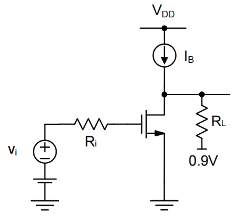

# 20230726 High-Performance Analog Circuit Design Lecture 04 -2 Miller Effect

# 1. Miller等效

重新审视之前的例子，如何才能写出更准确的传递函数

$$
H(s)=?
$$

忽略$C_{db}$，使用利用基尔霍夫

$$
i = (v_{gs}-v_0)\cdot C_{gd},\ \ \ g_m v_{gs}+\frac{v_0}{R_L}+(v_0-v_{gs})\cdot sC_{gd} = 0\\Y(s) = \frac{i(s)}{v_{gs}(s)}=(1-A_v(s))\cdot sC_{gd}\space with\space A_v(s)=-g_mR_L(\frac{1-s\frac{C_{gd}}{g_m}}{1+sR_LC_{gd}})
$$

由上式可以看到，$Y(s)$是一个被放大的电容（Miller电容）

$$
Y(s) \approx (1+g_mR_L)\cdot sC_{gd}
$$

更一般的情况，对于一个跨接的阻抗：

$$
Z_{in}=\frac{v_{test}}{i_{test}}=\frac{v_{test}}{\frac{v_{test}-A_v\cdot v_{test}}{Z}}=\frac{Z}{1-A_v}\\Y_{in} = Y(1-A_v)
$$

$$
A_v=0 \rightarrow Z_{in}=Z\\A_v=1\rightarrow Z_{in}=\infin
$$

- Bootstrapping & Impedance reduction

$$
A_v>1, e.g. A_v=2\rightarrow Z_{in}=-Z(negective)\\A_v <0 \rightarrow Z_{in} = \frac{Z}{1+|A_V|}
$$

从V的角度看，两个极板上的$\Delta v$不同，看起来像是电容被放大了（source follower）

<aside>
💡 增益大于1的时候会形成一个负电容

</aside>

Z→电阻：TIA，跨阻放大器

把之前电路中的跨接电容根据Miller效应分开，输入端变成为

再次根据之前扫到的表，带入数据计算

<aside>
💡 这次计算得到的数值与仿真非常相近

</aside>