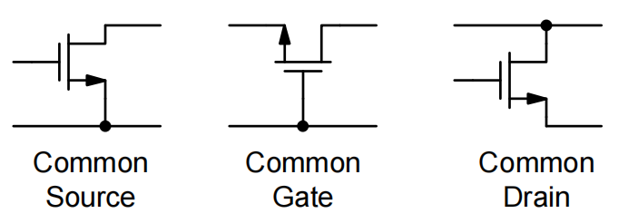

# 20230729 High-Performance Analog Circuit Design Lecture 05 -1 Backgate Effect

器件本质上是一个四端器件，Bulk和source如何连接会对电路产生影响。

模拟电路自动化：

数字电路自动化→基础模块（building blocks），模拟电路的building blocks

<aside>
💡 使用以上三个基础模块组建出更大的放大器

</aside>

- 对NMOS来说，衬底是接地的，因此无法调节衬底电位，NMOS本质上变为一个三端器件
- 对PMOS来说，多了一个Nwell衬底，因此可以调节衬底电位，是一个四端器件

### 双阱工艺

将Bulk考虑进来之后，Bulk有多种接法

<aside>
💡 Well是不能导通的→PMOS的Well接高电位，NMOS的Well接低电位

</aside>

## 背栅效应

改变Bulk的接法→改变Vth

对NMOS加一个正向的Vsb，本质上让PN节更加反偏，更高的电压才能开启，等价认为Vth升高了。

gmb（backgate）的强度

<aside>
💡 也是一个栅极，只不过是在背面，和gate的特征是一样的

</aside>

纵轴：背栅有多强（占顶栅调控能力的多少%），横轴：背栅电压强度

稳定的占顶栅调控能力的20%左右

### 进一步完善的小信号模型

加入了一个压控电流源

## Common Gate

共栅级电路结构：

先画出小信号模型，Cs为源级上的所有电容。gm与gmb处于并联关系，并且控制源为同一个，等效gm变为（gm+gmb），多了20%

在source端加入一个输入电流，在drain端看有多少电流能抽出来

唯一能漏掉的电流就是从Cs上漏掉的电流