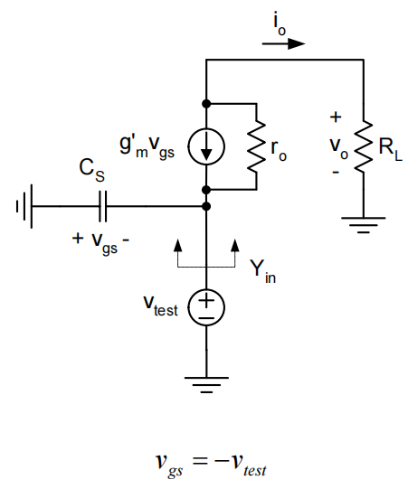

# 20230730 High-Performance Analog Circuit Design Lecture 05 -2 Backgate Effect & CG stage

<aside>
💡 对CG来说，当gm很大的时候，电流传输效率接近为1

</aside>

### 共栅结构输入阻抗

输入阻抗：source往上看阻抗为

$$
Input\space impedance:1/g_m
$$

利用基尔霍夫定律

KCL at $v_o$

$$
0=\frac{V_o}{R_L}+\frac{v_o}{r_o}-\frac{v_{test}}{r_o}-g'_mv_{test}\\ \to v_o \approx g'_m(R_L||r_o)v_{test}
$$

KCL at $v_{test}$

$$
i_{test}=g'_mv_{test}+\frac{v_{test}}{r_o}-\frac{v_o}{r_o}\\ \to Y_{in}-\frac{i_{test}}{v_{test}}\approx \frac{g'_mr_o}{R_L+r_o}+sC_s
$$

低频情况下：

$$
R_{in} = \frac{1}{Y_{in}}\approx \frac{1}{g'_m}(1+\frac{R_L}{r_o})
$$

当$R_L<<r_o$：

$$
R_{in}\approx\frac{1}{g'_m}
$$

当$R_L>>r_o$：

$$
R_{in}\approx\frac{R_L}{g'_mr_o}
$$

### 共栅结构输出阻抗

<aside>
💡 输出阻抗被扩增了$1+g'_mR_s$倍

</aside>

### CG总结

- CG对电流传输效率很高
- CG能实现很低阻抗的输入和一个很高的输出阻抗（like 理想电流源）
- 一个不错的电流源变成一个更好的压控电流源

# 共源共栅

在普通CS的基础上把负载替换成一个CG（更好的电流buffer），CG级的输入阻抗小，可以将电流全部吸收，同时输出阻抗大，提升增益。

### 共源共栅对增益的提升

相当于在CS的基础上套了个电流buffer

$$
G_m=g_{m1}\cdot \frac{i_o}{i_i}\approx g_{m1}\\R_o \approx r_{o2}(1+g'_{m2}r_{o1})
$$

$$
G_mR_o=g_{m1}r_{o2}(1+g'_{m2r_{o1}})\approx g_{m1}r_{o1}\cdot g'_{m2}r_{o2}\approx (g_mr_o)^2
$$

### 共源共栅对高频特性的提升

有效的减缓了Miller效应**（注意Miller关注的是高频特性）**

由于Miller效应，M1的Cgd相当于给前级加了个负载。但M1管增益并不高（M2输入阻抗较低），Miller效应被衰减了。

Zx点网上看是1/gm（$R_L$已经被ac couple到GND去了）

$$
\frac{v_x}{v_i}=g_{m1}Z_x\approx \frac{g_{m1}}{g'_{m2}}(1+\frac{R_L}{r_{o2}})
$$

Cascode只在$f_t$频率左右引入了一个非主极点，但有可能造成相位裕度或稳定性上的问题

$$
\frac{i_o}{i_i}\approx \frac{1}{1+s\frac{C_{gs}+C_{sb}}{g'_m}}
$$

## Revisited Design Example 2

算上Miller之后，带宽掉到了206MHz，可以拿一个Cascode管子恢复一下

预期可以看到的效果：

- 带宽增加（对Miller效应的减缓）
- 非主极点

<aside>
💡 带宽从200MHz增加到了250MHz左右

</aside>

## 摆幅限制

低电压供电时会产生问题

<aside>
💡 Cascode主要用在没有大信号摆幅的位置

</aside>