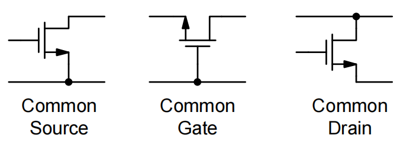

# 20230731 Summary Backgate Effect & CG stage

### Backgate Effect & CG stage 内容目录：

1. **模块**
2. **背栅效应**
    1. 2.1 双阱工艺
    2. 2.2 背栅效应推导
    3. 2.3 进一步完善的小信号模型
3. **Common Gate**
    1. 3.1 共栅级电路结构电流效率
    2. 3.2 共栅结构输入阻抗
    3. 3.3 共栅结构输出阻抗
4. **共源共栅**
    1. 4.1 共源共栅对增益的提升
    2. 4.2 共源共栅对高频特性的提升
    3. 4.3 摆幅限制

# 1. 模块

从这节开始，开始学习模拟电路的基本组成单元。

模拟电路自动化：

数字电路自动化→基础模块（building blocks），模拟电路的building blocks

<aside>
💡 使用以上三个基础模块组建出更大的放大器

</aside>

# 2. 背栅效应

器件本质上是一个四端器件，Bulk和source如何连接会对电路产生影响。

- 对NMOS来说，衬底是接地的，因此无法调节衬底电位，NMOS本质上变为一个三端器件
- 对PMOS来说，多了一个Nwell衬底，因此可以调节衬底电位，是一个四端器件

## 2.1 双阱工艺

将Bulk考虑进来之后，Bulk有多种接法

<aside>
💡 Well是不能导通的→PMOS的Well接高电位，NMOS的Well接低电位

</aside>

## 2.2 背栅效应推导

改变Bulk的接法→改变Vth

对NMOS加一个正向的Vsb，本质上让PN节更加反偏，更高的电压才能开启，等价认为Vth升高了。

$$
v_t=v_{t0}+(\sqrt{2\phi_f+V_{SB}}-\sqrt{2\phi})
$$

gmb（backgate）的强度

$$
g_{mb}=\frac{\partial I_D}{\partial V_{BS}}=-\frac{\partial I_D}{\partial V_{SB}}
$$

$$
\frac{g_{mb}}{g_m}=-\frac{\partial V_t}{\partial V_{SB}}\frac{\partial I_D}{\partial V_{t}}\frac{\partial V_{GS}}{\partial I_{D}}=\frac{\partial V_t}{\partial V_{SB}}=\frac{\gamma}{2\sqrt{V_{SB}+2\phi_f}}
$$

<aside>
💡 也是一个栅极，只不过是在背面，和gate的特征是一样的

</aside>

纵轴：背栅有多强（占顶栅调控能力的多少%），横轴：背栅电压强度

稳定的占顶栅调控能力的20%左右

## 2.3 进一步完善的小信号模型

加入了一个压控电流源

# 3. Common Gate

## 3.1 共栅级电路结构电流效率

先画出小信号模型，Cs为源级上的所有电容。gm与gmb处于并联关系，并且控制源为同一个，等效gm变为（gm+gmb），多了20%

在source端加入一个输入电流，在drain端看有多少电流能抽出来

唯一能漏掉的电流就是从Cs上漏掉的电流

<aside>
💡 对CG来说，当gm很大的时候，电流传输效率接近为1

</aside>

## 3.2 共栅结构输入阻抗

输入阻抗：source往上看阻抗为

$$
Input\space impedance:1/g_m
$$

利用基尔霍夫定律

KCL at $v_o$

$$
0=\frac{V_o}{R_L}+\frac{v_o}{r_o}-\frac{v_{test}}{r_o}-g'_mv_{test}\\ \to v_o \approx g'_m(R_L||r_o)v_{test}
$$

KCL at $v_{test}$

$$
i_{test}=g'_mv_{test}+\frac{v_{test}}{r_o}-\frac{v_o}{r_o}\\ \to Y_{in}-\frac{i_{test}}{v_{test}}\approx \frac{g'_mr_o}{R_L+r_o}+sC_s
$$

低频情况下：

$$
R_{in} = \frac{1}{Y_{in}}\approx \frac{1}{g'_m}(1+\frac{R_L}{r_o})
$$

当$R_L<<r_o$：

$$
R_{in}\approx\frac{1}{g'_m}
$$

当$R_L>>r_o$：

$$
R_{in}\approx\frac{R_L}{g'_mr_o}
$$

## 3.3 共栅结构输出阻抗

<aside>
💡 输出阻抗被扩增了$1+g'_mR_s$倍

</aside>

### CG总结

- CG对电流传输效率很高
- CG能实现很低阻抗的输入和一个很高的输出阻抗（like 理想电流源）
- 一个不错的电流源变成一个更好的压控电流源

# 4. 共源共栅

在普通CS的基础上把负载替换成一个CG（更好的电流buffer），CG级的输入阻抗小，可以将电流全部吸收，同时输出阻抗大，提升增益。

## 4.1 共源共栅对增益的提升

相当于在CS的基础上套了个电流buffer

$$
G_m=g_{m1}\cdot \frac{i_o}{i_i}\approx g_{m1}\\R_o \approx r_{o2}(1+g'_{m2}r_{o1})
$$

$$
G_mR_o=g_{m1}r_{o2}(1+g'_{m2r_{o1}})\approx g_{m1}r_{o1}\cdot g'_{m2}r_{o2}\approx (g_mr_o)^2
$$

## 4.2 共源共栅对高频特性的提升

有效的减缓了Miller效应**（注意Miller关注的是高频特性）**

由于Miller效应，M1的Cgd相当于给前级加了个负载。但M1管增益并不高（M2输入阻抗较低），Miller效应被衰减了。

Zx点网上看是1/gm（$R_L$已经被ac couple到GND去了）

$$
\frac{v_x}{v_i}=g_{m1}Z_x\approx \frac{g_{m1}}{g'_{m2}}(1+\frac{R_L}{r_{o2}})
$$

Cascode只在$f_t$频率左右引入了一个非主极点，但有可能造成相位裕度或稳定性上的问题

$$
\frac{i_o}{i_i}\approx \frac{1}{1+s\frac{C_{gs}+C_{sb}}{g'_m}}
$$

### Revisited Design Example 2

算上Miller之后，带宽掉到了206MHz，可以拿一个Cascode管子恢复一下

预期可以看到的效果：

- 带宽增加（对Miller效应的减缓）
- 非主极点

<aside>
💡 带宽从200MHz增加到了250MHz左右

</aside>

## 4.3 摆幅限制

低电压供电时会产生问题

<aside>
💡 Cascode主要用在没有大信号摆幅的位置

</aside>